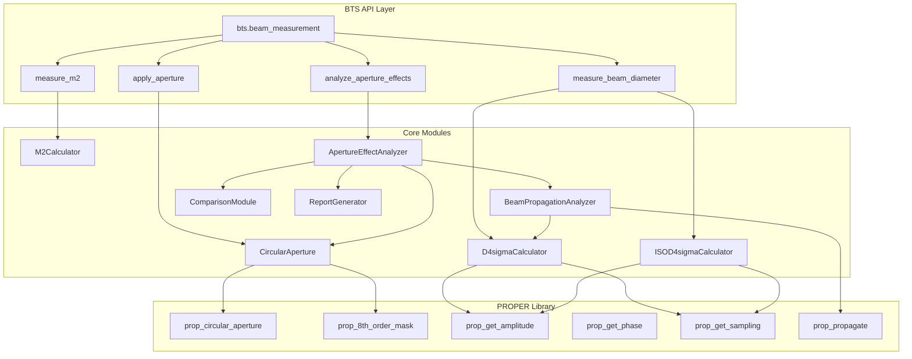

# Design Document: 光束参数测量与光阑设置

## Overview

本设计文档描述了 BTS 混合光学仿真系统中光束参数测量与光阑设置功能的技术实现方案。该功能基于 PROPER 库实现，提供：

1. **D4sigma 光束直径测量**：理想二阶矩方法和 ISO 11146 标准方法
2. **M² 因子测量**：通过多点光束直径拟合计算
3. **圆形光阑**：硬边、高斯、超高斯、8 阶软边四种振幅透过率设置
4. **光束传播分析**：光束参数随传输距离变化的测量与远场发散角计算
5. **光阑影响分析**：不同光阑类型和尺寸对光束传输的影响对比

## Architecture



## Components and Interfaces

### 1. D4sigmaCalculator

计算光束的二阶矩直径（D4sigma）。

```python
@dataclass
class D4sigmaResult:
    """D4sigma 测量结果"""
    dx: float           # X 方向直径 (m)
    dy: float           # Y 方向直径 (m)
    d_mean: float       # 平均直径 (m)
    centroid_x: float   # 质心 X 坐标 (m)
    centroid_y: float   # 质心 Y 坐标 (m)
    total_power: float  # 总功率（归一化）

class D4sigmaCalculator:
    """D4sigma 光束直径计算器（理想方法）"""
    
    def calculate(
        self,
        data: Union[np.ndarray, "proper.WaveFront"],
        sampling: Optional[float] = None,
    ) -> D4sigmaResult:
        """计算 D4sigma 光束直径
        
        参数:
            data: 复振幅数组或 PROPER 波前对象
            sampling: 采样间隔 (m)，如果 data 是波前对象则自动获取
        
        返回:
            D4sigmaResult 对象
        """
        pass
```


### 2. ISOD4sigmaCalculator

实现 ISO 11146 标准的 D4sigma 测量方法。

```python
@dataclass
class ISOD4sigmaResult(D4sigmaResult):
    """ISO 标准 D4sigma 测量结果"""
    iterations: int         # 迭代次数
    converged: bool         # 是否收敛
    roi_radius: float       # 最终 ROI 半径 (m)
    background_level: float # 背景噪声水平
    warning: Optional[str]  # 警告信息

class ISOD4sigmaCalculator:
    """ISO 11146 标准 D4sigma 计算器"""
    
    def __init__(
        self,
        max_iterations: int = 10,
        convergence_threshold: float = 0.01,
        roi_factor: float = 3.0,
    ):
        """初始化 ISO D4sigma 计算器
        
        参数:
            max_iterations: 最大迭代次数
            convergence_threshold: 收敛阈值（相对变化）
            roi_factor: ROI 边界因子（默认 3 倍 D4sigma）
        """
        pass
    
    def calculate(
        self,
        data: Union[np.ndarray, "proper.WaveFront"],
        sampling: Optional[float] = None,
    ) -> ISOD4sigmaResult:
        """使用 ISO 标准方法计算 D4sigma"""
        pass
    
    def _estimate_background(self, intensity: np.ndarray) -> float:
        """估计背景噪声水平"""
        pass
    
    def _apply_roi(
        self,
        intensity: np.ndarray,
        centroid: Tuple[float, float],
        roi_radius: float,
        sampling: float,
    ) -> np.ndarray:
        """应用 ROI 掩模"""
        pass
```

### 3. M2Calculator

计算光束的 M² 因子。

```python
@dataclass
class M2Result:
    """M² 测量结果"""
    m2_x: float           # X 方向 M² 因子
    m2_y: float           # Y 方向 M² 因子
    m2_mean: float        # 平均 M² 因子
    w0_x: float           # X 方向拟合束腰 (m)
    w0_y: float           # Y 方向拟合束腰 (m)
    z0_x: float           # X 方向束腰位置 (m)
    z0_y: float           # Y 方向束腰位置 (m)
    r_squared_x: float    # X 方向拟合优度
    r_squared_y: float    # Y 方向拟合优度
    wavelength: float     # 波长 (m)
    warning: Optional[str] # 警告信息

class M2Calculator:
    """M² 因子计算器"""
    
    def __init__(self, wavelength: float):
        """初始化 M² 计算器
        
        参数:
            wavelength: 波长 (m)
        """
        pass
    
    def calculate(
        self,
        z_positions: np.ndarray,
        beam_diameters_x: np.ndarray,
        beam_diameters_y: np.ndarray,
    ) -> M2Result:
        """通过曲线拟合计算 M² 因子
        
        参数:
            z_positions: 传输位置数组 (m)
            beam_diameters_x: X 方向光束直径数组 (m)
            beam_diameters_y: Y 方向光束直径数组 (m)
        
        返回:
            M2Result 对象
        """
        pass
    
    def _fit_beam_caustic(
        self,
        z: np.ndarray,
        d: np.ndarray,
    ) -> Tuple[float, float, float, float]:
        """拟合光束因果曲线
        
        返回:
            (m2, w0, z0, r_squared)
        """
        pass
```


### 4. CircularAperture

圆形光阑实现，支持四种振幅透过率设置方法。

```python
from enum import Enum

class ApertureType(Enum):
    """光阑类型枚举"""
    HARD_EDGE = "hard_edge"           # 硬边光阑
    GAUSSIAN = "gaussian"             # 高斯光阑
    SUPER_GAUSSIAN = "super_gaussian" # 超高斯/软边光阑
    EIGHTH_ORDER = "eighth_order"     # 8 阶软边光阑

@dataclass
class PowerTransmissionResult:
    """能量透过率计算结果"""
    actual_transmission: float      # 实际透过率
    theoretical_transmission: float # 理论透过率
    relative_error: float           # 相对误差
    input_power: float              # 输入功率
    output_power: float             # 输出功率

class CircularAperture:
    """圆形光阑"""
    
    def __init__(
        self,
        aperture_type: ApertureType,
        radius: float,
        normalized: bool = False,
        center_x: float = 0.0,
        center_y: float = 0.0,
        # 高斯光阑参数
        gaussian_sigma: Optional[float] = None,
        # 超高斯光阑参数
        super_gaussian_order: int = 2,
        # 8 阶光阑参数
        min_transmission: float = 0.0,
        max_transmission: float = 1.0,
    ):
        """初始化圆形光阑
        
        参数:
            aperture_type: 光阑类型
            radius: 光阑半径 (m)，或归一化半径（如果 normalized=True）
            normalized: 是否使用归一化半径（相对于光束半径）
            center_x: 光阑中心 X 坐标 (m)
            center_y: 光阑中心 Y 坐标 (m)
            gaussian_sigma: 高斯光阑的 σ 参数 (m)
            super_gaussian_order: 超高斯光阑的阶数 n
            min_transmission: 8 阶光阑的最小透过率
            max_transmission: 8 阶光阑的最大透过率
        """
        pass
    
    def apply(self, wfo: "proper.WaveFront") -> np.ndarray:
        """将光阑应用到 PROPER 波前
        
        参数:
            wfo: PROPER 波前对象
        
        返回:
            光阑透过率掩模数组
        """
        pass
    
    def _apply_hard_edge(self, wfo: "proper.WaveFront") -> np.ndarray:
        """应用硬边光阑"""
        pass
    
    def _apply_gaussian(self, wfo: "proper.WaveFront") -> np.ndarray:
        """应用高斯光阑"""
        pass
    
    def _apply_super_gaussian(self, wfo: "proper.WaveFront") -> np.ndarray:
        """应用超高斯光阑"""
        pass
    
    def _apply_eighth_order(self, wfo: "proper.WaveFront") -> np.ndarray:
        """应用 8 阶软边光阑"""
        pass
    
    def calculate_power_transmission(
        self,
        wfo: "proper.WaveFront",
        beam_radius: float,
    ) -> PowerTransmissionResult:
        """计算高斯光束通过光阑后的能量透过率
        
        参数:
            wfo: PROPER 波前对象
            beam_radius: 光束半径 (m)，用于计算理论透过率
        
        返回:
            PowerTransmissionResult 对象
        """
        pass
    
    def _theoretical_transmission_hard_edge(
        self,
        aperture_radius: float,
        beam_radius: float,
    ) -> float:
        """计算硬边光阑的理论透过率
        
        公式: T = 1 - exp(-2 * (a/w)²)
        其中 a 为光阑半径，w 为光束半径
        """
        pass
    
    def _theoretical_transmission_gaussian(
        self,
        sigma: float,
        beam_radius: float,
    ) -> float:
        """计算高斯光阑的理论透过率"""
        pass
```


### 5. BeamPropagationAnalyzer

分析光束参数随传输距离的变化。

```python
@dataclass
class PropagationDataPoint:
    """单个传输位置的测量数据"""
    z: float              # 传输位置 (m)
    dx: float             # X 方向直径 (m)
    dy: float             # Y 方向直径 (m)
    d_mean: float         # 平均直径 (m)
    method: str           # 测量方法

@dataclass
class PropagationAnalysisResult:
    """传播分析结果"""
    data_points: List[PropagationDataPoint]  # 测量数据点
    divergence_x: float                       # X 方向远场发散角 (rad)
    divergence_y: float                       # Y 方向远场发散角 (rad)
    divergence_mean: float                    # 平均远场发散角 (rad)
    wavelength: float                         # 波长 (m)
    w0: float                                 # 初始束腰 (m)

class BeamPropagationAnalyzer:
    """光束传播分析器"""
    
    def __init__(
        self,
        wavelength: float,
        w0: float,
        grid_size: int = 256,
        measurement_method: str = "ideal",
    ):
        """初始化传播分析器
        
        参数:
            wavelength: 波长 (m)
            w0: 束腰半径 (m)
            grid_size: 网格大小
            measurement_method: 测量方法 ("ideal" 或 "iso")
        """
        pass
    
    def analyze(
        self,
        z_positions: List[float],
        wfo: Optional["proper.WaveFront"] = None,
        aperture: Optional[CircularAperture] = None,
    ) -> PropagationAnalysisResult:
        """分析光束参数随传输距离的变化
        
        参数:
            z_positions: 传输位置列表 (m)
            wfo: 初始 PROPER 波前对象（可选）
            aperture: 要应用的光阑（可选）
        
        返回:
            PropagationAnalysisResult 对象
        """
        pass
    
    def _calculate_far_field_divergence(
        self,
        data_points: List[PropagationDataPoint],
    ) -> Tuple[float, float]:
        """计算远场发散角
        
        使用远场数据点的线性拟合计算发散角
        """
        pass
    
    def plot(
        self,
        result: PropagationAnalysisResult,
        show_theory: bool = True,
        save_path: Optional[str] = None,
    ) -> None:
        """绘制光束直径变化曲线
        
        参数:
            result: 分析结果
            show_theory: 是否显示理论曲线
            save_path: 保存路径（可选）
        """
        pass
```

### 6. ApertureEffectAnalyzer

分析不同光阑对光束传输的影响。

```python
@dataclass
class ApertureEffectDataPoint:
    """单个光阑配置的分析数据"""
    aperture_type: ApertureType
    aperture_ratio: float           # 光阑半径/光束半径
    power_transmission: float       # 功率透过率
    beam_diameter_change: float     # 光束直径变化率
    divergence_change: float        # 发散角变化率
    theoretical_transmission: float # 理论透过率

@dataclass
class ApertureEffectAnalysisResult:
    """光阑影响分析结果"""
    data_points: List[ApertureEffectDataPoint]
    aperture_types: List[ApertureType]
    aperture_ratios: List[float]
    wavelength: float
    w0: float
    recommendation: str  # 选型建议

class ApertureEffectAnalyzer:
    """光阑影响分析器"""
    
    def __init__(
        self,
        wavelength: float,
        w0: float,
        grid_size: int = 256,
        propagation_distance: float = None,
    ):
        """初始化光阑影响分析器
        
        参数:
            wavelength: 波长 (m)
            w0: 束腰半径 (m)
            grid_size: 网格大小
            propagation_distance: 传播距离 (m)，用于测量远场效果
        """
        pass
    
    def analyze(
        self,
        aperture_ratios: List[float],
        aperture_types: Optional[List[ApertureType]] = None,
    ) -> ApertureEffectAnalysisResult:
        """分析不同光阑配置的影响
        
        参数:
            aperture_ratios: 光阑半径/光束半径 列表
            aperture_types: 要分析的光阑类型列表（默认全部四种）
        
        返回:
            ApertureEffectAnalysisResult 对象
        """
        pass
    
    def _generate_recommendation(
        self,
        data_points: List[ApertureEffectDataPoint],
    ) -> str:
        """生成光阑选型建议"""
        pass
```


### 7. ComparisonModule

测量结果与理论对比模块。

```python
@dataclass
class ComparisonResult:
    """对比结果"""
    measured_values: np.ndarray
    theoretical_values: np.ndarray
    relative_errors: np.ndarray
    rms_error: float
    max_error: float
    fresnel_number: Optional[float]

class ComparisonModule:
    """测量结果与理论对比模块"""
    
    def __init__(self, wavelength: float, w0: float):
        """初始化对比模块
        
        参数:
            wavelength: 波长 (m)
            w0: 束腰半径 (m)
        """
        pass
    
    def theoretical_beam_diameter(self, z: float) -> float:
        """计算理论光束直径
        
        公式: w(z) = w₀ × √(1 + (z/z_R)²)
        D4sigma = 2 × w(z)
        """
        pass
    
    def compare_beam_diameters(
        self,
        z_positions: np.ndarray,
        measured_diameters: np.ndarray,
    ) -> ComparisonResult:
        """对比测量光束直径与理论值"""
        pass
    
    def calculate_fresnel_number(
        self,
        aperture_radius: float,
        propagation_distance: float,
    ) -> float:
        """计算菲涅尔数
        
        公式: N_F = a² / (λ × z)
        其中 a 为光阑半径，z 为传播距离
        """
        pass
    
    def estimate_diffraction_effect(
        self,
        fresnel_number: float,
    ) -> str:
        """基于菲涅尔数估算衍射效应
        
        - N_F >> 1: 几何光学区域，衍射效应可忽略
        - N_F ~ 1: 菲涅尔衍射区域
        - N_F << 1: 夫琅禾费衍射区域
        """
        pass

### 8. ReportGenerator

测试报告生成器。

```python
class ReportGenerator:
    """测试报告生成器"""
    
    def __init__(self, output_dir: str = "."):
        """初始化报告生成器
        
        参数:
            output_dir: 输出目录
        """
        pass
    
    def generate(
        self,
        aperture_analysis: ApertureEffectAnalysisResult,
        propagation_analysis: Optional[PropagationAnalysisResult] = None,
        comparison_result: Optional[ComparisonResult] = None,
        title: str = "光束参数测量与光阑分析报告",
    ) -> str:
        """生成完整的测试报告
        
        参数:
            aperture_analysis: 光阑影响分析结果
            propagation_analysis: 传播分析结果（可选）
            comparison_result: 对比结果（可选）
            title: 报告标题
        
        返回:
            Markdown 格式的报告内容
        """
        pass
    
    def _generate_header(self, title: str) -> str:
        """生成报告头部"""
        pass
    
    def _generate_config_section(
        self,
        wavelength: float,
        w0: float,
        aperture_ratios: List[float],
    ) -> str:
        """生成配置信息部分"""
        pass
    
    def _generate_comparison_table(
        self,
        data_points: List[ApertureEffectDataPoint],
    ) -> str:
        """生成对比分析表格"""
        pass
    
    def _generate_recommendation_section(
        self,
        recommendation: str,
    ) -> str:
        """生成选型建议部分"""
        pass
    
    def save(self, content: str, filename: str = "report.md") -> str:
        """保存报告到文件
        
        返回:
            保存的文件路径
        """
        pass
```

### 9. BTS API 集成

在 `bts` 模块中添加光束测量和光阑功能的 API。

```python
# src/bts/beam_measurement.py

def measure_beam_diameter(
    data: Union[np.ndarray, "proper.WaveFront", "SimulationResult"],
    method: str = "ideal",
    sampling: Optional[float] = None,
    surface_index: int = -1,
    **kwargs,
) -> Union[D4sigmaResult, ISOD4sigmaResult]:
    """测量光束直径
    
    参数:
        data: 复振幅数组、PROPER 波前对象或 SimulationResult
        method: 测量方法 ("ideal" 或 "iso")
        sampling: 采样间隔 (m)
        surface_index: 如果 data 是 SimulationResult，指定表面索引
        **kwargs: 传递给 ISO 方法的额外参数
    
    返回:
        D4sigmaResult 或 ISOD4sigmaResult 对象
    """
    pass

def measure_m2(
    z_positions: np.ndarray,
    beam_diameters_x: np.ndarray,
    beam_diameters_y: np.ndarray,
    wavelength: float,
) -> M2Result:
    """测量 M² 因子
    
    参数:
        z_positions: 传输位置数组 (m)
        beam_diameters_x: X 方向光束直径数组 (m)
        beam_diameters_y: Y 方向光束直径数组 (m)
        wavelength: 波长 (m)
    
    返回:
        M2Result 对象
    """
    pass

def apply_aperture(
    wfo: "proper.WaveFront",
    aperture_type: str,
    radius: float,
    normalized: bool = False,
    **kwargs,
) -> np.ndarray:
    """应用光阑到 PROPER 波前
    
    参数:
        wfo: PROPER 波前对象
        aperture_type: 光阑类型 ("hard_edge", "gaussian", "super_gaussian", "eighth_order")
        radius: 光阑半径 (m) 或归一化半径
        normalized: 是否使用归一化半径
        **kwargs: 光阑类型特定参数
    
    返回:
        光阑透过率掩模数组
    """
    pass

def analyze_aperture_effects(
    wavelength: float,
    w0: float,
    aperture_ratios: List[float],
    aperture_types: Optional[List[str]] = None,
    grid_size: int = 256,
    propagation_distance: Optional[float] = None,
    generate_report: bool = True,
    output_dir: str = ".",
) -> ApertureEffectAnalysisResult:
    """分析光阑对光束的影响
    
    参数:
        wavelength: 波长 (m)
        w0: 束腰半径 (m)
        aperture_ratios: 光阑半径/光束半径 列表
        aperture_types: 要分析的光阑类型列表
        grid_size: 网格大小
        propagation_distance: 传播距离 (m)
        generate_report: 是否生成报告
        output_dir: 报告输出目录
    
    返回:
        ApertureEffectAnalysisResult 对象
    """
    pass
```


## Data Models

### 测量结果数据模型

```python
from dataclasses import dataclass
from typing import Optional, List
from enum import Enum
import numpy as np

@dataclass
class D4sigmaResult:
    """D4sigma 测量结果"""
    dx: float           # X 方向直径 (m)
    dy: float           # Y 方向直径 (m)
    d_mean: float       # 平均直径 (m)
    centroid_x: float   # 质心 X 坐标 (m)
    centroid_y: float   # 质心 Y 坐标 (m)
    total_power: float  # 总功率（归一化）

@dataclass
class ISOD4sigmaResult(D4sigmaResult):
    """ISO 标准 D4sigma 测量结果"""
    iterations: int         # 迭代次数
    converged: bool         # 是否收敛
    roi_radius: float       # 最终 ROI 半径 (m)
    background_level: float # 背景噪声水平
    warning: Optional[str]  # 警告信息

@dataclass
class M2Result:
    """M² 测量结果"""
    m2_x: float           # X 方向 M² 因子
    m2_y: float           # Y 方向 M² 因子
    m2_mean: float        # 平均 M² 因子
    w0_x: float           # X 方向拟合束腰 (m)
    w0_y: float           # Y 方向拟合束腰 (m)
    z0_x: float           # X 方向束腰位置 (m)
    z0_y: float           # Y 方向束腰位置 (m)
    r_squared_x: float    # X 方向拟合优度
    r_squared_y: float    # Y 方向拟合优度
    wavelength: float     # 波长 (m)
    warning: Optional[str] # 警告信息

@dataclass
class PowerTransmissionResult:
    """能量透过率计算结果"""
    actual_transmission: float      # 实际透过率
    theoretical_transmission: float # 理论透过率
    relative_error: float           # 相对误差
    input_power: float              # 输入功率
    output_power: float             # 输出功率
```

### 光阑类型枚举

```python
class ApertureType(Enum):
    """光阑类型枚举"""
    HARD_EDGE = "hard_edge"           # 硬边光阑
    GAUSSIAN = "gaussian"             # 高斯光阑
    SUPER_GAUSSIAN = "super_gaussian" # 超高斯/软边光阑
    EIGHTH_ORDER = "eighth_order"     # 8 阶软边光阑
```

### 单位约定

| 量 | 内部单位 | PROPER 单位 | BTS API 单位 |
|----|----------|-------------|--------------|
| 长度 | m | m | mm |
| 波长 | m | m | μm |
| 角度 | rad | rad | rad |
| 功率 | 归一化 | 归一化 | 归一化 |

## Correctness Properties

*A property is a characteristic or behavior that should hold true across all valid executions of a system-essentially, a formal statement about what the system should do. Properties serve as the bridge between human-readable specifications and machine-verifiable correctness guarantees.*

### Property 1: D4sigma 高斯光束验证

*For any* 理想高斯光束（任意束腰半径 w），D4sigma 计算结果应等于 2×w（1/e² 直径）。

**Validates: Requirements 1.2, 1.3**

### Property 2: ISO D4sigma 去噪有效性

*For any* 带有已知背景噪声的光束数据，ISO 方法去噪后的 D4sigma 测量值应比不去噪的结果更接近真实值。

**Validates: Requirements 2.1**

### Property 3: M² 拟合正确性

*For any* 已知 M² 因子的光束因果曲线数据，M2Calculator 的拟合结果应与输入的 M² 值一致（误差 < 1%）。

**Validates: Requirements 3.1, 3.2**

### Property 4: 光阑透过率函数验证

*For any* 光阑类型和参数配置：
- 硬边光阑：透过率在半径内为 1，半径外为 0（考虑抗锯齿）
- 高斯光阑：透过率符合 T(r) = exp(-0.5 × (r/σ)²)
- 超高斯光阑：透过率符合 T(r) = exp(-(r/r₀)ⁿ)
- 8 阶光阑：透过率符合 PROPER prop_8th_order_mask 的定义

**Validates: Requirements 4.1, 4.2, 4.3, 4.4, 4.8**

### Property 5: 光阑半径归一化一致性

*For any* 光阑配置，使用绝对半径 r 和归一化半径 r/w（其中 w 为光束半径）应产生相同的透过率分布。

**Validates: Requirements 4.5**

### Property 6: 能量透过率计算正确性

*For any* 高斯光束通过硬边圆形光阑，计算的能量透过率应与理论公式 T = 1 - exp(-2×(a/w)²) 一致（误差 < 1%）。

**Validates: Requirements 4.10, 6.5**

### Property 7: 传播分析数据完整性

*For any* 传输位置列表，BeamPropagationAnalyzer 返回的数据点数应等于输入位置列表的长度。

**Validates: Requirements 5.1, 6.1**

### Property 8: 理论光束直径计算

*For any* 传输距离 z，理论光束直径计算应符合公式 w(z) = w₀ × √(1 + (z/z_R)²)。

**Validates: Requirements 5.4, 8.1**

### Property 9: 菲涅尔数计算正确性

*For any* 光阑半径 a 和传播距离 z，菲涅尔数计算应符合公式 N_F = a² / (λ × z)。

**Validates: Requirements 8.3**


## Error Handling

### 输入验证错误

```python
class BeamMeasurementError(Exception):
    """光束测量基础异常"""
    pass

class InvalidInputError(BeamMeasurementError):
    """无效输入错误"""
    pass

class ConvergenceError(BeamMeasurementError):
    """收敛失败错误"""
    pass

class InsufficientDataError(BeamMeasurementError):
    """数据不足错误"""
    pass
```

### 错误处理策略

| 错误类型 | 处理方式 |
|----------|----------|
| 空数组输入 | 抛出 InvalidInputError |
| 采样间隔为零或负 | 抛出 InvalidInputError |
| ISO 迭代不收敛 | 返回警告信息和当前最佳估计 |
| M² 测量点数 < 5 | 返回警告信息 |
| 无效光阑类型 | 抛出 InvalidInputError |
| 光阑半径为零或负 | 抛出 InvalidInputError |

### 警告信息

- ISO 迭代未收敛时，在结果中包含 `warning` 字段
- M² 测量点数不足时，在结果中包含 `warning` 字段
- 能量透过率计算误差过大时，记录警告日志

## Testing Strategy

### 单元测试

单元测试用于验证特定示例和边界条件：

1. **D4sigmaCalculator 单元测试**
   - 测试空数组输入抛出异常
   - 测试单点数组处理
   - 测试返回值结构完整性

2. **ISOD4sigmaCalculator 单元测试**
   - 测试迭代收敛行为
   - 测试最大迭代次数限制
   - 测试背景噪声估计

3. **M2Calculator 单元测试**
   - 测试少于 5 个数据点的警告
   - 测试返回值结构完整性

4. **CircularAperture 单元测试**
   - 测试各光阑类型的创建
   - 测试无效参数抛出异常
   - 测试光阑中心偏移

5. **BTS API 单元测试**
   - 测试 API 函数存在性
   - 测试参数验证

### 属性测试

属性测试用于验证普遍性质，每个测试至少运行 100 次迭代。

**测试配置**：
- 使用 `hypothesis` 库进行属性测试
- 每个属性测试最少 100 次迭代
- 每个测试必须引用设计文档中的属性编号

**属性测试列表**：

1. **Property 1: D4sigma 高斯光束验证**
   - 生成随机束腰半径 w ∈ [0.1mm, 10mm]
   - 创建理想高斯光束
   - 验证 D4sigma ≈ 2×w（误差 < 0.1%）
   - Tag: `Feature: beam-measurement-apertures, Property 1: D4sigma 高斯光束验证`

2. **Property 2: ISO D4sigma 去噪有效性**
   - 生成随机高斯光束
   - 添加已知背景噪声
   - 验证 ISO 方法结果比理想方法更接近真实值
   - Tag: `Feature: beam-measurement-apertures, Property 2: ISO D4sigma 去噪有效性`

3. **Property 3: M² 拟合正确性**
   - 生成随机 M² ∈ [1.0, 3.0]
   - 创建对应的光束因果曲线
   - 验证拟合结果与输入 M² 一致（误差 < 1%）
   - Tag: `Feature: beam-measurement-apertures, Property 3: M² 拟合正确性`

4. **Property 4: 光阑透过率函数验证**
   - 生成随机光阑参数
   - 验证各类型光阑的透过率分布符合定义
   - Tag: `Feature: beam-measurement-apertures, Property 4: 光阑透过率函数验证`

5. **Property 5: 光阑半径归一化一致性**
   - 生成随机光阑半径和光束半径
   - 验证绝对半径和归一化半径产生相同结果
   - Tag: `Feature: beam-measurement-apertures, Property 5: 光阑半径归一化一致性`

6. **Property 6: 能量透过率计算正确性**
   - 生成随机光阑半径/光束半径比
   - 验证计算透过率与理论公式一致（误差 < 1%）
   - Tag: `Feature: beam-measurement-apertures, Property 6: 能量透过率计算正确性`

7. **Property 7: 传播分析数据完整性**
   - 生成随机传输位置列表
   - 验证返回数据点数等于输入位置数
   - Tag: `Feature: beam-measurement-apertures, Property 7: 传播分析数据完整性`

8. **Property 8: 理论光束直径计算**
   - 生成随机传输距离
   - 验证计算结果符合高斯光束传播公式
   - Tag: `Feature: beam-measurement-apertures, Property 8: 理论光束直径计算`

9. **Property 9: 菲涅尔数计算正确性**
   - 生成随机光阑半径和传播距离
   - 验证菲涅尔数计算符合公式 N_F = a²/(λz)
   - Tag: `Feature: beam-measurement-apertures, Property 9: 菲涅尔数计算正确性`

### 集成测试

集成测试验证完整的工作流程：

1. **光阑影响分析集成测试**
   - 创建高斯光束
   - 应用不同类型和尺寸的光阑
   - 传播到远场
   - 测量光束直径和发散角
   - 生成分析报告

2. **BTS API 集成测试**
   - 使用 BTS API 执行完整的测量流程
   - 验证结果与直接调用模块一致

### 测试文件结构

```
tests/
├── unit/
│   ├── test_d4sigma_calculator.py
│   ├── test_iso_d4sigma_calculator.py
│   ├── test_m2_calculator.py
│   ├── test_circular_aperture.py
│   └── test_bts_beam_measurement_api.py
├── property/
│   ├── test_d4sigma_properties.py
│   ├── test_m2_properties.py
│   ├── test_aperture_properties.py
│   └── test_propagation_properties.py
└── integration/
    ├── test_aperture_effect_analysis.py
    └── test_beam_measurement_workflow.py
```
