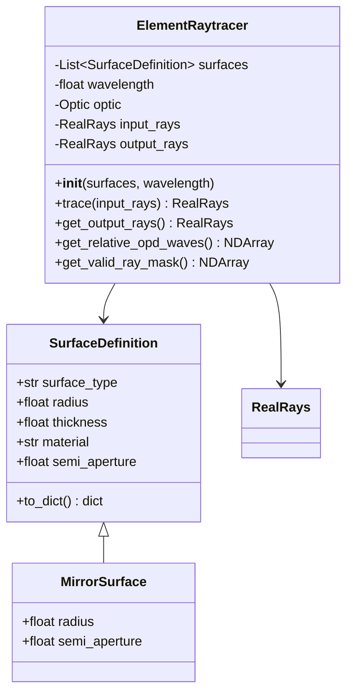
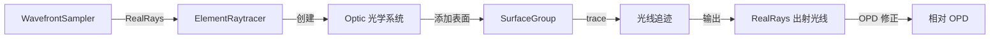

# 设计文档

## 概述

元件光线追迹模块（Element Raytracer）是混合光学仿真系统中负责在光学元件处执行几何光线追迹的核心组件。该模块接收来自 `wavefront_sampler` 模块的光线数据（RealRays 对象），通过定义的光学表面进行追迹，并输出出射光束的完整光线数据。

### 设计目标

1. **无缝集成**：与现有 `wavefront_to_rays` 模块无缝衔接
2. **灵活性**：支持多种光学表面类型（反射镜、折射面）
3. **准确性**：OPD 计算误差小于 0.01 波长
4. **可扩展性**：便于后续添加更多表面类型

### 核心设计决策

1. **基于 optiland 实现**：利用 optiland 的 `SurfaceGroup.trace()` 方法进行光线追迹，不自己实现反射/折射计算
2. **独立光学系统**：为每次追迹创建独立的光学系统，避免状态污染
3. **OPD 修正**：optiland 的光线追迹会自动计算 OPD，但需要处理相位面引入的 1000 倍放大问题
4. **入射面约定**：入射面固定在 z=0 位置，与 wavefront_sampler 输出一致

### 与 optiland 的关系

本模块是 optiland 光线追迹功能的封装层，主要职责：
- 将输入光线（RealRays）传递给 optiland 的 `SurfaceGroup.trace()` 方法
- 配置正确的光学系统（表面类型、曲率半径、材料等）
- 处理输出结果，特别是 OPD 的单位修正
- 提供便捷的接口用于混合光学仿真系统

## 架构

### 模块结构

```
src/wavefront_to_rays/
├── __init__.py                 # 模块导出
├── wavefront_sampler.py        # 现有：波前采样器
├── phase_surface.py            # 现有：相位面辅助函数
└── element_raytracer.py        # 新增：元件光线追迹器
```

### 类图



### 数据流



## 组件和接口

### ElementRaytracer 类

主要的光线追迹器类，负责管理光学表面定义和执行光线追迹。

```python
class ElementRaytracer:
    """元件光线追迹器
    
    将输入光线通过一个或多个光学表面进行追迹，
    输出出射光束的光线数据。
    
    支持正入射和倾斜入射两种情况。
    
    参数:
        surfaces: 光学表面定义列表
        wavelength: 波长，单位：μm
        chief_ray_direction: 主光线方向向量 (L, M, N)，默认 (0, 0, 1) 表示正入射
        entrance_position: 入射面中心在全局坐标系中的位置，默认 (0, 0, 0)
    
    属性:
        optic: optiland Optic 对象
        output_rays: 出射光线数据
        rotation_matrix: 从局部坐标系到全局坐标系的旋转矩阵
    """
    
    def __init__(
        self,
        surfaces: List[SurfaceDefinition],
        wavelength: float,
        chief_ray_direction: Tuple[float, float, float] = (0, 0, 1),
        entrance_position: Tuple[float, float, float] = (0, 0, 0),
    ) -> None:
        """初始化元件光线追迹器"""
        pass
    
    def trace(self, input_rays: RealRays) -> RealRays:
        """执行光线追迹
        
        参数:
            input_rays: 输入光线（来自 wavefront_sampler，在入射面局部坐标系中）
        
        返回:
            出射光线数据（在出射面局部坐标系中）
        
        处理流程:
            1. 将输入光线从入射面局部坐标系转换到全局坐标系
            2. 调用 optiland 进行光线追迹
            3. 将输出光线从全局坐标系转换到出射面局部坐标系
        """
        pass
    
    def get_output_rays(self) -> RealRays:
        """获取出射光线数据（在出射面局部坐标系中）"""
        pass
    
    def get_relative_opd_waves(self) -> NDArray:
        """获取相对于主光线的 OPD（波长数）"""
        pass
    
    def get_valid_ray_mask(self) -> NDArray:
        """获取有效光线的掩模"""
        pass
    
    def get_exit_chief_ray_direction(self) -> Tuple[float, float, float]:
        """获取出射主光线方向（在全局坐标系中）
        
        对于反射镜，出射方向与入射方向不同
        """
        pass
```

### SurfaceDefinition 数据类

定义光学表面的参数。

```python
@dataclass
class SurfaceDefinition:
    """光学表面定义
    
    参数:
        surface_type: 表面类型 ('mirror', 'refract')
        radius: 曲率半径，单位：mm。正值表示凹面（曲率中心在 +Z 方向）
        thickness: 到下一表面的厚度，单位：mm
        material: 材料名称（'mirror' 表示反射镜，其他为折射材料）
        semi_aperture: 半口径，单位：mm。None 表示无限制
    """
    surface_type: str = 'mirror'
    radius: float = np.inf
    thickness: float = 0.0
    material: str = 'mirror'
    semi_aperture: Optional[float] = None
```

### 辅助函数

```python
def create_mirror_surface(
    radius: float,
    semi_aperture: Optional[float] = None,
) -> SurfaceDefinition:
    """创建反射镜表面定义
    
    参数:
        radius: 曲率半径，单位：mm。正值表示凹面镜
        semi_aperture: 半口径，单位：mm
    
    返回:
        反射镜表面定义
    """
    pass

def create_concave_mirror_for_spherical_wave(
    source_distance: float,
    semi_aperture: Optional[float] = None,
) -> SurfaceDefinition:
    """创建用于将球面波转换为平面波的凹面镜
    
    参数:
        source_distance: 球面波源到镜面的距离，单位：mm
                        （等于凹面镜的焦距）
        semi_aperture: 半口径，单位：mm
    
    返回:
        凹面镜表面定义
    
    说明:
        凹面镜焦距 f = R/2，其中 R 为曲率半径
        当球面波从焦点发出时，反射后变为平面波
    """
    pass

def compute_rotation_matrix(
    chief_ray_direction: Tuple[float, float, float],
) -> NDArray:
    """计算从入射面局部坐标系到全局坐标系的旋转矩阵
    
    参数:
        chief_ray_direction: 主光线方向 (L, M, N)，即局部 Z 轴在全局坐标系中的方向
    
    返回:
        3x3 旋转矩阵 R，满足 v_global = R @ v_local
    """
    pass

def transform_rays_to_global(
    rays: RealRays,
    rotation_matrix: NDArray,
    entrance_position: Tuple[float, float, float],
) -> RealRays:
    """将光线从入射面局部坐标系转换到全局坐标系
    
    参数:
        rays: 输入光线（在局部坐标系中）
        rotation_matrix: 旋转矩阵
        entrance_position: 入射面中心位置
    
    返回:
        转换后的光线（在全局坐标系中）
    """
    pass

def transform_rays_to_local(
    rays: RealRays,
    rotation_matrix: NDArray,
    exit_position: Tuple[float, float, float],
) -> RealRays:
    """将光线从全局坐标系转换到出射面局部坐标系
    
    参数:
        rays: 输入光线（在全局坐标系中）
        rotation_matrix: 旋转矩阵（出射面的）
        exit_position: 出射面中心位置
    
    返回:
        转换后的光线（在局部坐标系中）
    """
    pass
```

## 数据模型

### 输入数据

输入光线来自 `WavefrontToRaysSampler`，是 optiland 的 `RealRays` 对象：

| 属性 | 类型 | 说明 |
|------|------|------|
| x | NDArray | X 坐标，单位：mm |
| y | NDArray | Y 坐标，单位：mm |
| z | NDArray | Z 坐标，单位：mm |
| L | NDArray | X 方向余弦 |
| M | NDArray | Y 方向余弦 |
| N | NDArray | Z 方向余弦 |
| i | NDArray | 光线强度 |
| w | NDArray | 波长，单位：μm |
| opd | NDArray | 光程差，单位：mm |

### 输出数据

输出同样是 `RealRays` 对象，包含追迹后的光线数据。

### 坐标系统

- **全局坐标系**：右手坐标系，Z 轴为光轴方向
- **入射面**：位于 z=0 位置
- **出射面**：位于最后一个光学表面的顶点位置
- **曲率半径符号**：正值表示曲率中心在 +Z 方向（凹面朝向 -Z）

### 坐标系统处理（关键设计点）

**问题背景**：
- `wavefront_sampler` 输出的光线是在入射面（z=0）的局部坐标系中定义的
- 入射面垂直于主光线方向
- 在倾斜入射的情况下，入射面的局部坐标系与全局坐标系不同
- optiland 的 `Surface.trace()` 方法会自动处理坐标系转换（localize/globalize）

**optiland 坐标系统处理机制**：
1. `localize(rays)`：将光线从全局坐标系转换到表面的局部坐标系
2. `globalize(rays)`：将光线从局部坐标系转换回全局坐标系
3. 每个表面都有自己的 `CoordinateSystem`，定义了相对于全局坐标系的位置和旋转

**本模块的坐标系统约定**：

1. **入射光线坐标系（局部坐标系）**：
   - 输入光线在入射面的局部坐标系中定义
   - 入射面位于局部 z=0
   - 入射面垂直于主光线方向
   - 主光线方向为局部 Z 轴正方向
   
2. **全局坐标系**：
   - optiland 光学系统使用全局坐标系
   - Z 轴为系统光轴方向
   - 第一个光学表面的顶点位于 z=0

3. **倾斜入射的坐标转换**：
   
   当主光线方向不沿全局 Z 轴时，需要进行坐标转换：
   
   ```
   入射面局部坐标系 → 全局坐标系 → optiland 追迹 → 全局坐标系 → 出射面局部坐标系
   ```
   
   **转换参数**：
   - `chief_ray_direction`: 主光线方向向量 (L, M, N)，定义入射面法向量
   - `entrance_position`: 入射面中心在全局坐标系中的位置 (x, y, z)
   
   **转换矩阵计算**：
   ```python
   # 主光线方向定义了入射面的法向量（局部 Z 轴）
   # 需要计算从局部坐标系到全局坐标系的旋转矩阵
   
   def compute_rotation_matrix(chief_ray_direction):
       """计算从入射面局部坐标系到全局坐标系的旋转矩阵
       
       参数:
           chief_ray_direction: 主光线方向 (L, M, N)，即局部 Z 轴在全局坐标系中的方向
       
       返回:
           3x3 旋转矩阵
       """
       # 局部 Z 轴 = 主光线方向
       z_local = normalize(chief_ray_direction)
       
       # 选择一个参考向量来定义局部 X 轴
       # 如果主光线接近全局 Y 轴，使用全局 X 轴作为参考
       # 否则使用全局 Y 轴作为参考
       if abs(z_local[1]) > 0.9:
           ref = [1, 0, 0]
       else:
           ref = [0, 1, 0]
       
       # 局部 X 轴 = ref × z_local（归一化）
       x_local = normalize(cross(ref, z_local))
       
       # 局部 Y 轴 = z_local × x_local
       y_local = cross(z_local, x_local)
       
       # 旋转矩阵：列向量为局部坐标轴在全局坐标系中的表示
       R = [x_local, y_local, z_local]  # 3x3 矩阵
       return R
   ```

4. **光线坐标转换流程**：

   **输入转换（局部 → 全局）**：
   ```python
   # 位置转换
   pos_global = R @ pos_local + entrance_position
   
   # 方向转换
   dir_global = R @ dir_local
   ```
   
   **输出转换（全局 → 局部）**：
   ```python
   # 位置转换
   pos_local = R.T @ (pos_global - exit_position)
   
   # 方向转换
   dir_local = R.T @ dir_global
   ```

5. **出射面定义**：
   - 出射面位于最后一个光学表面的顶点位置
   - 出射面法向量由出射主光线方向定义
   - 对于反射镜，出射主光线方向与入射主光线方向不同

```
# 坐标系统示意图
#
# 正入射情况：
#   入射面局部坐标系 ≈ 全局坐标系（仅平移）
#   
#        Y                    Y_global
#        |                    |
#        |_____ Z    ==>      |_____ Z_global
#       /                    /
#      X                    X_global
#
# 倾斜入射情况：
#   入射面局部坐标系相对于全局坐标系有旋转
#   
#        Y_local              Y_global
#         \                   |
#          \_____ Z_local     |_____ Z_global
#          /                 /
#         X_local           X_global
#
#   主光线方向 = 局部 Z 轴在全局坐标系中的方向
```

## 正确性属性

*正确性属性是系统应满足的特性，用于验证实现的正确性。每个属性都是一个普遍量化的陈述，适用于所有有效输入。*

**注意**：光线的反射/折射计算由 optiland 库的 `Surface.trace()` 方法完成，我们不需要自己实现这些物理计算。因此，正确性属性主要关注：
1. 模块接口的正确性（输入/输出）
2. 光学系统配置的正确性
3. OPD 计算结果的准确性（包括修正 optiland 的单位问题）


### Property 1: 输入光线数量不变性

*For any* 有效的输入光线集合，经过光线追迹后，输出光线的数量应等于输入光线的数量（包括被标记为无效的光线）。

**Validates: Requirements 1.3**

### Property 2: 方向余弦归一化

*For any* 有效的出射光线，其方向余弦应满足归一化条件：L² + M² + N² = 1（在数值精度范围内）。

**Validates: Requirements 5.2**

### Property 3: 球面波到平面波转换

*For any* 从凹面镜焦点发出的球面波，经凹面镜反射后，出射光束的 OPD 标准差应小于 0.01 波长（即输出为平面波）。

这是验证整个模块正确性的核心属性，包括：
- 光学系统配置正确
- 光线追迹调用正确
- OPD 计算和修正正确

**Validates: Requirements 6.1, 7.1**

### Property 4: 渐晕光线标记

*For any* 超出光学表面有效区域（半口径）的光线，应被标记为无效（强度为 0）。

**Validates: Requirements 4.5**

### Property 5: 出射面位置正确性

*For any* 光学系统配置，出射光线的 z 坐标应位于最后一个光学表面的顶点位置附近（在表面矢高范围内）。

**Validates: Requirements 3.2**

## 错误处理

### 异常类型

| 异常类型 | 触发条件 | 错误信息 |
|----------|----------|----------|
| TypeError | 输入参数类型错误 | "输入参数类型错误：期望 {expected}，实际 {actual}" |
| ValueError | 输入参数值无效 | "输入参数值无效：{description}" |
| ValueError | 方向余弦未归一化 | "光线方向余弦未归一化：L² + M² + N² = {value}" |

### 错误处理策略

1. **输入验证**：在追迹前验证输入光线的有效性
2. **渐晕处理**：将渐晕光线标记为无效（强度设为 0），不抛出异常
3. **全反射处理**：将发生全反射的光线标记为无效，不抛出异常
4. **空输入处理**：返回空的输出光线集合，不抛出异常

## 测试策略

### 双重测试方法

本模块采用单元测试和属性基测试相结合的方法：

1. **单元测试**：验证特定示例、边界条件和错误处理
2. **属性基测试**：验证普遍属性在所有有效输入上成立

### 属性基测试配置

- **测试框架**：pytest + hypothesis
- **最小迭代次数**：100 次
- **标签格式**：`Feature: element-raytracer, Property {number}: {property_text}`

### 单元测试用例

| 测试用例 | 描述 | 验证需求 |
|----------|------|----------|
| test_mirror_surface_creation | 验证反射镜表面创建 | 2.1, 2.2 |
| test_refract_surface_creation | 验证折射面创建 | 2.3 |
| test_empty_input | 验证空输入处理 | 1.4 |
| test_invalid_direction_cosines | 验证方向余弦验证 | 1.2 |
| test_spherical_wave_to_plane_wave | 球面波入射凹面镜测试 | 6.1, 7.1 |
| test_opd_visualization | OPD 可视化测试 | 7.3 |

### 属性基测试用例

| 测试用例 | 属性 | 生成器 |
|----------|------|--------|
| test_ray_count_invariant | Property 1 | 随机光线数量 (1-1000) |
| test_direction_cosine_normalization | Property 2 | 随机光线方向 |
| test_spherical_to_plane_wave | Property 3 | 随机焦距和光瞳大小 |
| test_vignetting | Property 4 | 随机光线位置和半口径 |
| test_exit_plane_position | Property 5 | 随机光学系统配置 |

### 验证测试

#### 测试用例 1：球面波入射凹面镜（正入射）

球面波入射凹面镜的理论验证：

1. **理论基础**：
   - 凹面镜焦距 f = R/2（R 为曲率半径）
   - 球面波从焦点发出，经凹面镜反射后变为平面波
   - 平面波的 OPD 应为常数

2. **测试参数**：
   - 曲率半径 R = 200 mm（焦距 f = 100 mm）
   - 光瞳直径 = 20 mm
   - 波长 = 0.55 μm
   - 反射镜半口径 = 15 mm（大于光瞳半径）
   - 主光线方向 = (0, 0, 1)（正入射）

3. **验证标准**：
   - OPD 标准差 < 0.01 波长
   - OPD 峰谷值 < 0.05 波长

#### 测试用例 2：球面波入射倾斜平面镜

这是验证倾斜入射坐标转换正确性的关键测试。

1. **理论基础**：
   - 平面镜反射不改变波前的曲率
   - 球面波经平面镜反射后仍为球面波
   - 反射后球面波的曲率中心位置由反射定律决定
   - OPD 分布应保持球面波特征（二次相位分布）

2. **测试配置**：
   ```
   球面波源 ──→ 倾斜平面镜 ──→ 反射球面波
   
   入射面（垂直于入射主光线）
        \
         \  入射主光线
          \
           ╲────────────╱  平面镜（倾斜 45°）
            ╲          ╱
             ╲        ╱
              ╲      ╱
               ╲    ╱
                ╲  ╱
                 ╲╱
                  │
                  │ 反射主光线
                  │
                  ▼
   出射面（垂直于反射主光线）
   ```

3. **测试参数**：
   - 球面波曲率半径 R_wave = 100 mm（源距离入射面 100 mm）
   - 平面镜倾斜角 = 45°（绕 X 轴旋转）
   - 光瞳直径 = 20 mm
   - 波长 = 0.55 μm
   - 入射主光线方向 = (0, 0, 1)
   - 反射主光线方向 = (0, -1, 0)（反射后向 -Y 方向）

4. **坐标系统**：
   - 入射面局部坐标系：Z 轴沿 (0, 0, 1)
   - 平面镜位于全局 z = 0，倾斜 45°
   - 出射面局部坐标系：Z 轴沿 (0, -1, 0)

5. **理论 OPD 计算**：
   
   对于球面波入射平面镜：
   - 入射球面波 OPD（相对于主光线）：
     ```
     OPD_in(x, y) = R_wave - sqrt(R_wave² - x² - y²)
                 ≈ (x² + y²) / (2 * R_wave)  （近轴近似）
     ```
   - 反射后球面波 OPD 应保持相同的二次分布形式
   - 由于平面镜不引入额外 OPD，反射后的 OPD 分布应与入射相同

6. **验证标准**：
   - 出射 OPD 与理论球面波 OPD 的差值标准差 < 0.01 波长
   - 验证 OPD 分布符合二次曲线特征
   - 验证出射主光线方向正确（应为 (0, -1, 0)）

7. **测试代码框架**：
   ```python
   def test_spherical_wave_tilted_plane_mirror():
       """测试球面波入射 45° 倾斜平面镜"""
       
       # 参数设置
       R_wave = 100.0  # mm，球面波曲率半径
       pupil_diameter = 20.0  # mm
       wavelength = 0.55  # μm
       tilt_angle = np.pi / 4  # 45°
       
       # 创建入射球面波（在入射面局部坐标系中）
       # 球面波相位：phase = k * (R - sqrt(R² - x² - y²))
       wavefront = create_spherical_wavefront(
           R_wave, pupil_diameter, wavelength, grid_size=64
       )
       
       # 采样为光线
       sampler = WavefrontToRaysSampler(
           wavefront, pupil_diameter, wavelength, num_rays=200
       )
       input_rays = sampler.get_output_rays()
       
       # 创建倾斜平面镜
       mirror = SurfaceDefinition(
           surface_type='mirror',
           radius=np.inf,  # 平面
           thickness=0.0,
       )
       
       # 创建光线追迹器
       raytracer = ElementRaytracer(
           surfaces=[mirror],
           wavelength=wavelength,
           chief_ray_direction=(0, 0, 1),  # 入射主光线沿 Z
           entrance_position=(0, 0, 0),
           mirror_tilt_x=-tilt_angle,  # 平面镜绕 X 轴倾斜
       )
       
       # 执行追迹
       output_rays = raytracer.trace(input_rays)
       
       # 验证出射主光线方向
       exit_direction = raytracer.get_exit_chief_ray_direction()
       expected_direction = (0, -1, 0)  # 反射后向 -Y
       assert_allclose(exit_direction, expected_direction, rtol=1e-6)
       
       # 获取出射 OPD
       opd_waves = raytracer.get_relative_opd_waves()
       
       # 计算理论 OPD（球面波）
       x, y = output_rays.x, output_rays.y
       theoretical_opd = (x**2 + y**2) / (2 * R_wave) / (wavelength * 1e-3)
       
       # 验证 OPD 差值
       opd_diff = opd_waves - theoretical_opd
       assert np.std(opd_diff) < 0.01, f"OPD 差值标准差过大: {np.std(opd_diff)}"
   ```

8. **关键验证点**：
   - 坐标转换正确性：入射光线正确转换到全局坐标系
   - 反射方向正确性：出射主光线方向符合反射定律
   - OPD 保持性：平面镜不改变波前曲率
   - 出射坐标系正确性：输出光线在正确的出射面局部坐标系中

### 测试文件结构

```
tests/
├── test_wavefront_to_rays.py      # 现有测试
└── test_element_raytracer.py      # 新增测试
    ├── TestSurfaceDefinition      # 表面定义测试
    ├── TestElementRaytracer       # 光线追迹器测试
    ├── TestSphericalWaveToPlane   # 球面波转平面波测试
    └── test_property_*            # 属性基测试
```
