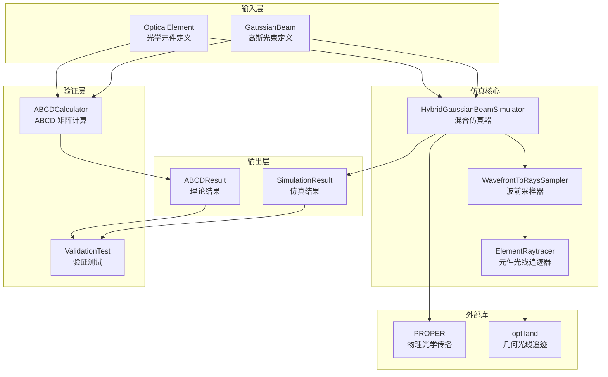
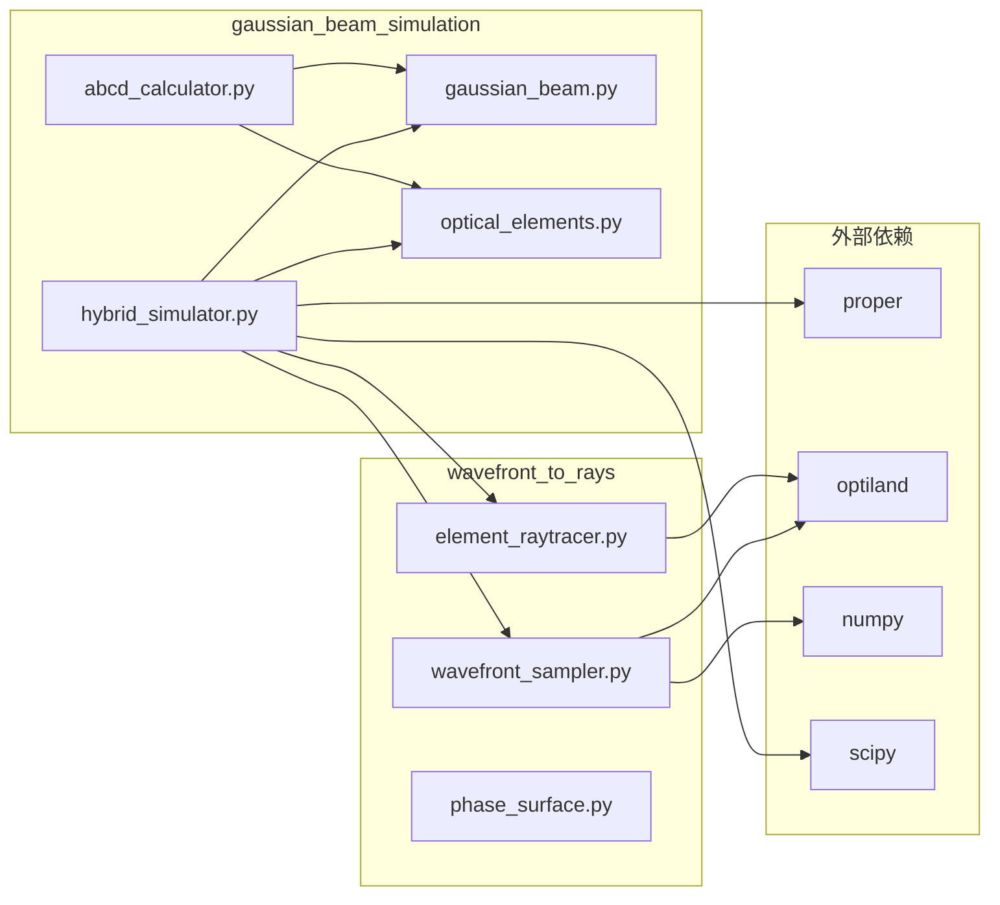
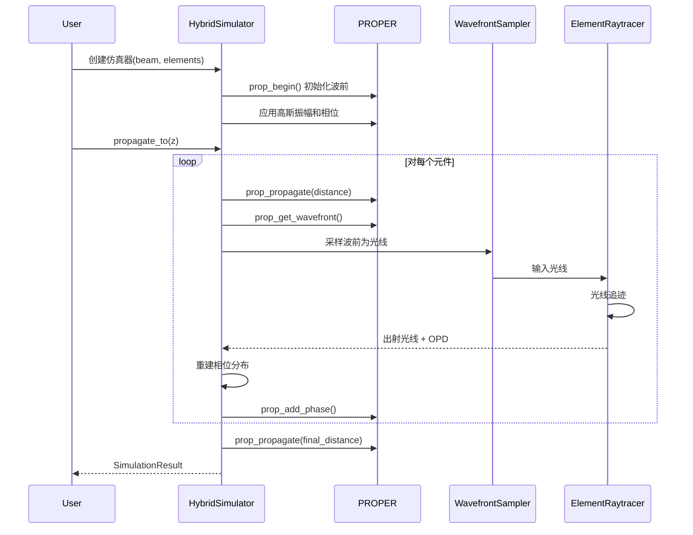

# 设计文档

## 概述

本设计文档描述高斯光束传输仿真模型的技术架构和实现方案。该模型结合 PROPER 物理光学传播和 optiland 几何光线追迹，实现高斯光束通过光学系统的混合仿真。

### 设计目标

1. **准确性**：仿真结果与 ABCD 矩阵理论计算的误差小于 5%
2. **灵活性**：支持多种光学元件和配置
3. **可扩展性**：易于添加新的元件类型和仿真功能
4. **可验证性**：提供完整的验证测试框架

### 核心工作流程

```
初始高斯光束 → PROPER 初始化 → 物理光学传播 → 元件处混合追迹 → 波前重建 → 继续传播 → 输出结果
```

## 架构

### 系统架构图



### 模块依赖关系



## 组件和接口

### 1. GaussianBeam 类

高斯光束定义类，负责管理光束参数和生成波前。

```python
@dataclass
class GaussianBeam:
    """高斯光束定义
    
    参数:
        wavelength: 波长（μm）
        w0: 束腰半径（mm）
        z0: 束腰位置（mm）
        m2: M² 因子，默认 1.0
        z_init: 初始面位置（mm）
        wavefront_error: 波前误差函数，可选
    """
    wavelength: float
    w0: float
    z0: float
    m2: float = 1.0
    z_init: float = 0.0
    wavefront_error: Optional[Callable[[NDArray, NDArray], NDArray]] = None
    
    @property
    def zR(self) -> float:
        """瑞利距离（mm）"""
        pass
    
    def w(self, z: float) -> float:
        """计算位置 z 处的光束半径"""
        pass
    
    def R(self, z: float) -> float:
        """计算位置 z 处的波前曲率半径"""
        pass
    
    def generate_wavefront(
        self,
        grid_size: int,
        physical_size: float,
        z: Optional[float] = None,
    ) -> NDArray:
        """生成波前复振幅"""
        pass
```

### 2. OpticalElement 类层次

光学元件定义的抽象基类和具体实现。

```python
@dataclass
class OpticalElement(ABC):
    """光学元件基类"""
    z_position: float
    semi_aperture: float
    tilt_x: float = 0.0
    tilt_y: float = 0.0
    decenter_x: float = 0.0
    decenter_y: float = 0.0
    name: Optional[str] = None
    
    @property
    @abstractmethod
    def focal_length(self) -> float:
        pass
    
    @abstractmethod
    def get_surface_definition(self):
        pass

@dataclass
class ParabolicMirror(OpticalElement):
    """抛物面反射镜"""
    parent_focal_length: float = 100.0
    
@dataclass
class SphericalMirror(OpticalElement):
    """球面反射镜"""
    radius_of_curvature: float = 200.0

@dataclass
class ThinLens(OpticalElement):
    """薄透镜"""
    focal_length_value: float = 50.0
```

### 3. HybridGaussianBeamSimulator 类

混合仿真器核心类，协调物理光学和几何光学的混合仿真。

```python
class HybridGaussianBeamSimulator:
    """混合高斯光束传输仿真器
    
    参数:
        beam: 高斯光束对象
        elements: 光学元件列表
        grid_size: 网格大小，默认 512
        beam_ratio: 光束直径与网格比例，默认 0.3
        num_rays: 光线采样数量，默认 200
        use_hybrid: 是否使用混合方法，默认 True
    """
    
    def __init__(
        self,
        beam: GaussianBeam,
        elements: List[OpticalElement],
        grid_size: int = 512,
        beam_ratio: float = 0.3,
        num_rays: int = 200,
        use_hybrid: bool = True,
    ) -> None:
        pass
    
    def propagate_to(self, z: float) -> SimulationResult:
        """传播到指定位置"""
        pass
    
    def reset(self) -> None:
        """重置仿真器"""
        pass
    
    def get_psf(self) -> Tuple[NDArray, float]:
        """获取 PSF"""
        pass
```

### 4. ABCDCalculator 类

ABCD 矩阵计算器，用于理论验证。

```python
class ABCDCalculator:
    """ABCD 矩阵计算器
    
    参数:
        beam: 高斯光束对象
        elements: 光学元件列表
    """
    
    def __init__(
        self,
        beam: GaussianBeam,
        elements: List[OpticalElement],
    ) -> None:
        pass
    
    def propagate_to(self, z: float) -> ABCDResult:
        """传播到指定位置"""
        pass
    
    def get_output_waist(self) -> Tuple[float, float]:
        """获取输出束腰位置和半径"""
        pass
    
    def trace_beam_profile(
        self,
        z_start: float,
        z_end: float,
        num_points: int = 100,
    ) -> Tuple[NDArray, NDArray, NDArray]:
        """追迹光束轮廓"""
        pass
```

### 5. 数据类

```python
@dataclass
class SimulationResult:
    """仿真结果"""
    z: float
    amplitude: NDArray
    phase: NDArray
    wavefront: NDArray
    sampling: float
    beam_radius: float
    wavefront_rms: float
    wavefront_pv: float

@dataclass
class ABCDResult:
    """ABCD 计算结果"""
    z: float
    q: complex
    w: float
    R: float
    gouy_phase: float
    waist_position: float
    waist_radius: float

@dataclass
class PropagationStep:
    """传播步骤记录"""
    step_type: str
    z_start: float
    z_end: float
    element: Optional[OpticalElement] = None
    result: Optional[SimulationResult] = None
    notes: str = ""
```

## 数据模型

### 坐标系统

采用右手坐标系，与 optiland 保持一致：

```
        Y (向上)
        |
        |
        |________ Z (光轴方向，光传播方向)
       /
      /
     X (指向屏幕内)
```

### 单位约定

| 物理量 | 单位 | 说明 |
|--------|------|------|
| 长度 | mm | 位置、尺寸、焦距等 |
| 波长 | μm | 光波长 |
| 角度 | rad | 旋转角度 |
| 相位 | rad | 波前相位 |
| OPD | waves | 光程差（波长数） |

### 数据流




## 正确性属性

*正确性属性是系统在所有有效执行中应保持为真的特征或行为——本质上是关于系统应该做什么的形式化陈述。属性作为人类可读规范和机器可验证正确性保证之间的桥梁。*

基于需求分析和 prework 分析，以下是本系统的核心正确性属性：

### Property 1: 高斯光束参数计算正确性

*For any* 有效的高斯光束参数（w0 > 0, M² >= 1.0, λ > 0），计算得到的瑞利距离、光束半径和波前曲率半径应满足高斯光束理论公式：
- zR = π * w0² / (M² * λ)
- w(z) = w0 * sqrt(1 + ((z - z0) / zR)²)
- R(z) = (z - z0) * (1 + (zR / (z - z0))²)，当 z ≠ z0

**Validates: Requirements 1.8, 1.9, 1.10**

### Property 2: 参数验证正确性

*For any* 输入参数，系统应正确验证：
- 正值参数（w0, semi_aperture, wavelength）必须为正值，否则抛出 ValueError
- M² 因子必须 >= 1.0，否则抛出 ValueError
- 任意实数参数（z0, z_init, z_position, tilt_x, tilt_y, decenter_x, decenter_y）应接受任意有限实数值

**Validates: Requirements 1.1, 1.3, 2.5, 9.1, 9.2, 9.3, 9.4**

### Property 3: 波前生成正确性

*For any* 有效的高斯光束配置和网格参数，生成的波前复振幅应满足：
- 振幅分布为高斯函数：A(r) ∝ exp(-r² / w(z)²)
- 相位分布包含球面波前相位：φ(r) = -k * r² / (2 * R(z))（当 R(z) 有限时）
- 如果指定了波前误差函数，相位应包含附加误差

**Validates: Requirements 1.11, 3.2, 3.3**

### Property 4: ABCD 矩阵计算正确性

*For any* 有效的传播距离 d 和焦距 f，ABCD 矩阵应满足：
- 自由空间传播矩阵：[[1, d], [0, 1]]
- 薄透镜/反射镜矩阵：[[1, 0], [-1/f, 1]]
- 复光束参数变换：q' = (A*q + B) / (C*q + D)

**Validates: Requirements 7.2, 7.3, 7.4**

### Property 5: 光学元件方向计算正确性

*For any* 光学元件的旋转参数（tilt_x, tilt_y），计算得到的主光线方向应满足：
- 方向余弦归一化：L² + M² + N² = 1
- 无旋转时方向为 (0, 0, 1)
- 旋转后方向符合旋转矩阵变换

**Validates: Requirements 2.11**

### Property 6: 仿真精度验证

*For any* 有效的高斯光束和单个抛物面反射镜配置，混合仿真计算的输出束腰位置和半径与 ABCD 矩阵理论计算的误差应小于 5%：
- |waist_position_sim - waist_position_theory| / |waist_position_theory| < 0.05
- |waist_radius_sim - waist_radius_theory| / waist_radius_theory < 0.05

**Validates: Requirements 8.4, 8.5**

### Property 7: 束腰处波前曲率半径

*For any* 高斯光束，在束腰位置（z = z0）处，波前曲率半径应趋近于无穷大（平场波前）：
- |1/R(z0)| < ε，其中 ε 为小量（如 1e-10）

**Validates: Requirements 8.7**

### Property 8: 元件顺序处理

*For any* 包含多个光学元件的系统，仿真器应按元件 z_position 从小到大的顺序依次处理元件。

**Validates: Requirements 6.2**

### Property 9: 仿真结果完整性

*For any* 仿真结果 SimulationResult，应包含所有必需字段：
- amplitude: 非空 2D 数组
- phase: 与 amplitude 形状相同的 2D 数组
- sampling: 正值
- beam_radius: 非负值
- wavefront_rms: 非负值
- wavefront_pv: 非负值

**Validates: Requirements 6.6, 6.7, 6.8**

### Property 10: 相位重建网格一致性

*For any* 波前重建操作，重建的相位分布网格大小应与输入网格大小一致。

**Validates: Requirements 5.4**

### Property 11: 方形均匀采样覆盖

*For any* 使用方形均匀采样的波前采样操作，采样光线应均匀分布在整个方形区域内，覆盖率应接近 100%。

**Validates: Requirements 4.3**

## 错误处理

### 异常类型层次

```python
class GaussianBeamSimulationError(Exception):
    """高斯光束仿真基础异常"""
    pass

class BeamParameterError(GaussianBeamSimulationError):
    """光束参数错误"""
    pass

class ElementConfigurationError(GaussianBeamSimulationError):
    """元件配置错误"""
    pass

class PropagationError(GaussianBeamSimulationError):
    """传播计算错误"""
    pass

class ReconstructionError(GaussianBeamSimulationError):
    """波前重建错误"""
    pass
```

### 错误处理策略

| 错误类型 | 处理方式 | 说明 |
|----------|----------|------|
| 参数验证失败 | 抛出 ValueError | 提供明确的错误信息 |
| 类型错误 | 抛出 TypeError | 说明期望类型和实际类型 |
| 光线追迹失败 | 记录警告，返回默认值 | 继续执行，不中断仿真 |
| PROPER 初始化失败 | 抛出 RuntimeError | 提供诊断信息 |
| 有效光线不足 | 记录警告，返回零相位 | 继续执行，不中断仿真 |

## 测试策略

### 双重测试方法

本项目采用单元测试和属性基测试相结合的方法：

- **单元测试**：验证特定示例、边界条件和错误处理
- **属性基测试**：验证所有有效输入的通用属性

### 属性基测试配置

- 使用 **hypothesis** 库进行属性基测试
- 每个属性测试至少运行 **100 次迭代**
- 每个测试用注释标注对应的设计属性

### 测试标注格式

```python
# Feature: gaussian-beam-simulation, Property 1: 高斯光束参数计算正确性
@given(
    w0=st.floats(min_value=0.1, max_value=10.0),
    m2=st.floats(min_value=1.0, max_value=3.0),
    wavelength=st.floats(min_value=0.3, max_value=1.0),
)
def test_gaussian_beam_parameter_calculation(w0, m2, wavelength):
    """验证高斯光束参数计算正确性"""
    pass
```

### 测试覆盖范围

| 测试类型 | 覆盖内容 | 优先级 |
|----------|----------|--------|
| 单元测试 | 参数验证、边界条件、错误处理 | 高 |
| 属性测试 | 计算正确性、不变量、往返属性 | 高 |
| 集成测试 | 完整仿真流程、模块交互 | 中 |
| 验证测试 | 与 ABCD 理论对比 | 高 |

### 验证测试场景

1. **单抛物面反射镜测试**
   - 输入：平面波前（束腰在无穷远）
   - 预期：输出束腰位于反射镜焦点
   - 验证：束腰位置误差 < 5%

2. **高斯光束聚焦测试**
   - 输入：发散高斯光束（束腰在反射镜前方）
   - 预期：输出束腰位置由 ABCD 矩阵计算
   - 验证：束腰位置和半径误差 < 5%

3. **M² 因子影响测试**
   - 输入：不同 M² 因子的高斯光束
   - 预期：瑞利距离随 M² 增大而减小
   - 验证：zR ∝ 1/M²
