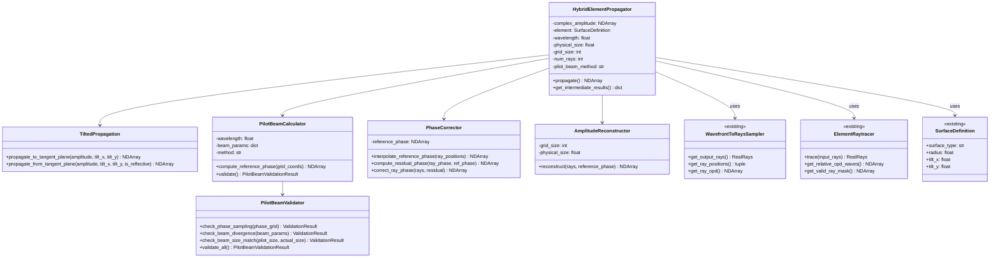

# 设计文档

## 概述

本设计文档描述了"混合元件传播"（Hybrid Element Propagation）功能的技术架构和实现方案。该功能实现在带有倾斜的光学元器件处的完整波前-光线-波前重建流程，是混合光学仿真系统的核心组件。

### 核心数据流

```
入射面复振幅 (Entrance Plane)
        │
        ▼ [Tilted ASM 正向传播]
切平面复振幅A(Tangent Plane - 局部坐标系)
        │
        ▼ [波前采样]：在Optiland中从入射光光轴方向发出光线，穿过在全局坐标系中摆放的切平面相位元件，以及待追迹实际曲面元件，最后再次入射切平面位置（可以设置为一个默认material的surface）
出射光线 (Rays with OPD) （OPD来源于相位元件引入的OPD，以及光学追迹过程中的切平面-元件表面-切平面的OPD），得到了切平面上的光线分布，以及强度、相位等信息。 
        │
        ▼ [Pilot Beam 相位修正]：
切平面修正后光线 (Corrected Rays)
        │
        ▼ [复振幅重建]
切平面复振幅 (Tangent Plane - 局部坐标系)
        │
        ▼ [Tilted ASM 反向传播]
出射面复振幅 (Exit Plane)
```

## 架构

### 复用现有模块

本设计最大化复用项目中已有的模块：

| 现有模块 | 位置 | 复用方式 |
|---------|------|---------|
| `WavefrontToRaysSampler` | `src/wavefront_to_rays/wavefront_sampler.py` | 直接复用，用于切平面波前采样 |
| `ElementRaytracer` | `src/wavefront_to_rays/element_raytracer.py` | 直接复用，用于元件光线追迹 |
| `SurfaceDefinition` | `src/wavefront_to_rays/element_raytracer.py` | 直接复用，用于元件定义 |
| `tilted_asm` | `angular_spectrum_method/tilted_asm.py` | 直接复用，用于倾斜平面传播 |
| `OpticalAxisTracker` | `src/sequential_system/coordinate_tracking.py` | 复用坐标系跟踪功能 |
| `RayDirection`, `Position3D` | `src/sequential_system/coordinate_tracking.py` | 复用坐标系数据结构 |
| `SequentialSystemError`, `SimulationError` | `src/sequential_system/exceptions.py` | 复用异常类 |
| `compute_rotation_matrix` | `src/wavefront_to_rays/element_raytracer.py` | 复用旋转矩阵计算 |

### 新增模块结构

```
src/hybrid_propagation/
├── __init__.py
├── propagator.py           # HybridElementPropagator 主类
├── tilted_propagation.py   # 倾斜平面传播封装（封装 tilted_asm）
├── pilot_beam.py           # Pilot Beam 计算和验证（新增）
├── phase_correction.py     # 相位修正模块（新增）
└── amplitude_reconstruction.py  # 复振幅重建模块（新增）
```

**注意**：异常类复用 `src/sequential_system/exceptions.py` 中的定义，不新建异常模块。

### 类图



## 组件和接口

### 1. HybridElementPropagator（主类）

主入口类，协调整个混合传播流程。复用 `WavefrontToRaysSampler` 和 `ElementRaytracer`。

```python
from wavefront_to_rays.wavefront_sampler import WavefrontToRaysSampler
from wavefront_to_rays.element_raytracer import ElementRaytracer, SurfaceDefinition

class HybridElementPropagator:
    """混合元件传播器
    
    在光学元件处执行完整的波前-光线-波前重建流程。
    
    参数:
        complex_amplitude: 入射面复振幅数组，形状 (N, N)
        element: 光学元件定义 (SurfaceDefinition)，复用现有类
        wavelength: 波长，单位 μm
        physical_size: 波前物理尺寸（直径），单位 mm
        grid_size: 输出网格大小，默认与输入相同
        num_rays: 采样光线数量，默认 100
        pilot_beam_method: Pilot Beam 方法，'proper' 或 'analytical'
        entrance_direction: 入射主光线方向 (L, M, N)
        entrance_position: 入射面中心位置 (x, y, z)，单位 mm
    """
    
    def propagate(self) -> NDArray:
        """执行完整的混合传播
        
        内部流程：
        1. 使用 TiltedPropagation 从入射面传播到切平面
        2. 使用 WavefrontToRaysSampler（复用）采样为光线
        3. 使用 ElementRaytracer（复用）追迹光线
        4. 使用 PilotBeamCalculator 计算参考相位
        5. 使用 PhaseCorrector 修正相位
        6. 使用 AmplitudeReconstructor 重建复振幅
        7. 使用 TiltedPropagation 从切平面传播到出射面
        
        返回:
            出射面复振幅数组，形状 (grid_size, grid_size)
        """
        pass
    
    def get_intermediate_results(self) -> dict:
        """获取中间结果
        
        返回:
            包含以下键的字典:
            - 'tangent_amplitude_in': 切平面输入复振幅
            - 'rays_in': 输入光线 (RealRays)
            - 'rays_out': 输出光线 (RealRays)
            - 'pilot_phase': Pilot Beam 参考相位
            - 'residual_phase': 残差相位
            - 'tangent_amplitude_out': 切平面输出复振幅
            - 'validation_result': Pilot Beam 验证结果
        """
        pass
```

### 2. TiltedPropagation（倾斜传播模块）

封装 `angular_spectrum_method/tilted_asm.py` 中的 `tilted_asm` 函数。

```python
from angular_spectrum_method.tilted_asm import tilted_asm
from scipy.spatial.transform import Rotation

class TiltedPropagation:
    """倾斜平面传播
    
    封装 tilted_asm 功能，处理入射面/出射面与切平面之间的传播。
    
    参数:
        wavelength: 波长，单位 mm（注意：与主类单位不同，需要转换）
        dx: x 方向采样间隔，单位 mm
        dy: y 方向采样间隔，单位 mm
    """
    
    def propagate_to_tangent_plane(
        self,
        amplitude: NDArray,
        tilt_x: float,
        tilt_y: float,
    ) -> NDArray:
        """从入射面传播到切平面
        
        使用 tilted_asm 计算倾斜传播。
        
        参数:
            amplitude: 入射面复振幅
            tilt_x: 元件绕 X 轴倾斜角度（弧度）
            tilt_y: 元件绕 Y 轴倾斜角度（弧度）
        
        返回:
            切平面复振幅（在切平面局部坐标系中）
        """
        # 计算旋转矩阵
        T = self._compute_rotation_matrix(tilt_x, tilt_y)
        
        # 调用 tilted_asm
        return tilted_asm(amplitude, self.wavelength, self.dx, self.dy, T)
    
    def propagate_from_tangent_plane(
        self,
        amplitude: NDArray,
        tilt_x: float,
        tilt_y: float,
        is_reflective: bool,
    ) -> NDArray:
        """从切平面传播到出射面
        
        参数:
            amplitude: 切平面复振幅
            tilt_x: 元件绕 X 轴倾斜角度（弧度）
            tilt_y: 元件绕 Y 轴倾斜角度（弧度）
            is_reflective: 是否为反射元件
        
        返回:
            出射面复振幅（在出射面全局坐标系中）
        """
        # 计算出射方向的旋转矩阵
        T = self._compute_exit_rotation_matrix(tilt_x, tilt_y, is_reflective)
        
        # 调用 tilted_asm（反向传播）
        return tilted_asm(amplitude, self.wavelength, self.dx, self.dy, T)
    
    @staticmethod
    def _compute_rotation_matrix(tilt_x: float, tilt_y: float) -> NDArray:
        """计算从入射面到切平面的旋转矩阵
        
        使用 scipy.spatial.transform.Rotation 生成旋转矩阵。
        """
        # 先绕 X 轴旋转，再绕 Y 轴旋转
        r = Rotation.from_euler('xy', [tilt_x, tilt_y], degrees=False)
        return r.as_matrix()
    
    @staticmethod
    def _compute_exit_rotation_matrix(
        tilt_x: float,
        tilt_y: float,
        is_reflective: bool,
    ) -> NDArray:
        """计算从切平面到出射面的旋转矩阵
        
        对于反射元件，需要考虑反射后的光轴方向变化。
        """
        pass
```

### 3. PilotBeamCalculator（Pilot Beam 计算器）

计算 Pilot Beam 参考相位，支持两种方法。

```python
class PilotBeamCalculator:
    """Pilot Beam 参考相位计算器
    
    参数:
        wavelength: 波长，单位 μm
        beam_waist: 光束束腰半径，单位 mm
        beam_waist_position: 束腰位置（相对于元件），单位 mm
        element_focal_length: 元件焦距，单位 mm
        method: 计算方法，'proper' 或 'analytical'
    """
    
    def compute_reference_phase(
        self,
        x_coords: NDArray,
        y_coords: NDArray,
    ) -> NDArray:
        """计算参考相位
        
        参数:
            x_coords: x 坐标数组，单位 mm
            y_coords: y 坐标数组，单位 mm
        
        返回:
            参考相位数组（弧度）
        """
        pass
    
    def compute_reference_phase_proper(
        self,
        x_coords: NDArray,
        y_coords: NDArray,
    ) -> NDArray:
        """方案 A：使用 PROPER 计算参考相位
        
        1. 创建理想高斯光束
        2. 使用 PROPER 传播到切平面（薄相位元件近似）
        3. 使用 tilted_asm 反向传播回镜面切面
        """
        pass
    
    def compute_reference_phase_analytical(
        self,
        x_coords: NDArray,
        y_coords: NDArray,
    ) -> NDArray:
        """方案 B：解析计算参考相位
        
        1. 设置理想高斯光束 Pilot Beam
        2. 计算其在镜面反射后（取镜面顶点处的理论曲率）
           切平面上各位置的波前相位
        """
        pass
    
    def validate(self) -> 'PilotBeamValidationResult':
        """验证 Pilot Beam 适用性"""
        pass
```

### 4. PilotBeamValidator（Pilot Beam 验证器）

检测 Pilot Beam 方法的适用性。

```python
@dataclass
class ValidationResult:
    """单项验证结果"""
    passed: bool
    message: str
    value: Optional[float] = None
    threshold: Optional[float] = None

@dataclass
class PilotBeamValidationResult:
    """Pilot Beam 验证结果"""
    is_valid: bool
    phase_sampling: ValidationResult
    beam_divergence: ValidationResult
    beam_size_match: ValidationResult
    max_phase_gradient: float
    mean_phase_gradient: float
    warnings: List[str]

class PilotBeamValidator:
    """Pilot Beam 适用性验证器
    
    参数:
        phase_grid: 参考相位网格
        dx: x 方向采样间隔
        dy: y 方向采样间隔
        pilot_beam_size: Pilot Beam 光束尺寸
        actual_beam_size: 实际光束尺寸
        beam_divergence: 光束发散角
    """
    
    def check_phase_sampling(self) -> ValidationResult:
        """检查相位采样是否充足
        
        检查相邻像素间的相位差是否超过 π/2
        """
        pass
    
    def check_beam_divergence(
        self,
        max_divergence: float = 0.1,  # 弧度
    ) -> ValidationResult:
        """检查光束发散角是否过大"""
        pass
    
    def check_beam_size_match(
        self,
        max_ratio: float = 1.5,
    ) -> ValidationResult:
        """检查 Pilot Beam 与实际光束尺寸匹配度
        
        差异超过 50% 时发出警告
        """
        pass
    
    def validate_all(self) -> PilotBeamValidationResult:
        """执行所有验证检查"""
        pass
```

### 5. PhaseCorrector（相位修正器）

计算并应用相位修正。

```python
class PhaseCorrector:
    """相位修正器
    
    参数:
        reference_phase: 参考相位网格
        x_coords: x 坐标数组
        y_coords: y 坐标数组
    """
    
    def interpolate_reference_phase(
        self,
        ray_x: NDArray,
        ray_y: NDArray,
    ) -> NDArray:
        """在光线位置插值参考相位
        
        使用双线性插值获取每条光线位置的参考相位值。
        """
        pass
    
    def compute_residual_phase(
        self,
        ray_phase: NDArray,
        reference_phase_at_rays: NDArray,
    ) -> NDArray:
        """计算残差相位
        
        残差相位 = 实际相位 - 参考相位
        结果包裹到 [-π, π] 范围
        """
        pass
    
    def correct_ray_phase(
        self,
        ray_opd_waves: NDArray,
        residual_phase: NDArray,
        wavelength: float,
    ) -> NDArray:
        """修正光线相位
        
        从光线 OPD 中减去残差相位对应的 OPD
        """
        pass
    
    def check_residual_range(
        self,
        residual_phase: NDArray,
    ) -> Tuple[bool, List[str]]:
        """检查残差相位范围
        
        如果残差超出 [-π, π]，返回警告信息
        """
        pass
```

### 6. AmplitudeReconstructor（复振幅重建器）

从光线数据重建复振幅场。

```python
class AmplitudeReconstructor:
    """复振幅重建器
    
    从光线数据重建网格化的复振幅场。
    
    参数:
        grid_size: 输出网格大小
        physical_size: 物理尺寸（直径），单位 mm
        wavelength: 波长，单位 μm
    """
    
    def reconstruct(
        self,
        ray_x: NDArray,
        ray_y: NDArray,
        ray_intensity: NDArray,
        ray_opd_waves: NDArray,
        reference_phase: NDArray,
        valid_mask: NDArray,
    ) -> NDArray:
        """重建复振幅
        
        参数:
            ray_x, ray_y: 光线位置
            ray_intensity: 光线强度
            ray_opd_waves: 光线 OPD（波长数）
            reference_phase: 参考相位网格
            valid_mask: 有效光线掩模
        
        返回:
            复振幅数组，形状 (grid_size, grid_size)
        """
        pass
    
    def _interpolate_to_grid(
        self,
        ray_x: NDArray,
        ray_y: NDArray,
        ray_values: NDArray,
        valid_mask: NDArray,
    ) -> NDArray:
        """将光线数据插值到网格
        
        使用 scipy.interpolate.griddata 进行插值
        """
        pass
    
    def _apply_reference_phase(
        self,
        amplitude: NDArray,
        phase: NDArray,
        reference_phase: NDArray,
    ) -> NDArray:
        """将参考相位加回到重建的复振幅中"""
        pass
```

## 数据模型

### 输入数据

```python
@dataclass
class PropagationInput:
    """传播输入数据"""
    complex_amplitude: NDArray  # 入射面复振幅，形状 (N, N)
    wavelength: float           # 波长，单位 μm
    physical_size: float        # 物理尺寸，单位 mm
    element: SurfaceDefinition  # 元件定义
    entrance_direction: Tuple[float, float, float]  # 入射方向
    entrance_position: Tuple[float, float, float]   # 入射面位置
```

### 输出数据

```python
@dataclass
class PropagationOutput:
    """传播输出数据"""
    complex_amplitude: NDArray  # 出射面复振幅
    exit_direction: Tuple[float, float, float]  # 出射方向
    exit_position: Tuple[float, float, float]   # 出射面位置
    validation_result: PilotBeamValidationResult  # 验证结果
```

### 中间数据

```python
@dataclass
class IntermediateResults:
    """中间结果"""
    tangent_amplitude_in: NDArray   # 切平面输入复振幅
    rays_in: RealRays               # 输入光线
    rays_out: RealRays              # 输出光线
    pilot_phase: NDArray            # Pilot Beam 参考相位
    residual_phase: NDArray         # 残差相位
    tangent_amplitude_out: NDArray  # 切平面输出复振幅
```


## 正确性属性

*正确性属性是系统应该在所有有效执行中保持为真的特性或行为——本质上是关于系统应该做什么的形式化陈述。属性作为人类可读规范和机器可验证正确性保证之间的桥梁。*


### Property 1: 能量守恒

*For any* 有效的输入复振幅和光学元件配置，执行完整的混合传播流程后，出射面复振幅的总能量（振幅平方和）与入射面复振幅的总能量之比应在 [0.99, 1.01] 范围内。

**Validates: Requirements 1.4, 8.4**

### Property 2: 旋转矩阵正交性

*For any* 倾斜角度 (tilt_x, tilt_y)，计算得到的旋转矩阵 R 应满足：
- R @ R.T = I（正交性）
- det(R) = 1（行列式为 1）

**Validates: Requirements 1.3, 8.2**

### Property 3: 光线方向余弦归一化

*For any* 采样生成的光线集合，每条光线的方向余弦 (L, M, N) 应满足 L² + M² + N² = 1。

**Validates: Requirements 2.2, 3.2**

### Property 4: 光线数量一致性

*For any* 配置的采样光线数量 num_rays，波前采样器生成的光线数量应等于 num_rays。

**Validates: Requirements 2.4**

### Property 5: 反射定律

*For any* 反射镜元件和入射光线，出射光线方向应满足反射定律：r = d - 2(d·n)n，其中 d 是入射方向，n 是表面法向量，r 是反射方向。

**Validates: Requirements 3.3**

### Property 6: 无效光线标记

*For any* 光线追迹场景，如果光线未能到达元件有效区域（超出半口径），则该光线应被标记为无效（强度为 0 或 NaN）。

**Validates: Requirements 3.6**

### Property 7: 相位采样质量

*For any* Pilot Beam 参考相位网格，相邻像素间的相位差的最大值应被正确计算，且当最大值超过 π/2 时应触发采样不足警告。

**Validates: Requirements 5.1, 5.2, 5.7**

### Property 8: Pilot Beam 适用性检测

*For any* Pilot Beam 和实际光束参数组合，验证器应正确检测：
- 光束发散角是否超过阈值
- 光束尺寸差异是否超过 50%
并在不满足条件时发出相应警告。

**Validates: Requirements 5.3, 5.4, 5.5, 5.6**

### Property 9: 残差相位包裹

*For any* 计算得到的残差相位值，应被正确包裹到 [-π, π] 范围内。

**Validates: Requirements 6.4**

### Property 10: 相位插值一致性

*For any* 参考相位网格和光线位置，在网格节点位置的插值结果应与网格值完全一致（误差 < 1e-10）。

**Validates: Requirements 6.1**

### Property 11: 复振幅重建完整性

*For any* 有效的光线数据集，重建的复振幅数组应：
- 形状为 (grid_size, grid_size)
- 在有效光线覆盖区域内有非零值
- 在无效区域内为零或 NaN

**Validates: Requirements 7.3, 7.4, 7.5**

### Property 12: 参考相位加回

*For any* 重建的复振幅和参考相位，最终输出的相位应等于重建相位加上参考相位。

**Validates: Requirements 7.2**

### Property 13: 输入验证

*For any* 无效的输入参数（非正方形数组、非正波长、无效元件定义），HybridElementPropagator 应抛出 ValueError 并提供清晰的错误信息。

**Validates: Requirements 11.1, 11.2, 11.3**

### Property 14: 全光线无效处理

*For any* 导致所有光线都无效的配置（如元件半口径过小），HybridElementPropagator 应抛出 SimulationError。

**Validates: Requirements 11.4**

### Property 15: 正入射等价性

*For any* 无倾斜的元件（tilt_x=0, tilt_y=0），入射面到切平面的传播应返回与输入相同的复振幅（在数值精度范围内）。

**Validates: Requirements 1.2, 8.3**

### Property 16: 坐标系转换往返一致性

*For any* 光线数据，从入射面局部坐标系转换到全局坐标系，再转换回局部坐标系，应得到与原始数据相同的结果（在数值精度范围内）。

**Validates: Requirements 10.3**

## 错误处理

### 异常类型（复用现有）

复用 `src/sequential_system/exceptions.py` 中的异常类：

```python
from sequential_system.exceptions import (
    SequentialSystemError,  # 基类
    SimulationError,        # 仿真执行错误
    SamplingError,          # 采样错误
)

# 新增警告类型
class PilotBeamWarning(UserWarning):
    """Pilot Beam 适用性警告"""
    pass
```

### 错误处理策略

1. **输入验证错误**：在 `propagate()` 方法开始时验证所有输入参数，无效时立即抛出 `ValueError`。

2. **Pilot Beam 验证警告**：当 Pilot Beam 适用性检测失败时，发出 `ValidationWarning` 但继续执行。

3. **全光线无效**：当所有光线都无效时，抛出 `SimulationError` 并建议可能的解决方案（增大元件半口径、调整光束尺寸等）。

4. **残差相位过大**：当残差相位超出 [-π, π] 范围时，发出警告并记录日志，但继续执行。

## 测试策略

### 单元测试

单元测试用于验证各个组件的独立功能：

1. **TiltedPropagation 测试**
   - 旋转矩阵计算正确性
   - 正入射情况的等价性
   - 能量守恒

2. **PilotBeamCalculator 测试**
   - 两种方法的输出格式
   - 参考相位的合理性

3. **PilotBeamValidator 测试**
   - 相位采样检测
   - 发散角检测
   - 尺寸匹配检测

4. **PhaseCorrector 测试**
   - 插值准确性
   - 残差计算正确性
   - 相位包裹

5. **AmplitudeReconstructor 测试**
   - 网格插值
   - 参考相位加回
   - 无效区域处理

### 属性测试

属性测试使用 hypothesis 库验证通用属性：

```python
from hypothesis import given, strategies as st

# 配置：每个属性测试至少运行 100 次迭代
settings(max_examples=100)

@given(
    tilt_x=st.floats(min_value=-np.pi/4, max_value=np.pi/4),
    tilt_y=st.floats(min_value=-np.pi/4, max_value=np.pi/4),
)
def test_rotation_matrix_orthogonality(tilt_x, tilt_y):
    """
    **Feature: hybrid-element-propagation, Property 2: 旋转矩阵正交性**
    **Validates: Requirements 1.3, 8.2**
    """
    R = TiltedPropagation.compute_rotation_matrix(tilt_x, tilt_y)
    assert_allclose(R @ R.T, np.eye(3), atol=1e-10)
    assert_allclose(np.linalg.det(R), 1.0, atol=1e-10)
```

### 集成测试

集成测试验证完整的传播流程：

1. **简单反射镜测试**
   - 平面镜正入射
   - 凹面镜正入射
   - 45° 折叠镜

2. **能量守恒测试**
   - 不同网格大小
   - 不同光线数量
   - 不同元件类型

3. **与 SequentialOpticalSystem 集成测试**
   - 单元件系统
   - 多元件系统
   - 混合传播与纯 PROPER 传播对比

### 验证测试

与参考结果对比的验证测试：

1. **与纯 PROPER 传播对比**
   - 在几何光学极限下，混合传播结果应接近纯 PROPER 传播

2. **与解析解对比**
   - 简单系统（如平面镜、薄透镜）的解析解对比
