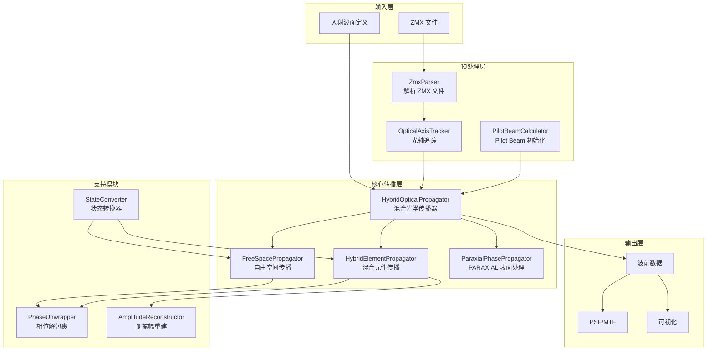

# 设计文档：混合光学传播系统

## 概述

本设计文档描述了混合光学传播系统的技术架构和实现方案。该系统将 PROPER 物理光学传输与 optiland 几何光线追迹相结合，对导入的 Zemax 序列模式光路结构进行高精度仿真。

### 核心功能

1. **入射波面定义**：理想高斯光束 × 初始复振幅像差
2. **光轴追踪**：预先追踪整个光学系统的主光轴
3. **自由空间传播**：使用 PROPER 执行面与面之间的衍射传播
4. **混合元件传播**：在材质变化处执行波前-光线-波前重建
5. **相位解包裹**：使用 Pilot Beam 参考相位解包裹 PROPER 折叠相位
6. **数据一致性**：在整个传播过程中保持仿真复振幅、Pilot Beam 参数和 PROPER 对象的一致性

### 设计原则

- **物理正确性**：严格遵循物理光学和几何光学原理
- **模块化设计**：各传播阶段独立封装，便于测试和维护
- **复用现有实现**：最大程度复用 zemax-optical-axis-tracing、hybrid-amplitude-reconstruction、phase-unwrapping-pilot-beam 等已有功能
- **禁止擅自使用傍轴近似**：仅对 ZMX 文件中明确标记为 PARAXIAL 的表面使用薄相位元件处理

## 架构

### 系统架构图



### 数据流

```
入射波面定义
    ↓
[初始化] 创建 PROPER 波前 + Pilot Beam 参数 + 仿真复振幅
    ↓
[光轴追踪] 预先追踪所有面的主光线位置和方向
    ↓
┌─────────────────────────────────────────────────────────────┐
│ 传播循环（对每个表面）                                        │
│                                                              │
│   [材质检测] 检测是否需要混合元件传播                         │
│       ↓                                                      │
│   ┌─────────────────┬─────────────────┬─────────────────┐   │
│   │ 同材质          │ 材质变化         │ PARAXIAL 表面   │   │
│   │ (空气→空气)     │ (反射/折射)      │ (理想薄透镜)    │   │
│   ├─────────────────┼─────────────────┼─────────────────┤   │
│   │ 自由空间传播    │ 混合元件传播     │ 薄相位元件处理  │   │
│   │ PROPER 衍射     │ 光线追迹+重建    │ 直接相位修正    │   │
│   └─────────────────┴─────────────────┴─────────────────┘   │
│       ↓                                                      │
│   [状态更新] 更新仿真复振幅 + Pilot Beam + PROPER 对象       │
│                                                              │
└─────────────────────────────────────────────────────────────┘
    ↓
输出波前数据
```


## 组件和接口

### 1. HybridOpticalPropagator（主类）

混合光学传播器，协调整个传播流程。

```python
class HybridOpticalPropagator:
    """混合光学传播器
    
    协调 PROPER 物理光学传输和 optiland 几何光线追迹，
    实现完整的混合光学传播仿真。
    
    属性:
        optical_system: 光学系统定义（从 ZMX 加载或手动定义）
        source: 入射波面定义
        wavelength_um: 波长 (μm)
        grid_size: 网格大小
        num_rays: 光线采样数量
    """
    
    def __init__(
        self,
        optical_system: "OpticalSystemDefinition",
        source: "SourceDefinition",
        wavelength_um: float,
        grid_size: int = 512,
        num_rays: int = 200,
        propagation_method: str = "local_raytracing",
    ) -> None:
        """初始化混合光学传播器
        
        参数:
            optical_system: 光学系统定义
            source: 入射波面定义（高斯光束 + 初始像差）
            wavelength_um: 波长 (μm)
            grid_size: 网格大小，默认 512
            num_rays: 光线采样数量，默认 200
            propagation_method: 元件传播方法
                - 'local_raytracing': 局部光线追迹方法（默认）
                - 'pure_diffraction': 纯衍射方法
        """
        self._optical_system = optical_system
        self._source = source
        self._wavelength_um = wavelength_um
        self._grid_size = grid_size
        self._num_rays = num_rays
        self._propagation_method = propagation_method
        
        # 内部状态
        self._optical_axis_tracker: OpticalAxisTracker = None
        self._pilot_beam_calculator: PilotBeamCalculator = None
        self._current_state: PropagationState = None
        self._surface_states: List[PropagationState] = []
    
    def propagate(self) -> "PropagationResult":
        """执行完整传播
        
        返回:
            PropagationResult 包含最终波前和中间结果
        """
        ...
    
    def propagate_to_surface(self, surface_index: int) -> "PropagationState":
        """传播到指定表面
        
        参数:
            surface_index: 目标表面索引
        
        返回:
            该表面处的传播状态
        """
        ...
    
    def get_wavefront_at_surface(self, surface_index: int) -> np.ndarray:
        """获取指定表面的波前复振幅
        
        参数:
            surface_index: 表面索引
        
        返回:
            复振幅数组 (grid_size × grid_size)
        """
        ...
    
    def get_state_at_surface(self, surface_index: int) -> "PropagationState":
        """获取指定表面的完整传播状态
        
        参数:
            surface_index: 表面索引
        
        返回:
            PropagationState 对象
        """
        ...
    
    def get_grid_sampling(self, surface_index: int) -> "GridSampling":
        """获取指定表面的网格采样信息
        
        参数:
            surface_index: 表面索引
        
        返回:
            GridSampling 对象
        """
        ...
```

### 2. PropagationState（传播状态）

存储传播过程中的完整状态信息。

```python
@dataclass
class PropagationState:
    """传播状态
    
    存储传播过程中某一位置的完整状态信息，
    包括仿真复振幅、Pilot Beam 参数和 PROPER 对象。
    
    属性:
        surface_index: 表面索引
        position: 'entrance' 或 'exit'
        simulation_amplitude: 仿真复振幅（非折叠相位）
        pilot_beam_params: Pilot Beam 参数
        proper_wfo: PROPER 波前对象
        optical_axis_state: 光轴状态
        grid_sampling: 网格采样信息
    """
    surface_index: int
    position: str  # 'entrance' or 'exit'
    simulation_amplitude: np.ndarray  # complex, shape (N, N)
    pilot_beam_params: "PilotBeamParams"
    proper_wfo: Any  # PROPER wavefront object
    optical_axis_state: "OpticalAxisState"
    grid_sampling: "GridSampling"
    
    def validate_consistency(self) -> bool:
        """验证三种数据表示的一致性
        
        检查仿真复振幅、Pilot Beam 参数和 PROPER 对象
        在物理上是否等价。
        
        返回:
            True 如果一致，False 否则
        """
        ...
```

### 3. FreeSpacePropagator（自由空间传播器）

执行面与面之间的自由空间衍射传播。

```python
class FreeSpacePropagator:
    """自由空间传播器
    
    使用 PROPER 执行面与面之间的衍射传播，
    支持正向和逆向传播。
    
    属性:
        wavelength_um: 波长 (μm)
    """
    
    def __init__(self, wavelength_um: float) -> None:
        self._wavelength_um = wavelength_um
    
    def propagate(
        self,
        state: PropagationState,
        target_axis_state: OpticalAxisState,
    ) -> PropagationState:
        """执行自由空间传播
        
        参数:
            state: 当前传播状态
            target_axis_state: 目标位置的光轴状态
        
        返回:
            传播后的状态
        
        说明:
            - 传播距离由主光线交点连线计算
            - 如果方向与主光线相同，距离为正（正向传播）
            - 如果方向与主光线相反，距离为负（逆向传播）
        """
        ...
    
    def _compute_propagation_distance(
        self,
        current_position: np.ndarray,
        target_position: np.ndarray,
        current_direction: np.ndarray,
    ) -> float:
        """计算传播距离（带符号）
        
        参数:
            current_position: 当前位置 (mm)
            target_position: 目标位置 (mm)
            current_direction: 当前光轴方向（单位向量）
        
        返回:
            传播距离 (mm)，正值表示正向，负值表示逆向
        """
        displacement = target_position - current_position
        distance = np.linalg.norm(displacement)
        
        # 判断方向
        if distance > 1e-10:
            direction = displacement / distance
            dot_product = np.dot(direction, current_direction)
            if dot_product < 0:
                distance = -distance
        
        return distance
```

### 4. HybridElementPropagator（混合元件传播器）

执行元件处的混合传播仿真。

```python
class HybridElementPropagator:
    """混合元件传播器
    
    在材质变化处执行波前-光线-波前重建流程。
    支持局部光线追迹方法和纯衍射方法。
    
    属性:
        wavelength_um: 波长 (μm)
        num_rays: 光线采样数量
        method: 传播方法 ('local_raytracing' 或 'pure_diffraction')
    """
    
    def __init__(
        self,
        wavelength_um: float,
        num_rays: int = 200,
        method: str = "local_raytracing",
    ) -> None:
        self._wavelength_um = wavelength_um
        self._num_rays = num_rays
        self._method = method
    
    def propagate(
        self,
        state: PropagationState,
        surface: "GlobalSurfaceDefinition",
        entrance_axis: OpticalAxisState,
        exit_axis: OpticalAxisState,
    ) -> PropagationState:
        """执行混合元件传播
        
        参数:
            state: 入射面传播状态
            surface: 表面定义
            entrance_axis: 入射光轴状态
            exit_axis: 出射光轴状态
        
        返回:
            出射面传播状态
        """
        if self._method == "local_raytracing":
            return self._propagate_local_raytracing(
                state, surface, entrance_axis, exit_axis
            )
        else:
            return self._propagate_pure_diffraction(
                state, surface, entrance_axis, exit_axis
            )
    
    def _propagate_local_raytracing(
        self,
        state: PropagationState,
        surface: "GlobalSurfaceDefinition",
        entrance_axis: OpticalAxisState,
        exit_axis: OpticalAxisState,
    ) -> PropagationState:
        """局部光线追迹方法
        
        流程:
        1. 从入射面采样光线（使用非折叠相位）
        2. 使用 ElementRaytracer 进行光线追迹
        3. 计算 OPD 和雅可比矩阵振幅
        4. 使用 RayToWavefrontReconstructor 重建复振幅
        5. 转换为 PROPER 形式
        """
        ...
    
    def _propagate_pure_diffraction(
        self,
        state: PropagationState,
        surface: "GlobalSurfaceDefinition",
        entrance_axis: OpticalAxisState,
        exit_axis: OpticalAxisState,
    ) -> PropagationState:
        """纯衍射方法
        
        流程:
        1. 使用 tilted_asm 从入射面传播到元件切平面
        2. 在切平面计算表面矢高并应用相位延迟
        3. 使用 tilted_asm 从切平面传播到出射面
        """
        ...
```


### 5. StateConverter（状态转换器）

在仿真复振幅和 PROPER 复振幅之间进行转换。

```python
class StateConverter:
    """状态转换器
    
    在仿真复振幅（非折叠相位）和 PROPER 复振幅（相对于参考球面）
    之间进行转换。
    
    属性:
        wavelength_um: 波长 (μm)
    """
    
    def __init__(self, wavelength_um: float) -> None:
        self._wavelength_um = wavelength_um
    
    def proper_to_simulation(
        self,
        wfo: Any,
        pilot_beam_params: "PilotBeamParams",
        grid_sampling: "GridSampling",
    ) -> np.ndarray:
        """从 PROPER 提取仿真复振幅
        
        流程:
        1. 从 PROPER 提取折叠相位
        2. 使用 Pilot Beam 参考相位解包裹
        3. 组合振幅和非折叠相位
        
        参数:
            wfo: PROPER 波前对象
            pilot_beam_params: Pilot Beam 参数
            grid_sampling: 网格采样信息
        
        返回:
            仿真复振幅（非折叠相位）
        """
        import proper
        
        # 提取振幅和折叠相位
        amplitude = proper.prop_get_amplitude(wfo)
        wrapped_phase = proper.prop_get_phase(wfo)
        
        # 计算 Pilot Beam 参考相位
        pilot_phase = self._compute_pilot_phase(
            pilot_beam_params, grid_sampling
        )
        
        # 解包裹: T_unwrapped = T_pilot + angle(exp(1j * (T - T_pilot)))
        phase_diff = wrapped_phase - pilot_phase
        unwrapped_phase = pilot_phase + np.angle(np.exp(1j * phase_diff))
        
        # 组合为仿真复振幅
        simulation_amplitude = amplitude * np.exp(1j * unwrapped_phase)
        
        return simulation_amplitude
    
    def simulation_to_proper(
        self,
        simulation_amplitude: np.ndarray,
        pilot_beam_params: "PilotBeamParams",
        grid_sampling: "GridSampling",
    ) -> Any:
        """将仿真复振幅写入 PROPER 对象
        
        流程:
        1. 使用 Pilot Beam 参数初始化 PROPER 对象
        2. 计算仿真复振幅与参考波面的残差
        3. 将残差赋值至 PROPER 对象
        
        参数:
            simulation_amplitude: 仿真复振幅（非折叠相位）
            pilot_beam_params: Pilot Beam 参数
            grid_sampling: 网格采样信息
        
        返回:
            PROPER 波前对象
        """
        import proper
        
        # 初始化 PROPER 对象
        beam_diameter_m = grid_sampling.physical_size_mm * 1e-3
        wavelength_m = self._wavelength_um * 1e-6
        
        wfo = proper.prop_begin(
            beam_diameter_m,
            wavelength_m,
            grid_sampling.grid_size,
            grid_sampling.beam_ratio,
        )
        
        # 设置高斯光束参数
        # ... (根据 pilot_beam_params 设置)
        
        # 计算参考相位
        pilot_phase = self._compute_pilot_phase(
            pilot_beam_params, grid_sampling
        )
        
        # 计算残差相位
        simulation_phase = np.angle(simulation_amplitude)
        residual_phase = simulation_phase - pilot_phase
        
        # 将残差写入 PROPER
        amplitude = np.abs(simulation_amplitude)
        wfo.wfarr = proper.prop_shift_center(
            amplitude * np.exp(1j * residual_phase)
        )
        
        return wfo
    
    def _compute_pilot_phase(
        self,
        pilot_beam_params: "PilotBeamParams",
        grid_sampling: "GridSampling",
    ) -> np.ndarray:
        """计算 Pilot Beam 参考相位
        
        公式: φ_pilot(r) = k × r² / (2 × R)
        
        其中:
            k = 2π/λ
            r² = x² + y²
            R = 波前曲率半径
        """
        n = grid_sampling.grid_size
        half_size = grid_sampling.physical_size_mm / 2
        coords = np.linspace(-half_size, half_size, n)
        X, Y = np.meshgrid(coords, coords)
        r_sq = X**2 + Y**2  # mm²
        
        wavelength_mm = self._wavelength_um * 1e-3
        k = 2 * np.pi / wavelength_mm
        R = pilot_beam_params.curvature_radius_mm
        
        if np.isinf(R):
            return np.zeros((n, n))
        
        pilot_phase = k * r_sq / (2 * R)
        return pilot_phase
```

### 6. ParaxialPhasePropagator（PARAXIAL 表面处理器）

处理 ZMX 文件中的 PARAXIAL 表面类型。

```python
class ParaxialPhasePropagator:
    """PARAXIAL 表面处理器
    
    处理 Zemax ZMX 文件中的 PARAXIAL 表面类型（理想薄透镜），
    使用 optiland 的薄相位元件进行处理。
    
    注意：仅用于 ZMX 文件中明确标记为 PARAXIAL 的表面，
    严禁对其他表面类型擅自使用傍轴近似。
    """
    
    def __init__(self, wavelength_um: float) -> None:
        self._wavelength_um = wavelength_um
    
    def propagate(
        self,
        state: PropagationState,
        surface: "GlobalSurfaceDefinition",
    ) -> PropagationState:
        """处理 PARAXIAL 表面
        
        参数:
            state: 当前传播状态
            surface: PARAXIAL 表面定义（包含焦距）
        
        返回:
            处理后的传播状态
        
        说明:
            直接在 PROPER 波前上应用相位修正：
            φ = -k × r² / (2f)
        """
        import proper
        
        focal_length_mm = surface.focal_length
        if np.isinf(focal_length_mm):
            return state  # 无穷焦距，无效果
        
        # 计算相位修正
        n = state.grid_sampling.grid_size
        half_size = state.grid_sampling.physical_size_mm / 2
        coords = np.linspace(-half_size, half_size, n)
        X, Y = np.meshgrid(coords, coords)
        r_sq = X**2 + Y**2  # mm²
        
        wavelength_mm = self._wavelength_um * 1e-3
        k = 2 * np.pi / wavelength_mm
        
        # φ = -k × r² / (2f)
        phase_correction = -k * r_sq / (2 * focal_length_mm)
        
        # 应用相位修正到 PROPER 波前
        wfo = state.proper_wfo
        amplitude = proper.prop_get_amplitude(wfo)
        current_phase = proper.prop_get_phase(wfo)
        new_phase = current_phase + phase_correction
        
        wfo.wfarr = proper.prop_shift_center(
            amplitude * np.exp(1j * new_phase)
        )
        
        # 更新 Pilot Beam 参数
        new_pilot_params = self._update_pilot_beam(
            state.pilot_beam_params, focal_length_mm
        )
        
        # 更新仿真复振幅
        new_simulation_amplitude = state.simulation_amplitude * np.exp(
            1j * phase_correction
        )
        
        return PropagationState(
            surface_index=state.surface_index,
            position='exit',
            simulation_amplitude=new_simulation_amplitude,
            pilot_beam_params=new_pilot_params,
            proper_wfo=wfo,
            optical_axis_state=state.optical_axis_state,
            grid_sampling=state.grid_sampling,
        )
    
    def _update_pilot_beam(
        self,
        params: "PilotBeamParams",
        focal_length_mm: float,
    ) -> "PilotBeamParams":
        """更新 Pilot Beam 参数（薄透镜 ABCD 矩阵）
        
        薄透镜 ABCD 矩阵:
        | 1    0 |
        | -1/f 1 |
        """
        # 使用 ABCD 法则更新 q 参数
        q_in = params.q_parameter
        A, B, C, D = 1, 0, -1/focal_length_mm, 1
        q_out = (A * q_in + B) / (C * q_in + D)
        
        return PilotBeamParams.from_q_parameter(
            q_out, params.wavelength_um
        )
```


## 数据模型

### PilotBeamParams（Pilot Beam 参数）

```python
@dataclass
class PilotBeamParams:
    """Pilot Beam 参数
    
    基于 ABCD 法则追踪的理想高斯光束参数。
    
    属性:
        wavelength_um: 波长 (μm)
        waist_radius_mm: 束腰半径 (mm)
        waist_position_mm: 束腰位置（相对于当前位置）(mm)
        curvature_radius_mm: 当前曲率半径 (mm)
        spot_size_mm: 当前光斑大小 (mm)
        q_parameter: 复参数 q (mm)
    """
    wavelength_um: float
    waist_radius_mm: float
    waist_position_mm: float
    curvature_radius_mm: float
    spot_size_mm: float
    q_parameter: complex
    
    @classmethod
    def from_gaussian_source(
        cls,
        wavelength_um: float,
        w0_mm: float,
        z0_mm: float,
    ) -> "PilotBeamParams":
        """从高斯光源参数创建
        
        参数:
            wavelength_um: 波长 (μm)
            w0_mm: 束腰半径 (mm)
            z0_mm: 束腰位置（负值表示在光源前）(mm)
        """
        wavelength_mm = wavelength_um * 1e-3
        z_R = np.pi * w0_mm**2 / wavelength_mm  # 瑞利长度
        
        # 复参数 q = z + j*z_R
        q = z0_mm + 1j * z_R
        
        # 从 q 计算曲率半径和光斑大小
        R = 1 / np.real(1/q) if np.real(1/q) != 0 else np.inf
        w = w0_mm * np.sqrt(1 + (z0_mm/z_R)**2)
        
        return cls(
            wavelength_um=wavelength_um,
            waist_radius_mm=w0_mm,
            waist_position_mm=z0_mm,
            curvature_radius_mm=R,
            spot_size_mm=w,
            q_parameter=q,
        )
    
    @classmethod
    def from_q_parameter(
        cls,
        q: complex,
        wavelength_um: float,
    ) -> "PilotBeamParams":
        """从复参数 q 创建"""
        wavelength_mm = wavelength_um * 1e-3
        
        # 从 q 提取参数
        R = 1 / np.real(1/q) if np.real(1/q) != 0 else np.inf
        w_sq = -wavelength_mm / (np.pi * np.imag(1/q))
        w = np.sqrt(w_sq) if w_sq > 0 else 0
        
        z_R = np.imag(q)
        w0 = np.sqrt(wavelength_mm * z_R / np.pi)
        z = np.real(q)
        
        return cls(
            wavelength_um=wavelength_um,
            waist_radius_mm=w0,
            waist_position_mm=z,
            curvature_radius_mm=R,
            spot_size_mm=w,
            q_parameter=q,
        )
    
    def propagate(self, distance_mm: float) -> "PilotBeamParams":
        """自由空间传播
        
        ABCD 矩阵: [[1, d], [0, 1]]
        """
        A, B, C, D = 1, distance_mm, 0, 1
        q_new = (A * self.q_parameter + B) / (C * self.q_parameter + D)
        return PilotBeamParams.from_q_parameter(q_new, self.wavelength_um)
    
    def apply_lens(self, focal_length_mm: float) -> "PilotBeamParams":
        """薄透镜效果
        
        ABCD 矩阵: [[1, 0], [-1/f, 1]]
        """
        A, B, C, D = 1, 0, -1/focal_length_mm, 1
        q_new = (A * self.q_parameter + B) / (C * self.q_parameter + D)
        return PilotBeamParams.from_q_parameter(q_new, self.wavelength_um)
    
    def apply_mirror(self, radius_mm: float) -> "PilotBeamParams":
        """球面镜效果
        
        ABCD 矩阵: [[1, 0], [-2/R, 1]]
        """
        if np.isinf(radius_mm):
            return self  # 平面镜
        A, B, C, D = 1, 0, -2/radius_mm, 1
        q_new = (A * self.q_parameter + B) / (C * self.q_parameter + D)
        return PilotBeamParams.from_q_parameter(q_new, self.wavelength_um)
```

### GridSampling（网格采样信息）

```python
@dataclass
class GridSampling:
    """网格采样信息
    
    属性:
        grid_size: 网格大小 (N × N)
        physical_size_mm: 物理尺寸（直径）(mm)
        sampling_mm: 采样间隔 (mm/pixel)
        beam_ratio: PROPER beam_ratio 参数
    """
    grid_size: int
    physical_size_mm: float
    sampling_mm: float
    beam_ratio: float
    
    @classmethod
    def from_proper(cls, wfo: Any) -> "GridSampling":
        """从 PROPER 波前对象提取采样信息"""
        import proper
        
        grid_size = proper.prop_get_gridsize(wfo)
        sampling_m = proper.prop_get_sampling(wfo)
        sampling_mm = sampling_m * 1e3
        physical_size_mm = sampling_mm * grid_size
        beam_ratio = wfo.beam_ratio if hasattr(wfo, 'beam_ratio') else 0.5
        
        return cls(
            grid_size=grid_size,
            physical_size_mm=physical_size_mm,
            sampling_mm=sampling_mm,
            beam_ratio=beam_ratio,
        )
    
    def is_compatible(self, other: "GridSampling", tolerance: float = 0.01) -> bool:
        """检查两个采样信息是否兼容
        
        参数:
            other: 另一个 GridSampling
            tolerance: 相对容差
        
        返回:
            True 如果兼容
        """
        if self.grid_size != other.grid_size:
            return False
        
        size_diff = abs(self.physical_size_mm - other.physical_size_mm)
        if size_diff / self.physical_size_mm > tolerance:
            return False
        
        return True
```

### SourceDefinition（入射波面定义）

```python
@dataclass
class SourceDefinition:
    """入射波面定义
    
    定义入射波面，包括理想高斯光束和初始复振幅像差。
    
    属性:
        wavelength_um: 波长 (μm)
        w0_mm: 束腰半径 (mm)
        z0_mm: 束腰位置（负值表示在光源前）(mm)
        initial_aberration: 初始复振幅像差（可选）
        grid_size: 网格大小
        physical_size_mm: 物理尺寸 (mm)
    """
    wavelength_um: float
    w0_mm: float
    z0_mm: float
    initial_aberration: Optional[np.ndarray] = None
    grid_size: int = 512
    physical_size_mm: float = 50.0
    
    def create_initial_wavefront(self) -> Tuple[np.ndarray, "PilotBeamParams", Any]:
        """创建初始波前
        
        返回:
            (simulation_amplitude, pilot_beam_params, proper_wfo)
        """
        import proper
        
        # 创建 PROPER 波前
        beam_diameter_m = self.physical_size_mm * 1e-3
        wavelength_m = self.wavelength_um * 1e-6
        
        wfo = proper.prop_begin(
            beam_diameter_m,
            wavelength_m,
            self.grid_size,
            0.5,  # beam_ratio
        )
        
        # 设置高斯光束
        w0_m = self.w0_mm * 1e-3
        proper.prop_define_entrance(wfo)
        # ... 设置高斯光束参数
        
        # 创建 Pilot Beam 参数
        pilot_beam_params = PilotBeamParams.from_gaussian_source(
            self.wavelength_um, self.w0_mm, self.z0_mm
        )
        
        # 提取仿真复振幅
        amplitude = proper.prop_get_amplitude(wfo)
        phase = proper.prop_get_phase(wfo)
        simulation_amplitude = amplitude * np.exp(1j * phase)
        
        # 应用初始像差
        if self.initial_aberration is not None:
            simulation_amplitude = simulation_amplitude * self.initial_aberration
            # 同步更新 PROPER
            wfo.wfarr = proper.prop_shift_center(simulation_amplitude)
        
        return simulation_amplitude, pilot_beam_params, wfo
```


## 算法详解

### 传播距离计算

自由空间传播距离的计算需要考虑负厚度的情况：

```python
def compute_propagation_distance(
    current_position: np.ndarray,  # 当前位置 (mm)
    target_position: np.ndarray,   # 目标位置 (mm)
    current_direction: np.ndarray, # 当前光轴方向（单位向量）
) -> float:
    """计算传播距离（带符号）
    
    规则:
    1. 计算位移向量: displacement = target - current
    2. 计算距离绝对值: distance = |displacement|
    3. 判断方向:
       - 如果 displacement · current_direction > 0，距离为正（正向传播）
       - 如果 displacement · current_direction < 0，距离为负（逆向传播）
    
    返回:
        传播距离 (mm)，正值表示正向，负值表示逆向
    """
    displacement = target_position - current_position
    distance = np.linalg.norm(displacement)
    
    if distance < 1e-10:
        return 0.0
    
    direction = displacement / distance
    dot_product = np.dot(direction, current_direction)
    
    if dot_product < 0:
        distance = -distance
    
    return distance
```

### 材质变化检测

```python
def detect_material_change(
    current_surface: "GlobalSurfaceDefinition",
    previous_surface: Optional["GlobalSurfaceDefinition"],
) -> bool:
    """检测是否需要混合元件传播
    
    触发条件:
    1. 反射镜面（is_mirror = True）
    2. 材质从空气变为玻璃（入射至透镜前表面）
    3. 材质从玻璃变为空气（从透镜后表面出射）
    
    不触发条件:
    1. 相邻面材质相同（如空气→空气）
    2. PARAXIAL 表面（单独处理）
    3. 坐标断点（虚拟表面）
    """
    # PARAXIAL 表面单独处理
    if current_surface.surface_type == 'paraxial':
        return False
    
    # 反射镜
    if current_surface.is_mirror:
        return True
    
    # 材质变化
    if previous_surface is None:
        return current_surface.material.lower() != 'air'
    
    prev_material = previous_surface.material.lower()
    curr_material = current_surface.material.lower()
    
    # 空气→玻璃 或 玻璃→空气
    if prev_material != curr_material:
        if 'air' in [prev_material, curr_material]:
            return True
    
    return False
```

### 混合元件传播流程（局部光线追迹方法）

```
┌─────────────────────────────────────────────────────────────────┐
│ 入射面处理                                                       │
│                                                                  │
│   1. 从 PROPER 提取折叠相位                                      │
│   2. 使用 Pilot Beam 参考相位解包裹                              │
│   3. 组合振幅和非折叠相位得到仿真复振幅                          │
│   4. 从仿真复振幅采样光线                                        │
│                                                                  │
└─────────────────────────────────────────────────────────────────┘
                              ↓
┌─────────────────────────────────────────────────────────────────┐
│ 光线追迹                                                         │
│                                                                  │
│   5. 使用 ElementRaytracer 进行光线追迹                          │
│   6. 获取输入/输出光线位置                                       │
│   7. 计算 OPD（相对于主光线）                                    │
│                                                                  │
└─────────────────────────────────────────────────────────────────┘
                              ↓
┌─────────────────────────────────────────────────────────────────┐
│ 出射面重建                                                       │
│                                                                  │
│   8. 使用雅可比矩阵方法计算振幅                                  │
│   9. 使用 RayToWavefrontReconstructor 重建复振幅                 │
│   10. 更新 Pilot Beam 参数                                       │
│   11. 转换为 PROPER 形式                                         │
│                                                                  │
└─────────────────────────────────────────────────────────────────┘
```

### 纯衍射方法流程

```
┌─────────────────────────────────────────────────────────────────┐
│ 入射面 → 切平面                                                  │
│                                                                  │
│   1. 计算入射面到切平面的倾斜角度                                │
│   2. 使用 tilted_asm 传播到切平面                                │
│                                                                  │
└─────────────────────────────────────────────────────────────────┘
                              ↓
┌─────────────────────────────────────────────────────────────────┐
│ 切平面处理                                                       │
│                                                                  │
│   3. 计算表面矢高（由切平面处的几何面形计算）                    │
│   4. 将矢高转换为相位延迟: φ = k × sag × (n2 - n1)              │
│   5. 乘以复振幅                                                  │
│                                                                  │
└─────────────────────────────────────────────────────────────────┘
                              ↓
┌─────────────────────────────────────────────────────────────────┐
│ 切平面 → 出射面                                                  │
│                                                                  │
│   6. 计算切平面到出射面的倾斜角度                                │
│   7. 使用 tilted_asm 传播到出射面                                │
│                                                                  │
└─────────────────────────────────────────────────────────────────┘
```


## 正确性属性

*正确性属性是系统在所有有效执行中应保持为真的特征或行为。属性作为人类可读规范与机器可验证正确性保证之间的桥梁。*

### Property 1: 入射面/出射面垂直于光轴

*For any* 光学元件和任意传播状态，入射面的法向量应与入射光轴方向平行（点积绝对值为 1），出射面的法向量应与出射光轴方向平行。

**Validates: Requirements 3.1, 3.3, 13.2**

### Property 2: 相位解包裹正确性

*For any* PROPER 波前和对应的 Pilot Beam 参数，解包裹后的相位应满足：
1. 与 Pilot Beam 参考相位的差异在每个像素处小于 π
2. 相邻像素间的相位差小于 π（无 2π 跳变）

**Validates: Requirements 5.1, 5.2, 5.4, 5.5**

### Property 3: 传播距离计算正确性

*For any* 两个位置点和光轴方向，计算的传播距离应满足：
1. 距离绝对值等于两点间的欧几里得距离
2. 当位移向量与光轴方向同向时，距离为正
3. 当位移向量与光轴方向反向时，距离为负

**Validates: Requirements 4.5, 4.6, 4.7**

### Property 4: 自由空间传播往返一致性

*For any* 传播状态和传播距离 d，先正向传播 d 再逆向传播 -d 后，波前应恢复到原始状态（在数值精度范围内）。

**Validates: Requirements 4.3, 4.4**

### Property 5: 材质变化检测正确性

*For any* 相邻两个表面，材质变化检测应满足：
1. 反射镜面始终触发混合元件传播
2. 空气→玻璃或玻璃→空气触发混合元件传播
3. 同材质（如空气→空气）不触发混合元件传播

**Validates: Requirements 11.1, 11.2, 11.3, 11.4, 11.5**

### Property 6: 单位转换正确性

*For any* 长度值，optiland（mm）和 PROPER（m）之间的转换应满足：
1. mm_value × 1e-3 = m_value
2. 相位（弧度）= 2π × OPD（波长数）
3. 波长转换：μm × 1e-3 = mm，μm × 1e-6 = m

**Validates: Requirements 12.3, 12.4, 12.5, 12.6, 12.7**

### Property 7: Pilot Beam ABCD 追踪正确性

*For any* 初始高斯光束参数和光学元件序列，ABCD 法则追踪的 Pilot Beam 参数应满足：
1. 自由空间传播：q_out = q_in + d
2. 薄透镜：q_out = q_in / (1 - q_in/f)
3. 球面镜：q_out = q_in / (1 - 2×q_in/R)
4. 曲率半径 R = 1 / Re(1/q)

**Validates: Requirements 8.1, 8.3, 8.6**

### Property 8: 数据表示往返一致性

*For any* 仿真复振幅，转换为 PROPER 形式再转换回仿真复振幅后，应与原始值在数值精度范围内一致。

**Validates: Requirements 9.5, 10.2**

### Property 9: 能量守恒（雅可比矩阵振幅）

*For any* 混合元件传播，入射面和出射面的总能量应在 5% 误差范围内守恒：
|∫|A_out|² dS - ∫|A_in|² dS| / ∫|A_in|² dS < 0.05

**Validates: Requirements 6.6**

### Property 10: 波前无整体倾斜

*For any* 传播后的波前，相位分布中不应包含线性倾斜分量。可通过计算相位梯度的平均值验证，平均值应接近零。

**Validates: Requirements 3.5, 7.6, 13.3**

### Property 11: PARAXIAL 表面相位修正正确性

*For any* PARAXIAL 表面（焦距 f），应用的相位修正应满足：
φ(r) = -k × r² / (2f)，其中 k = 2π/λ

**Validates: Requirements 19.4, 19.5**

### Property 12: Pilot Beam 相位在主光线处为零

*For any* Pilot Beam 参考相位分布，在网格中心（主光线位置）处的相位值应为零。

**Validates: Requirements 8.5**

### Property 13: 网格采样信息一致性

*For any* 传播状态，从 PROPER 对象提取的网格采样信息应与 GridSampling 对象中存储的信息一致。

**Validates: Requirements 17.1, 17.3, 17.4**


## 错误处理

### 异常类型

```python
class HybridPropagationError(Exception):
    """混合传播基础异常"""
    pass

class RayTracingError(HybridPropagationError):
    """光线追迹错误"""
    pass

class PhaseUnwrappingError(HybridPropagationError):
    """相位解包裹错误"""
    pass

class MaterialError(HybridPropagationError):
    """材质相关错误"""
    pass

class GridSamplingError(HybridPropagationError):
    """网格采样错误"""
    pass
```

### 错误处理策略

| 错误情况 | 处理方式 | 错误信息 |
|---------|---------|---------|
| 光线追迹无交点 | 抛出 RayTracingError | 包含表面索引和光线位置 |
| 有效光线数量 < 4 | 抛出 RayTracingError | 建议增加采样密度 |
| 相位解包裹残差 > π | 发出 UserWarning | 包含最大残差值和位置 |
| 传播距离为零 | 跳过传播步骤 | 记录日志 |
| 材质折射率无效 | 抛出 MaterialError | 包含材质名称和值 |
| 网格尺寸不匹配 | 抛出 GridSamplingError | 包含两个网格的尺寸 |


## 测试策略

### 测试框架

- **pytest**：单元测试和集成测试
- **hypothesis**：属性基测试（Property-Based Testing）
- **numpy.testing**：数值比较

### 测试目录结构

```
tests/
├── unit/
│   ├── test_hybrid_propagator.py
│   ├── test_free_space_propagator.py
│   ├── test_hybrid_element_propagator.py
│   ├── test_state_converter.py
│   ├── test_pilot_beam_params.py
│   └── test_paraxial_propagator.py
├── integration/
│   ├── test_end_to_end_propagation.py
│   └── test_galilean_oap_expander.py
└── property/
    ├── test_phase_unwrapping_properties.py
    ├── test_propagation_distance_properties.py
    ├── test_material_detection_properties.py
    ├── test_unit_conversion_properties.py
    ├── test_abcd_tracking_properties.py
    ├── test_roundtrip_properties.py
    └── test_energy_conservation_properties.py
```

### 单元测试

单元测试用于验证具体示例和边界情况：

1. **HybridOpticalPropagator 测试**
   - 初始化参数验证
   - API 接口测试
   - 错误处理测试

2. **FreeSpacePropagator 测试**
   - 正向传播测试
   - 逆向传播测试
   - 零距离传播测试

3. **StateConverter 测试**
   - PROPER → 仿真复振幅转换
   - 仿真复振幅 → PROPER 转换
   - Pilot Beam 相位计算

### 属性基测试

属性基测试用于验证普遍性质，每个测试至少运行 100 次迭代：

```python
from hypothesis import given, strategies as st, settings

@settings(max_examples=100)
@given(
    wavelength_um=st.floats(min_value=0.4, max_value=1.0),
    w0_mm=st.floats(min_value=0.1, max_value=10.0),
    z0_mm=st.floats(min_value=-100.0, max_value=100.0),
)
def test_pilot_beam_phase_at_center_is_zero(wavelength_um, w0_mm, z0_mm):
    """
    **Feature: hybrid-optical-propagation, Property 12: Pilot Beam 相位在主光线处为零**
    **Validates: Requirements 8.5**
    """
    params = PilotBeamParams.from_gaussian_source(wavelength_um, w0_mm, z0_mm)
    grid_sampling = GridSampling(
        grid_size=64,
        physical_size_mm=20.0,
        sampling_mm=20.0/64,
        beam_ratio=0.5,
    )
    
    converter = StateConverter(wavelength_um)
    pilot_phase = converter._compute_pilot_phase(params, grid_sampling)
    
    # 中心点相位应为零
    center = grid_sampling.grid_size // 2
    assert np.abs(pilot_phase[center, center]) < 1e-10
```

### 集成测试

1. **端到端传播测试**
   - 从 ZMX 文件加载光学系统
   - 执行完整传播
   - 验证输出波前质量

2. **伽利略 OAP 扩束镜测试**
   - 验证光束扩展比（误差 < 5%）
   - 验证波前质量（Strehl > 0.9）
   - 验证能量守恒（误差 < 5%）

### 测试覆盖率目标

- 整体覆盖率 > 80%
- 核心模块覆盖率 > 90%
- 所有公共 API 100% 覆盖

