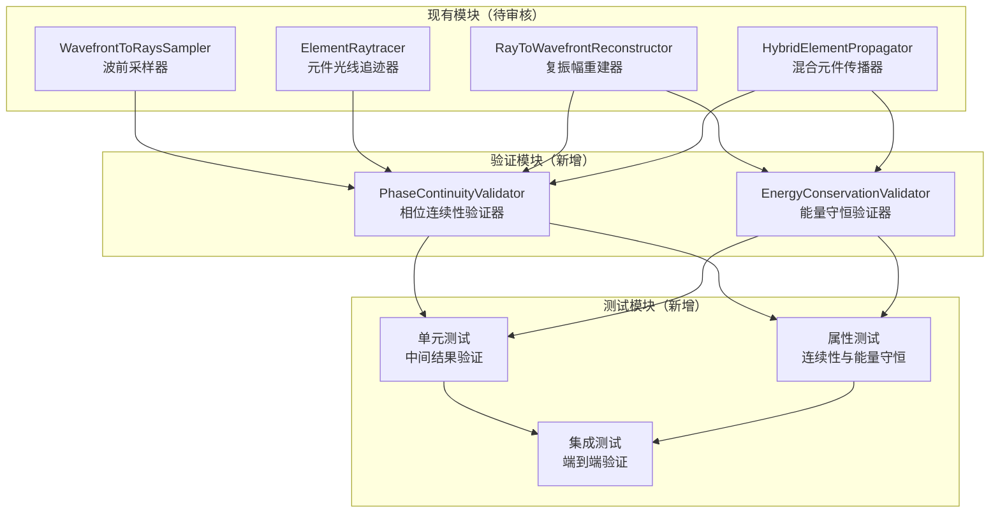

# 设计文档：混合光学追迹验证与修复

## 概述

本设计文档描述混合光学追迹验证与修复功能的技术方案。

### ⚠️ 重要说明：本次任务性质

**本次任务是检查、审核和修复现有代码，而非重新实现功能。**

现有模块已经实现了混合光学追迹的核心功能，包括：
- `src/wavefront_to_rays/wavefront_sampler.py` - 波前采样器
- `src/wavefront_to_rays/element_raytracer.py` - 元件光线追迹器
- `src/wavefront_to_rays/reconstructor.py` - 复振幅重建器
- `src/hybrid_optical_propagation/` - 混合光学传播模块

本次任务的目标是：
1. **审核**现有代码的计算逻辑是否正确
2. **验证**关键步骤的数值结果是否符合预期
3. **修复**发现的问题
4. **创建测试**确保每一步中间结果的正确性

### 核心验证内容

根据简化后的验证需求，本次任务重点验证以下内容：

1. **相位采样连续性验证**：所有相位网格相邻像素的相位差是否小于 π
2. **能量守恒验证**：雅可比矩阵计算振幅时的能量损失
3. **曲率半径公式正确性验证**：PROPER 参考面和 Pilot Beam 使用正确的曲率半径公式
4. **薄透镜 Pilot Beam 更新审查**：使用 prop_lens 后从 PROPER 读取参数的正确性

### 设计原则

- **最小侵入性**：尽量复用现有实现，最小化代码修改
- **可验证性**：每个步骤都可独立验证
- **诊断友好**：提供清晰的错误信息和诊断数据

## 关键概念澄清

### 曲率半径公式的本质区别

**PROPER 参考面和 Pilot Beam 使用本质不同的曲率半径计算公式，绝对禁止混用！**

| 项目 | PROPER 参考面 | Pilot Beam |
|------|---------------|------------|
| **曲率半径公式** | `R_ref = z - z_w0`（远场近似） | `R = z × (1 + (z_R/z)²)`（严格精确） |
| **适用范围** | 仅远场（z >> z_R） | 任意距离（近场、远场均精确） |
| **近场行为** | 使用平面参考面（"PLANAR"） | 使用严格曲率公式 |
| **用途** | FFT 传播时减小相位梯度 | 几何光线追迹时的相位解包裹 |

**PROPER 在瑞利距离内的特殊行为**：
- 当 `|z - z_w0| < rayleigh_factor × z_R` 时，PROPER 自动切换为平面参考面
- 此时 `reference_surface = "PLANAR"`，参考相位为零
- 这是 PROPER 的内部优化策略，但 Pilot Beam 始终使用严格公式

### 薄透镜 Pilot Beam 更新策略

**对于使用 `prop_lens` 处理的薄透镜元件，Pilot Beam 参数可以在传播后直接从 PROPER 对象读取。**

原因：
1. `prop_lens` 会正确更新 PROPER 的高斯光束参数（w0, z_w0, z_Rayleigh）
2. `prop_lens` 会正确更新参考面类型（PLANAR 或 SPHERI）
3. 这些参数与 ABCD 法则计算的结果理论上一致

审查要点：
- 验证 `prop_lens` 后 PROPER 参数与 ABCD 法则计算结果一致
- 验证 `PilotBeamParams.apply_lens()` 与 PROPER 更新后的参数同步

## 关键概念澄清

### 光程差与相位的关系

**本文档中不使用"OPD"一词，而是明确说明其物理含义。**

在混合光学追迹中，光线携带的信息是**相对于主光线的光程差**（以及xy坐标，用于计算网格变形与振幅映射。），其物理含义如下：

```
光程差（相对于主光线）= 该光线的几何光程 - 主光线的几何光程

相位（弧度）= 2π × 光程差 / 波长
           = 2π × 光程差（波长数）
```

### ⚠️ 关键论断：出射面相位采样值的物理含义

**从入射面薄相位元件开始追迹至出射面的光束，其所记载的光程差（相对于主光线）直接就是出射面处仿真复振幅的相位量（非折叠）的确切采样值。**

这个论断的正确性分析：

1. **入射面**：光线从薄相位元件出射时，携带了入射波前的相位信息（已解包裹）
2. **光线追迹**：optiland 追迹过程中累积几何光程，相对于主光线计算光程差
3. **出射面**：光线到达出射面时，其光程差 = 入射相位 + 追迹过程中的光程差
4. **结论**：出射光线的光程差（减去主光线光程后置零）就是出射面仿真复振幅相位的确切采样值

**验证要点**：
- 主光线的光程差应为 0（或可通过减去主光线光程来置零）
- 其他光线的光程差代表相对于主光线的相位延迟
- 这个相位是非折叠的，因为光线追迹过程是连续的


## 架构

### 验证流程图



### 数据流（修正后）

```
入射面处理：
┌─────────────────────────────────────────────────────────────────┐
│ 1. 从 PROPER 提取折叠相位 T（范围 [-π, π]）                      │
│ 2. 计算 Pilot Beam 参考相位 T_pilot（非折叠，解析计算）          │
│ 3. 解包裹：T_unwrapped = T_pilot + angle(exp(j*(T - T_pilot)))  │
│ 4. 【验证】相邻像素相位差 < π                                    │
│ 5. 创建薄相位元件，相位分布 = T_unwrapped                        │
│ 6. 平行光入射到相位元件，相位梯度决定光线方向                    │
└─────────────────────────────────────────────────────────────────┘
                              ↓
光线追迹：
┌─────────────────────────────────────────────────────────────────┐
│ 1. 追迹光线通过元件                                              │
│ 2. 记录每条光线的光程差（相对于主光线）                          │
│ 3. 光程差 = 出射面仿真复振幅相位的确切采样值（非折叠）           │
│ 4. 减去主光线光程，使主光线相位 = 0                              │
└─────────────────────────────────────────────────────────────────┘
                              ↓
出射面重建（修正后的步骤）：
┌─────────────────────────────────────────────────────────────────┐
│ 1. 获取光线位置和相位采样值（非折叠，主光线相位 = 0）            │
│                                                                  │
│ 2. 【关键步骤】计算波前误差：                                    │
│    - 计算出射面 Pilot Beam 相位 T_pilot_out（在各光线位置）      │
│    - 波前误差 = 光线相位采样值 - T_pilot_out                     │
│    - 主光线处：波前误差 = 0 - 0 = 0                              │
│    - 其他光线：波前误差 = 相对于理想高斯光束的相位偏差           │
│    - 【验证】波前误差的取值应该很小（代表像差）                  │
│                                                                  │
│ 3. 【关键步骤】对波前误差进行网格重采样：                        │
│    - 由于波前误差取值很小，避免了采样频率不足的问题              │
│    - 使用三次插值将稀疏光线数据插值到规则网格                    │
│    - 【验证】重采样后相邻像素相位差 < π                          │
│                                                                  │
│ 4. 【关键步骤】加回 Pilot Beam 相位：                            │
│    - 计算出射面 Pilot Beam 相位网格 T_pilot_grid                 │
│    - 出射面相位 = 重采样的波前误差 + T_pilot_grid                │
│    - 结果：未折叠的仿真复振幅相位量                              │
│                                                                  │
│ 5. 使用雅可比矩阵计算振幅：                                      │
│    - 振幅 = 1 / sqrt(|J|)（能量守恒）                            │
│    - 【验证】能量损失 < 1%                                       │
│                                                                  │
│ 6. 组合复振幅并转换为 PROPER 形式                                │
└─────────────────────────────────────────────────────────────────┘
```


## 组件和接口

### 1. PhaseContinuityValidator（相位连续性验证器）

验证所有相位网格的采样连续性。

```python
class PhaseContinuityValidator:
    """相位连续性验证器
    
    验证相位网格相邻像素的相位差是否小于 π。
    
    **Validates: Requirements 1, 2**
    """
    
    def __init__(self, threshold_rad: float = np.pi) -> None:
        """初始化验证器
        
        参数:
            threshold_rad: 相位差阈值（弧度），默认 π
        """
        self._threshold_rad = threshold_rad
    
    def validate_phase_grid(
        self,
        phase_grid: NDArray[np.floating],
        valid_mask: Optional[NDArray[np.bool_]] = None,
        grid_name: str = "phase_grid",
    ) -> ValidationResult:
        """验证相位网格的连续性
        
        检查相邻像素的相位差是否小于阈值。
        
        参数:
            phase_grid: 相位网格（弧度）
            valid_mask: 有效区域掩模（可选）
            grid_name: 网格名称（用于报告）
        
        返回:
            ValidationResult 对象
        """
        # 计算 x 方向相邻像素的相位差
        phase_diff_x = np.abs(np.diff(phase_grid, axis=1))
        # 计算 y 方向相邻像素的相位差
        phase_diff_y = np.abs(np.diff(phase_grid, axis=0))
        
        # 如果有有效区域掩模，只检查有效区域
        if valid_mask is not None:
            valid_x = valid_mask[:, :-1] & valid_mask[:, 1:]
            valid_y = valid_mask[:-1, :] & valid_mask[1:, :]
            max_diff_x = np.max(phase_diff_x[valid_x]) if np.any(valid_x) else 0
            max_diff_y = np.max(phase_diff_y[valid_y]) if np.any(valid_y) else 0
        else:
            max_diff_x = np.max(phase_diff_x)
            max_diff_y = np.max(phase_diff_y)
        
        max_phase_diff = max(max_diff_x, max_diff_y)
        is_valid = max_phase_diff < self._threshold_rad
        
        # 找到不连续位置
        discontinuity_locations = []
        if not is_valid:
            if valid_mask is not None:
                locs_x = np.argwhere(phase_diff_x > self._threshold_rad & valid_x)
                locs_y = np.argwhere(phase_diff_y > self._threshold_rad & valid_y)
            else:
                locs_x = np.argwhere(phase_diff_x > self._threshold_rad)
                locs_y = np.argwhere(phase_diff_y > self._threshold_rad)
            discontinuity_locations = [tuple(loc) for loc in locs_x[:10]]
            discontinuity_locations.extend([tuple(loc) for loc in locs_y[:10]])
        
        return ValidationResult(
            is_valid=is_valid,
            message=f"{grid_name}: 最大相位差 = {max_phase_diff:.4f} rad "
                    f"({'通过' if is_valid else '失败'})",
            details={
                'max_phase_diff_rad': max_phase_diff,
                'max_phase_diff_waves': max_phase_diff / (2 * np.pi),
                'threshold_rad': self._threshold_rad,
                'discontinuity_locations': discontinuity_locations,
            },
        )
    
    def validate_wavefront_error_range(
        self,
        wavefront_error: NDArray[np.floating],
        valid_mask: Optional[NDArray[np.bool_]] = None,
        expected_max_rad: float = 1.0,
    ) -> ValidationResult:
        """验证波前误差的取值范围
        
        波前误差（相对于 Pilot Beam 的相位偏差）应该很小，
        代表像差而非整体曲率。
        
        参数:
            wavefront_error: 波前误差（弧度）
            valid_mask: 有效区域掩模（可选）
            expected_max_rad: 期望的最大值（弧度）
        
        返回:
            ValidationResult 对象
        """
        if valid_mask is not None:
            valid_error = wavefront_error[valid_mask]
        else:
            valid_error = wavefront_error.ravel()
        
        max_error = np.max(np.abs(valid_error))
        rms_error = np.sqrt(np.mean(valid_error ** 2))
        
        is_valid = max_error < expected_max_rad
        
        return ValidationResult(
            is_valid=is_valid,
            message=f"波前误差: RMS = {rms_error:.4f} rad, "
                    f"Max = {max_error:.4f} rad "
                    f"({'通过' if is_valid else '失败'})",
            details={
                'rms_error_rad': rms_error,
                'max_error_rad': max_error,
                'rms_error_waves': rms_error / (2 * np.pi),
                'max_error_waves': max_error / (2 * np.pi),
                'expected_max_rad': expected_max_rad,
            },
        )
```


### 2. EnergyConservationValidator（能量守恒验证器）

验证雅可比矩阵计算振幅时的能量守恒。

```python
class EnergyConservationValidator:
    """能量守恒验证器
    
    验证雅可比矩阵计算振幅时的能量损失。
    
    **Validates: Requirements 5**
    """
    
    def __init__(self, tolerance: float = 0.01) -> None:
        """初始化验证器
        
        参数:
            tolerance: 能量损失容差（相对值），默认 1%
        """
        self._tolerance = tolerance
    
    def compute_total_energy(
        self,
        amplitude: NDArray[np.floating],
        pixel_area: float = 1.0,
    ) -> float:
        """计算总能量
        
        总能量 = Σ |A|² × pixel_area
        
        参数:
            amplitude: 振幅数组
            pixel_area: 像素面积
        
        返回:
            总能量（任意单位）
        """
        intensity = np.abs(amplitude) ** 2
        return np.sum(intensity) * pixel_area
    
    def validate_energy_conservation(
        self,
        amplitude_before: NDArray[np.floating],
        amplitude_after: NDArray[np.floating],
        pixel_area_before: float = 1.0,
        pixel_area_after: float = 1.0,
    ) -> ValidationResult:
        """验证能量守恒
        
        检查传播前后总能量是否相等（相对误差 < tolerance）。
        
        参数:
            amplitude_before: 传播前振幅
            amplitude_after: 传播后振幅
            pixel_area_before: 传播前像素面积
            pixel_area_after: 传播后像素面积
        
        返回:
            ValidationResult 对象
        """
        energy_before = self.compute_total_energy(amplitude_before, pixel_area_before)
        energy_after = self.compute_total_energy(amplitude_after, pixel_area_after)
        
        if energy_before > 0:
            relative_change = (energy_after - energy_before) / energy_before
            energy_loss = -relative_change if relative_change < 0 else 0
            energy_gain = relative_change if relative_change > 0 else 0
            is_valid = abs(relative_change) < self._tolerance
        else:
            relative_change = 0.0
            energy_loss = 0.0
            energy_gain = 0.0
            is_valid = energy_after == 0
        
        return ValidationResult(
            is_valid=is_valid,
            message=f"能量守恒: 变化 = {relative_change*100:.2f}% "
                    f"({'通过' if is_valid else '失败'})",
            details={
                'energy_before': energy_before,
                'energy_after': energy_after,
                'relative_change': relative_change,
                'energy_loss': energy_loss,
                'energy_gain': energy_gain,
                'tolerance': self._tolerance,
            },
        )
    
    def validate_jacobian_amplitude(
        self,
        jacobian_det: NDArray[np.floating],
        amplitude: NDArray[np.floating],
        valid_mask: NDArray[np.bool_],
    ) -> ValidationResult:
        """验证雅可比矩阵振幅计算
        
        检查振幅是否符合公式 A = 1/sqrt(|J|)。
        
        参数:
            jacobian_det: 雅可比行列式
            amplitude: 计算的振幅
            valid_mask: 有效光线掩模
        
        返回:
            ValidationResult 对象
        """
        # 只检查有效区域
        valid_jacobian = jacobian_det[valid_mask]
        valid_amplitude = amplitude[valid_mask]
        
        # 期望振幅 = 1/sqrt(|J|)
        expected_amplitude = 1.0 / np.sqrt(np.maximum(valid_jacobian, 1e-10))
        
        # 归一化后比较
        if np.mean(expected_amplitude) > 0:
            expected_normalized = expected_amplitude / np.mean(expected_amplitude)
        else:
            expected_normalized = expected_amplitude
        
        if np.mean(valid_amplitude) > 0:
            actual_normalized = valid_amplitude / np.mean(valid_amplitude)
        else:
            actual_normalized = valid_amplitude
        
        # 计算相对误差
        relative_error = np.abs(actual_normalized - expected_normalized)
        max_error = np.max(relative_error)
        rms_error = np.sqrt(np.mean(relative_error ** 2))
        
        is_valid = max_error < 0.01  # 1% 容差
        
        return ValidationResult(
            is_valid=is_valid,
            message=f"雅可比振幅: RMS误差 = {rms_error:.4f}, "
                    f"Max误差 = {max_error:.4f} "
                    f"({'通过' if is_valid else '失败'})",
            details={
                'rms_error': rms_error,
                'max_error': max_error,
            },
        )
```

### 3. ValidationResult（验证结果）

```python
@dataclass
class ValidationResult:
    """验证结果
    
    属性:
        is_valid: 验证是否通过
        message: 结果消息
        details: 详细信息字典
        warnings: 警告列表
    """
    is_valid: bool
    message: str
    details: Dict[str, Any] = field(default_factory=dict)
    warnings: List[str] = field(default_factory=list)
```


## 现有代码审核要点

### 1. WavefrontToRaysSampler 审核要点

文件：`src/wavefront_to_rays/wavefront_sampler.py`

**审核项目**：
- [ ] 相位提取是否正确使用 `np.angle()`
- [ ] 相位元件创建是否正确处理 1000 倍放大问题
- [ ] 平行光入射是否正确设置
- [ ] 出射光线方向是否由相位梯度正确决定

**验证方法**：
- 创建已知相位分布，验证出射光线方向与理论值一致

### 2. ElementRaytracer 审核要点

文件：`src/wavefront_to_rays/element_raytracer.py`

**审核项目**：
- [ ] 光程差计算是否正确（相对于主光线）
- [ ] 坐标变换是否正确（入射面/出射面局部坐标系）
- [ ] 带符号光程差计算是否正确处理折叠光路

**验证方法**：
- 使用简单几何（平面镜、球面镜），验证光程差与理论值一致

### 3. RayToWavefrontReconstructor 审核要点

文件：`src/wavefront_to_rays/reconstructor.py`

**审核项目**：
- [ ] 雅可比矩阵计算是否正确
- [ ] 振幅公式 A = 1/sqrt(|J|) 是否正确应用
- [ ] 网格重采样是否正确处理边界
- [ ] 相位突变检测是否正确

**需要修改**：
根据用户反馈，需要修改出射面相位处理流程：
1. 先减去 Pilot Beam 相位得到波前误差
2. 对波前误差进行网格重采样
3. 重采样后加回 Pilot Beam 相位

### 4. HybridElementPropagator 审核要点

文件：`src/hybrid_optical_propagation/hybrid_element_propagator.py`

**审核项目**：
- [ ] 入射面相位解包裹是否正确
- [ ] 出射面相位重建是否正确
- [ ] Pilot Beam 参数更新是否正确
- [ ] 状态转换是否正确

### 5. PilotBeamParams 曲率半径公式审核要点（新增）

文件：`src/hybrid_optical_propagation/data_models.py`

**审核项目**：
- [ ] `from_gaussian_source` 方法：曲率半径使用严格公式 `R = z * (1 + (z_R / z)**2)`
- [ ] `from_q_parameter` 方法：曲率半径从 `1/Re(1/q)` 正确提取
- [ ] `propagate` 方法：q 参数变换后通过 `from_q_parameter` 重新计算曲率半径
- [ ] `apply_lens` 方法：ABCD 变换后通过 `from_q_parameter` 重新计算曲率半径
- [ ] `apply_mirror` 方法：ABCD 变换后通过 `from_q_parameter` 重新计算曲率半径
- [ ] `compute_phase_grid` 方法：使用 `self.curvature_radius_mm`（严格公式）

**验证方法**：
```python
# 验证严格公式
z = 100.0  # mm
z_R = 50.0  # mm
R_strict = z * (1 + (z_R / z)**2)  # = 125 mm
R_approx = z  # 远场近似 = 100 mm
# 误差 = 25%
```

### 6. StateConverter PROPER 参考面相位审核要点（新增）

文件：`src/hybrid_optical_propagation/state_converter.py`

**审核项目**：
- [ ] `compute_proper_reference_phase` 方法：检查 `wfo.reference_surface` 类型
- [ ] 平面参考面处理：当 `reference_surface == "PLANAR"` 时返回零相位
- [ ] 球面参考面曲率半径：使用 `wfo.z - wfo.z_w0`（远场近似）
- [ ] 参考面相位公式：`φ_ref = -k × r² / (2 × R_ref)`（注意负号）
- [ ] 不使用严格公式：不使用 `z * (1 + (z_R/z)**2)` 计算 PROPER 参考面

**验证方法**：
- 检查代码中是否有混用公式的情况
- 使用正则表达式搜索禁止模式

### 7. ParaxialPhasePropagator 薄透镜 Pilot Beam 更新审核要点（新增）

文件：`src/hybrid_optical_propagation/paraxial_propagator.py`

**审核项目**：
- [ ] 使用 `prop_lens` 应用薄透镜效果
- [ ] 使用 `PilotBeamParams.apply_lens()` 更新 Pilot Beam 参数
- [ ] 验证 PROPER 参数与 ABCD 法则计算结果一致

**关键代码审查**：
```python
# 当前实现（paraxial_propagator.py）
proper.prop_lens(state.proper_wfo, focal_length_m)
new_pilot_params = state.pilot_beam_params.apply_lens(focal_length_mm)
```

**验证要点**：
1. `prop_lens` 后 PROPER 的 `w0`, `z_w0`, `z_Rayleigh` 是否正确更新
2. `apply_lens` 后 Pilot Beam 的 `curvature_radius_mm` 是否与 PROPER 一致
3. 两者的高斯光束参数是否同步

**审查结论**：
由于薄透镜使用 `prop_lens` 处理，Pilot Beam 参数可以在传播后直接从 PROPER 读取。
当前实现使用 `apply_lens()` 独立计算，理论上与 PROPER 结果一致，但需要验证。

## 算法详解

### 出射面相位重建算法（修正后）

```python
def reconstruct_exit_phase(
    ray_positions: Tuple[NDArray, NDArray],  # (x, y) 光线位置
    ray_phase_samples: NDArray,               # 光线相位采样值（非折叠）
    pilot_beam_params: PilotBeamParams,       # 出射面 Pilot Beam 参数
    grid_sampling: GridSampling,              # 网格采样信息
) -> NDArray:
    """重建出射面


---

## 正确性属性

### 属性 1：Pilot Beam 曲率半径公式正确性

**Validates: Requirements 9.1, 10.1**

```
对于任意高斯光束参数（w0, z, λ）：
  Pilot Beam 曲率半径 R = z × (1 + (z_R/z)²)
  其中 z_R = π × w0² / λ

验证方法：
  1. 从 PilotBeamParams.from_gaussian_source() 创建参数
  2. 检查 curvature_radius_mm 是否等于严格公式计算值
  3. 误差应小于 1e-10（数值精度）
```

### 属性 2：PROPER 参考面相位公式正确性

**Validates: Requirements 9.2, 10.4**

```
对于 PROPER 波前对象 wfo：
  IF wfo.reference_surface == "PLANAR":
    参考相位 = 0
  ELSE:
    R_ref = wfo.z - wfo.z_w0
    参考相位 = -k × r² / (2 × R_ref)

验证方法：
  1. 创建 PROPER 波前对象
  2. 调用 StateConverter.compute_proper_reference_phase()
  3. 检查结果是否符合上述公式
```

### 属性 3：薄透镜 Pilot Beam 与 PROPER 参数同步

**Validates: Requirements 6.3, 10.2**

```
对于薄透镜（焦距 f）：
  使用 prop_lens 后：
    PROPER.w0 应与 PilotBeamParams.waist_radius_mm 一致
    PROPER.z_Rayleigh 应与 PilotBeamParams.rayleigh_length_mm 一致

验证方法：
  1. 创建初始 Pilot Beam 参数和 PROPER 对象
  2. 应用 prop_lens(wfo, f)
  3. 应用 pilot_params.apply_lens(f)
  4. 比较两者的高斯光束参数
  5. 相对误差应小于 1%
```

### 属性 4：相位连续性

**Validates: Requirements 2.5, 7.2**

```
对于任意相位网格：
  相邻像素相位差 < π

验证方法：
  1. 计算 x 方向相位差：|phase[i,j+1] - phase[i,j]|
  2. 计算 y 方向相位差：|phase[i+1,j] - phase[i,j]|
  3. 所有相位差应小于 π
```

### 属性 5：能量守恒

**Validates: Requirements 5.1, 5.2**

```
对于无损耗元件：
  传播前总能量 ≈ 传播后总能量
  相对误差 < 1%

验证方法：
  1. 计算传播前总能量：Σ |A_in|² × pixel_area
  2. 计算传播后总能量：Σ |A_out|² × pixel_area
  3. 相对误差 = |E_out - E_in| / E_in < 0.01
```

### 属性 6：近场与远场公式一致性

**Validates: Requirements 11.5**

```
当 z >> z_R（远场）时：
  严格公式 R = z × (1 + (z_R/z)²) ≈ z
  远场近似 R_ref = z - z_w0 ≈ z
  两者趋于一致

验证方法：
  1. 设置 z = 10 × z_R
  2. 计算严格公式和远场近似
  3. 相对误差应小于 1%
```

---

## 代码审查禁止模式

### 禁止模式 1：在 Pilot Beam 上下文中使用 PROPER 远场近似

```python
# ❌ 错误
R = wfo.z - wfo.z_w0  # 用于 Pilot Beam 相位计算

# ✅ 正确
R = pilot_params.curvature_radius_mm  # 使用严格公式
```

### 禁止模式 2：在 PROPER 参考面上下文中使用严格公式

```python
# ❌ 错误
R_ref = z * (1 + (z_R/z)**2)  # 用于 PROPER 参考面

# ✅ 正确
R_ref = wfo.z - wfo.z_w0  # PROPER 远场近似
```

### 禁止模式 3：直接使用 wfo 参数计算 Pilot Beam 曲率

```python
# ❌ 错误
pilot_curvature = wfo.z - wfo.z_w0

# ✅ 正确
pilot_curvature = pilot_params.curvature_radius_mm
```

---

## 测试策略

### 单元测试

1. **PilotBeamParams 曲率半径测试**
   - 测试 `from_gaussian_source` 使用严格公式
   - 测试 `from_q_parameter` 正确提取曲率半径
   - 测试 `apply_lens` 后曲率半径正确更新

2. **StateConverter 参考面相位测试**
   - 测试平面参考面返回零相位
   - 测试球面参考面使用远场近似
   - 测试不混用公式

3. **ParaxialPhasePropagator 薄透镜测试**
   - 测试 `prop_lens` 后 PROPER 参数正确
   - 测试 `apply_lens` 后 Pilot Beam 参数正确
   - 测试两者参数同步

### 属性基测试

1. **曲率半径公式属性测试**
   - 生成任意高斯光束参数
   - 验证严格公式正确性
   - 验证近场与远场一致性

2. **相位连续性属性测试**
   - 生成任意相位分布
   - 验证解包裹后相位连续

3. **能量守恒属性测试**
   - 生成任意振幅分布
   - 验证传播前后能量守恒
