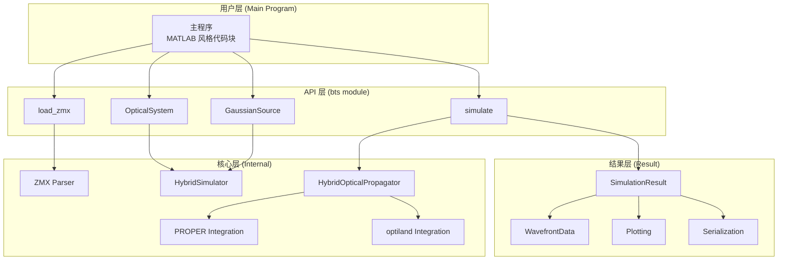

# Design Document: MATLAB Style API

## Overview

本设计文档描述混合光学仿真系统 API 的重构方案，将当前的 Python 类封装风格改为 MATLAB 风格的直观代码块结构。

### 设计目标

1. **简洁性**：主程序代码极简，功能分块直观
2. **完整性**：API 功能强大，足以支撑所有自定义测试
3. **稳定性**：API 参数完整且稳定，不频繁变动
4. **兼容性**：保留现有 API 作为备选接口

### 核心设计理念

采用 MATLAB 风格的"代码块"结构，将复杂逻辑封装在 `bts` 模块内部，主程序只需要简单的函数调用。

## Architecture

### 系统架构图



### 模块结构

```
src/
├── bts/                          # 新的 MATLAB 风格 API 模块
│   ├── __init__.py               # 导出所有公共 API
│   ├── optical_system.py         # OpticalSystem 类
│   ├── source.py                 # GaussianSource 类
│   ├── simulation.py             # simulate() 函数
│   └── io.py                     # load_zmx() 等 I/O 函数
│
├── hybrid_simulation/            # 现有模块（保留）
│   ├── simulator.py              # HybridSimulator（内部使用）
│   ├── result.py                 # SimulationResult
│   └── ...
│
└── hybrid_optical_propagation/   # 底层传播模块（保留）
    └── ...
```

## Components and Interfaces

### 1. bts 模块公共接口

```python
# bts/__init__.py

# 核心函数
def load_zmx(path: str) -> OpticalSystem:
    """从 ZMX 文件加载光学系统"""
    ...

def simulate(
    system: OpticalSystem,
    source: GaussianSource,
    verbose: bool = True,
) -> SimulationResult:
    """执行混合光学仿真"""
    ...

# 核心类
class OpticalSystem:
    """光学系统定义"""
    ...

class GaussianSource:
    """高斯光源定义"""
    ...

# 重导出结果类
from hybrid_simulation import SimulationResult, WavefrontData, SurfaceRecord
```

### 2. OpticalSystem 类

```python
class OpticalSystem:
    """光学系统定义
    
    支持两种构建方式：
    1. 从 ZMX 文件加载：bts.load_zmx("system.zmx")
    2. 逐行定义元件：system.add_surface(...)
    
    属性:
        surfaces: 表面定义列表
        name: 系统名称
        source_path: ZMX 文件路径（如果从文件加载）
    """
    
    def __init__(self, name: str = "Unnamed System") -> None:
        """创建空的光学系统"""
        ...
    
    @classmethod
    def from_zmx(cls, path: str) -> "OpticalSystem":
        """从 ZMX 文件创建光学系统"""
        ...
    
    def add_surface(
        self,
        z: float,
        radius: float = float('inf'),
        conic: float = 0.0,
        semi_aperture: float = 25.0,
        is_mirror: bool = False,
        tilt_x: float = 0.0,
        tilt_y: float = 0.0,
        material: str = "",
    ) -> "OpticalSystem":
        """添加通用光学表面（支持链式调用）"""
        ...
    
    def add_flat_mirror(
        self,
        z: float,
        tilt_x: float = 0.0,
        tilt_y: float = 0.0,
        semi_aperture: float = 25.0,
    ) -> "OpticalSystem":
        """添加平面反射镜（支持链式调用）"""
        ...
    
    def add_spherical_mirror(
        self,
        z: float,
        radius: float,
        tilt_x: float = 0.0,
        tilt_y: float = 0.0,
        semi_aperture: float = 25.0,
    ) -> "OpticalSystem":
        """添加球面反射镜（支持链式调用）"""
        ...
    
    def add_paraxial_lens(
        self,
        z: float,
        focal_length: float,
        semi_aperture: float = 25.0,
    ) -> "OpticalSystem":
        """添加薄透镜（支持链式调用）"""
        ...
    
    def print_info(self) -> None:
        """打印系统参数摘要"""
        ...
    
    def plot_layout(
        self,
        projection: str = "YZ",
        num_rays: int = 5,
        save_path: Optional[str] = None,
        show: bool = True,
    ) -> Tuple[Figure, Axes]:
        """绘制光路图"""
        ...
    
    @property
    def num_surfaces(self) -> int:
        """表面数量"""
        ...
    
    def __len__(self) -> int:
        """返回表面数量"""
        ...
```

### 3. GaussianSource 类

```python
class GaussianSource:
    """高斯光源定义
    
    定义入射高斯光束的参数。
    
    属性:
        wavelength_um: 波长 (μm)
        w0_mm: 束腰半径 (mm)
        grid_size: 网格大小
        physical_size_mm: 物理尺寸 (mm)
        z0_mm: 束腰位置 (mm)
        beam_diam_fraction: PROPER beam_diam_fraction 参数
    """
    
    def __init__(
        self,
        wavelength_um: float,
        w0_mm: float,
        grid_size: int = 256,
        physical_size_mm: Optional[float] = None,
        z0_mm: float = 0.0,
        beam_diam_fraction: Optional[float] = None,
    ) -> None:
        """创建高斯光源
        
        参数:
            wavelength_um: 波长 (μm)
            w0_mm: 束腰半径 (mm)
            grid_size: 网格大小，默认 256
            physical_size_mm: 物理尺寸 (mm)，默认 8 倍束腰
            z0_mm: 束腰位置 (mm)，默认 0
            beam_diam_fraction: PROPER beam_diam_fraction 参数（可选）
        """
        ...
    
    @property
    def z_rayleigh_mm(self) -> float:
        """瑞利距离 (mm)"""
        ...
    
    def print_info(self) -> None:
        """打印光源参数"""
        ...
```

### 4. simulate() 函数

```python
def simulate(
    system: OpticalSystem,
    source: GaussianSource,
    verbose: bool = True,
    num_rays: int = 200,
) -> SimulationResult:
    """执行混合光学仿真
    
    参数:
        system: 光学系统定义
        source: 高斯光源定义
        verbose: 是否输出详细信息，默认 True
        num_rays: 光线追迹使用的光线数量，默认 200
    
    返回:
        SimulationResult 对象，包含所有表面的波前数据
    
    异常:
        ConfigurationError: 配置不完整
        SimulationError: 仿真执行失败
    
    示例:
        >>> system = bts.load_zmx("system.zmx")
        >>> source = bts.GaussianSource(wavelength_um=0.633, w0_mm=5.0)
        >>> result = bts.simulate(system, source)
        >>> result.summary()
    """
    ...
```

### 5. load_zmx() 函数

```python
def load_zmx(path: str) -> OpticalSystem:
    """从 ZMX 文件加载光学系统
    
    参数:
        path: ZMX 文件路径（绝对路径或相对路径）
    
    返回:
        OpticalSystem 对象
    
    异常:
        FileNotFoundError: 文件不存在
        ParseError: 解析错误
    
    示例:
        >>> system = bts.load_zmx("path/to/system.zmx")
        >>> system.print_info()
    """
    ...
```

### 6. SimulationResult 增强

现有 `SimulationResult` 类保持不变，但增加以下便捷方法：

```python
class SimulationResult:
    # 现有方法保持不变
    ...
    
    # 新增便捷方法
    def get_final_wavefront(self) -> WavefrontData:
        """获取最终表面的出射波前数据"""
        ...
    
    def get_entrance_wavefront(self, surface_index: int) -> WavefrontData:
        """获取指定表面的入射波前数据"""
        ...
    
    def get_exit_wavefront(self, surface_index: int) -> WavefrontData:
        """获取指定表面的出射波前数据"""
        ...
```

## Data Models

### OpticalSystem 内部数据结构

```python
@dataclass
class SurfaceDefinition:
    """表面定义（内部使用）"""
    index: int
    surface_type: str  # 'standard', 'paraxial', 'coordbrk'
    vertex_position: np.ndarray  # [x, y, z] in mm
    orientation: np.ndarray  # 3x3 旋转矩阵
    radius: float  # 曲率半径 (mm)，inf 表示平面
    conic: float  # 圆锥常数
    semi_aperture: float  # 半口径 (mm)
    is_mirror: bool
    material: str
    focal_length: Optional[float] = None  # 仅用于 paraxial
```

### GaussianSource 内部数据结构

```python
@dataclass
class SourceParams:
    """光源参数（内部使用）"""
    wavelength_um: float
    w0_mm: float
    z0_mm: float
    grid_size: int
    physical_size_mm: float
    beam_diam_fraction: Optional[float]
    z_rayleigh_mm: float  # 计算得出
```


## Correctness Properties

*A property is a characteristic or behavior that should hold true across all valid executions of a system—essentially, a formal statement about what the system should do. Properties serve as the bridge between human-readable specifications and machine-verifiable correctness guarantees.*

### Property 1: load_zmx 返回正确类型

*For any* 有效的 ZMX 文件路径，调用 `bts.load_zmx(path)` 应该返回 `OpticalSystem` 类型的对象，且该对象的表面数量应该大于 0。

**Validates: Requirements 1.1, 2.1**

### Property 2: 不存在的文件抛出 FileNotFoundError

*For any* 不存在的文件路径字符串，调用 `bts.load_zmx(path)` 应该抛出 `FileNotFoundError` 异常。

**Validates: Requirements 2.2**

### Property 3: GaussianSource 参数存储正确性

*For any* 有效的波长值 `wavelength_um`（正浮点数）和束腰半径 `w0_mm`（正浮点数），创建 `GaussianSource(wavelength_um, w0_mm)` 后，对象的 `wavelength_um` 和 `w0_mm` 属性应该等于传入的值。

**Validates: Requirements 3.1, 3.2**

### Property 4: physical_size_mm 默认值计算

*For any* 有效的束腰半径 `w0_mm`（正浮点数），当创建 `GaussianSource(wavelength_um, w0_mm)` 时未指定 `physical_size_mm`，则 `physical_size_mm` 属性应该等于 `8 * w0_mm`。

**Validates: Requirements 3.6**

### Property 5: print_info 输出包含必要信息

*For any* 包含至少一个表面的 `OpticalSystem`，调用 `print_info()` 的输出应该包含每个表面的类型和位置信息。

**Validates: Requirements 4.3**

### Property 6: simulate 返回完整结果

*For any* 有效的 `OpticalSystem`（至少一个表面）和有效的 `GaussianSource`，调用 `bts.simulate(system, source)` 应该返回 `SimulationResult` 类型的对象，且结果中的表面数量应该等于系统中的表面数量。

**Validates: Requirements 5.1, 5.2, 5.3**

### Property 7: 仿真失败时抛出异常

*For any* 空的 `OpticalSystem`（无表面）或无效的 `GaussianSource`（如负波长），调用 `bts.simulate()` 应该抛出 `ConfigurationError` 或 `SimulationError` 异常。

**Validates: Requirements 5.4**

### Property 8: 结果保存/加载往返一致性

*For any* 有效的 `SimulationResult` 对象，保存到目录后再加载回来，加载的结果应该与原始结果在关键属性上一致（success、wavelength_um、grid_size、表面数量）。

**Validates: Requirements 7.2, 7.3, 7.4**

### Property 9: 向后兼容性

*For any* 使用现有 `HybridSimulator` API 的代码，应该能够正常执行并返回与新 API 等效的结果。

**Validates: Requirements 10.2, 10.3**


## Error Handling

### 异常类型

| 异常类型 | 触发条件 | 错误信息格式 |
|----------|----------|--------------|
| `FileNotFoundError` | ZMX 文件不存在 | "ZMX 文件不存在: {path}" |
| `ParseError` | ZMX 文件解析失败 | "解析 ZMX 文件失败: {details}" |
| `ConfigurationError` | 配置不完整或无效 | "配置错误: {details}" |
| `SimulationError` | 仿真执行失败 | "仿真失败: {details}" |
| `ValueError` | 参数值无效 | "无效参数: {param_name} = {value}" |

### 错误处理策略

1. **早期验证**：在 `simulate()` 执行前验证所有配置
2. **清晰错误信息**：所有异常都包含详细的错误描述
3. **异常链**：保留原始异常信息用于调试
4. **优雅降级**：非致命错误时输出警告并继续

### 验证检查点

```python
def simulate(system, source, verbose=True):
    # 1. 验证系统配置
    if len(system) == 0:
        raise ConfigurationError("光学系统为空，请先添加表面")
    
    # 2. 验证光源配置
    if source.wavelength_um <= 0:
        raise ValueError(f"无效参数: wavelength_um = {source.wavelength_um}")
    if source.w0_mm <= 0:
        raise ValueError(f"无效参数: w0_mm = {source.w0_mm}")
    
    # 3. 执行仿真（捕获内部异常）
    try:
        result = _execute_simulation(system, source, verbose)
    except Exception as e:
        raise SimulationError(f"仿真执行失败: {e}") from e
    
    return result
```

## Testing Strategy

### 测试框架

- **pytest**：单元测试和集成测试
- **hypothesis**：属性基测试（Property-Based Testing）

### 测试类型

#### 1. 单元测试

测试各个组件的独立功能：

- `test_optical_system.py`：OpticalSystem 类的方法测试
- `test_gaussian_source.py`：GaussianSource 类的参数验证
- `test_io.py`：load_zmx 函数的文件处理

#### 2. 属性基测试

使用 hypothesis 库验证正确性属性：

```python
# tests/property/test_bts_api_properties.py

from hypothesis import given, strategies as st
import bts

@given(st.floats(min_value=0.1, max_value=10.0))
def test_physical_size_default_calculation(w0_mm):
    """Property 4: physical_size_mm 默认值计算"""
    # Feature: matlab-style-api, Property 4: physical_size_mm 默认值计算
    source = bts.GaussianSource(wavelength_um=0.633, w0_mm=w0_mm)
    assert source.physical_size_mm == 8 * w0_mm
```

#### 3. 集成测试

测试完整的仿真流程：

- `test_zmx_simulation.py`：从 ZMX 文件到结果的完整流程
- `test_manual_system.py`：手动定义系统的完整流程

### 属性基测试配置

- 每个属性测试运行至少 100 次迭代
- 使用 `@settings(max_examples=100)` 配置
- 每个测试标注对应的设计文档属性

### 测试覆盖率目标

- 公共 API：100% 覆盖
- 核心逻辑：> 90% 覆盖
- 错误处理：100% 覆盖

## Implementation Notes

### ⚠️ 核心原则：复用现有模块

**新的 `bts` 模块是对现有模块的薄封装，不重新定义任何概念或计算方法。**

1. **不修改物理关系**：所有光学计算逻辑保持不变
2. **不修改计算方法**：复用 `HybridSimulator`、`HybridOpticalPropagator` 等现有实现
3. **仅提供简洁接口**：`bts` 模块只是将现有 API 包装成 MATLAB 风格

### 模块组织

```
src/bts/
├── __init__.py          # 导出公共 API，重导出现有类
├── optical_system.py    # OpticalSystem 类（封装 HybridSimulator 的元件定义功能）
├── source.py            # GaussianSource 类（封装 SourceDefinition）
├── simulation.py        # simulate() 函数（调用 HybridSimulator.run()）
└── io.py                # load_zmx() 函数（调用现有 ZMX 解析器）
```

### 依赖关系

```
bts (新模块 - 薄封装层)
  │
  ├── 直接复用 ──────────────────────────────────────────┐
  │                                                       │
  ▼                                                       ▼
hybrid_simulation (现有模块 - 不修改)          hybrid_optical_propagation (底层模块 - 不修改)
  ├── HybridSimulator                            ├── HybridOpticalPropagator
  ├── SimulationResult                           ├── SourceDefinition
  └── ...                                        └── ...
```

### 实现策略

```python
# bts/simulation.py - 示例实现

from hybrid_simulation import HybridSimulator, SimulationResult

def simulate(system, source, verbose=True, num_rays=200):
    """执行混合光学仿真
    
    内部直接调用 HybridSimulator，不重新实现任何逻辑。
    """
    # 创建 HybridSimulator 实例
    sim = HybridSimulator(verbose=verbose)
    
    # 复用现有的表面定义
    sim._surfaces = system._surfaces
    
    # 复用现有的光源定义
    sim.set_source(
        wavelength_um=source.wavelength_um,
        w0_mm=source.w0_mm,
        grid_size=source.grid_size,
        physical_size_mm=source.physical_size_mm,
        beam_diam_fraction=source.beam_diam_fraction,
    )
    
    # 调用现有的 run() 方法
    return sim.run()
```

```python
# bts/io.py - 示例实现

from hybrid_optical_propagation import load_optical_system_from_zmx
from pathlib import Path

def load_zmx(path):
    """从 ZMX 文件加载光学系统
    
    内部直接调用现有的 ZMX 解析器。
    """
    surfaces = load_optical_system_from_zmx(path)
    
    system = OpticalSystem(name=Path(path).stem)
    system._surfaces = surfaces
    system._source_path = path
    
    return system
```

### 向后兼容性实现

**不添加弃用警告**，保持现有 API 完全可用：

```python
# hybrid_simulation/__init__.py - 保持不变
# HybridSimulator 继续正常工作，不输出警告
```

### 主程序模板

```python
"""
混合光学仿真主程序模板

本程序演示 MATLAB 风格的混合光学仿真流程。
"""

# ============================================================
# 1. 导入与初始化
# ============================================================
import bts

# ============================================================
# 2. 定义光学系统（两种方式二选一）
# ============================================================
# 方式 A：从 ZMX 文件导入
system = bts.load_zmx("path/to/system.zmx")

# 方式 B：逐行定义元件
# system = bts.OpticalSystem("My System")
# system.add_flat_mirror(z=50, tilt_x=45, semi_aperture=30)
# system.add_spherical_mirror(z=150, radius=200, semi_aperture=25)

# ============================================================
# 3. 定义光源
# ============================================================
source = bts.GaussianSource(
    wavelength_um=0.633,    # He-Ne 激光波长
    w0_mm=5.0,              # 束腰半径
    grid_size=256,          # 网格大小
)

# ============================================================
# 4. 系统信息展示（仿真前）
# ============================================================
system.print_info()           # 打印系统参数
system.plot_layout()          # 绘制光路图

# ============================================================
# 5. 执行仿真
# ============================================================
result = bts.simulate(system, source)

# ============================================================
# 6. 结果展示与保存
# ============================================================
result.summary()              # 打印结果摘要
result.plot_all()             # 绘制所有结果图
result.save("output/")        # 保存结果
```

### 示例 1：近场倾斜平面镜仿真

```python
"""
近场高斯光束入射倾斜平面镜仿真

测试条件：
- 波长: 0.633 μm (He-Ne)
- 束腰半径: 5.0 mm
- 传输距离: 50 mm（近场）
- 平面镜倾斜角: 45°
"""

# ============================================================
# 1. 导入与初始化
# ============================================================
import bts
import numpy as np

# ============================================================
# 2. 仿真参数
# ============================================================
wavelength_um = 0.633    # He-Ne 激光波长
w0_mm = 5.0              # 束腰半径
grid_size = 256          # 网格大小
mirror_z_mm = 50.0       # 镜面位置
tilt_angle_deg = 45.0    # 倾斜角度

# 计算瑞利长度
wavelength_mm = wavelength_um * 1e-3
z_R = np.pi * w0_mm**2 / wavelength_mm
print(f"瑞利长度: z_R = {z_R:.2f} mm")
print(f"z/z_R = {mirror_z_mm/z_R:.3f} (近场条件: < 1)")

# ============================================================
# 3. 定义光学系统
# ============================================================
system = bts.OpticalSystem("Near Field Tilted Mirror")
system.add_flat_mirror(z=mirror_z_mm, tilt_x=tilt_angle_deg, semi_aperture=30.0)

# ============================================================
# 4. 定义光源
# ============================================================
source = bts.GaussianSource(
    wavelength_um=wavelength_um,
    w0_mm=w0_mm,
    grid_size=grid_size,
    physical_size_mm=8 * w0_mm,
)

# ============================================================
# 5. 系统信息展示
# ============================================================
system.print_info()
system.plot_layout(save_path="output/layout.png")

# ============================================================
# 6. 执行仿真
# ============================================================
result = bts.simulate(system, source)

# ============================================================
# 7. 结果分析
# ============================================================
result.summary()

# 获取最终波前数据
final_wf = result.get_final_wavefront()
rms_waves = final_wf.get_residual_rms_waves()
pv_waves = final_wf.get_residual_pv_waves()

print(f"\n最终波前误差:")
print(f"  相位残差 RMS: {rms_waves*1000:.3f} milli-waves")
print(f"  相位残差 PV:  {pv_waves:.4f} waves")

# ============================================================
# 8. 结果保存
# ============================================================
result.plot_all(save_path="output/overview.png")
result.save("output/result_data")
```

### 示例 2：简单折叠镜测试（极简版）

```python
"""
简单折叠镜测试示例

演示 bts API 的基本用法，代码极简（< 10 行核心代码）。
"""

# ============================================================
# 1. 导入与初始化
# ============================================================
import bts

# ============================================================
# 2. 定义光学系统
# ============================================================
system = bts.OpticalSystem("Simple Fold Mirror")
system.add_flat_mirror(z=50.0, tilt_x=45.0)  # 45° 折叠镜

# ============================================================
# 3. 定义光源
# ============================================================
source = bts.GaussianSource(wavelength_um=0.633, w0_mm=5.0, grid_size=256)

# ============================================================
# 4. 执行仿真
# ============================================================
result = bts.simulate(system, source)

# ============================================================
# 5. 查看结果
# ============================================================
result.summary()
result.plot_all(save_path='fold_mirror_overview.png')
result.save('output/fold_mirror_result')
```

### 示例 3：ZMX 文件仿真

```python
"""
ZMX 文件混合光学仿真示例

演示如何从 ZMX 文件加载光学系统并执行仿真。
"""

# ============================================================
# 1. 导入与初始化
# ============================================================
import bts

# ============================================================
# 2. 加载 ZMX 文件
# ============================================================
system = bts.load_zmx("complicated_fold_mirrors_setup_v2.zmx")

# ============================================================
# 3. 系统信息展示
# ============================================================
system.print_info()
system.plot_layout(projection='YZ', num_rays=5, save_path="output/layout.png")

# ============================================================
# 4. 定义光源
# ============================================================
source = bts.GaussianSource(wavelength_um=0.633, w0_mm=5.0, grid_size=256)

# ============================================================
# 5. 执行仿真
# ============================================================
result = bts.simulate(system, source)

# ============================================================
# 6. 结果展示与保存
# ============================================================
result.summary()
result.plot_all(save_path="output/simulation_overview.png")
result.save("output/result_data")

# 验证加载功能
loaded = bts.SimulationResult.load("output/result_data")
print(f"加载验证: {loaded.success}, {len(loaded.surfaces)} 个表面")
```
