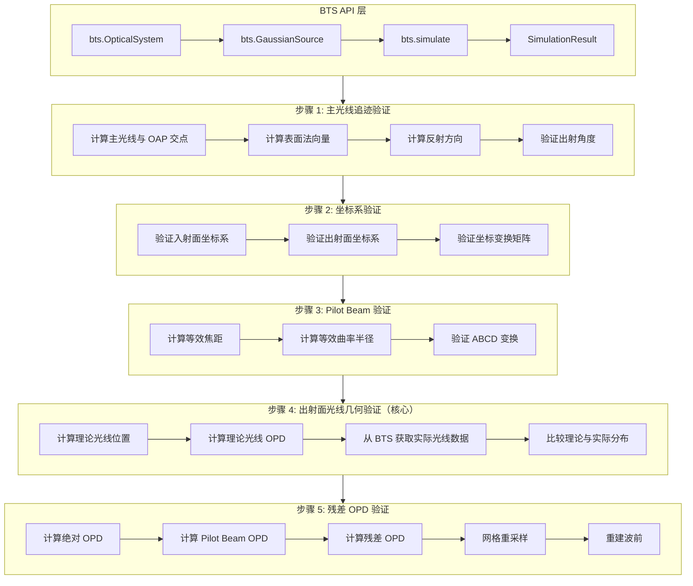

# Design Document: OAP Hybrid Raytracing Debug

## Overview

本设计文档描述了离轴抛物面（OAP）混合光学追迹误差系统化调试的技术方案。采用渐进式验证流程，每个步骤验证通过后记录为"已验证"，后续步骤不再重复验证前面的内容。

**核心原则**：所有元件创建、高斯光束初始化、光学追迹、结果读取都必须通过 BTS API 进行。

调试流程按以下顺序进行：
1. 主光线追迹方向和交点坐标验证
2. 入射面、出射面坐标系验证
3. Pilot Beam 参数验证
4. 出射面光线位置和 OPD 几何验证（核心）
5. 出射面残差 OPD 计算和网格重采样验证

## ⚠️⚠️⚠️ 强制禁止事项（极其重要）

### 🚫🚫🚫 绝对禁止的参数和方法

以下参数和方法已被**永久废弃**，在本项目中**不存在**：

```python
# 🚫🚫🚫 以下代码绝对禁止！永远不要写！

# 禁止使用 off_axis_distance 参数
system.add_parabolic_mirror(off_axis_distance=100)  # 🚫 禁止！

# 禁止使用 dy/dx 参数
optic.add_surface(dy=100)  # 🚫 禁止！
optic.add_surface(dx=50)   # 🚫 禁止！

# 禁止使用 add_oap 方法
system.add_oap(...)  # 🚫 禁止！

# 禁止使用 semi_aperture/aperture 参数
system.add_surface(semi_aperture=20)  # 🚫 禁止！
system.add_surface(aperture=40)       # 🚫 禁止！
```

### ✅ 正确做法：绝对坐标定位

```python
# ✅ 正确：使用绝对坐标定义离轴抛物面
system.add_parabolic_mirror(
    x=0,             # X 位置
    y=100,           # Y 位置 = 离轴量 100mm
    z=0,             # Z 位置（抛物面顶点）
    radius=200,      # 曲率半径 R = 2f
)
```

### 🚫 禁止直接赋值 Pilot Beam 相位

```python
# 🚫🚫🚫 以下代码绝对禁止！

# 禁止直接将 Pilot Beam 相位赋值给仿真复振幅
amplitude = np.exp(1j * pilot_beam_phase)  # 🚫 禁止！

# 禁止直接将 Pilot Beam OPD 赋值给光线 OPD
rays.opd = pilot_beam_opd  # 🚫 禁止！
```

### ✅ Pilot Beam 的正确用途

```python
# ✅ 正确：用于相位解包裹
unwrapped_phase = pilot_phase + np.angle(np.exp(1j * (wrapped_phase - pilot_phase)))

# ✅ 正确：用于计算残差 OPD
# 注意：是加法！因为 pilot_opd = r²/(2R)，当 R < 0（会聚波）时 pilot_opd < 0
# 对于理想球面镜：absolute_opd > 0，pilot_opd < 0，两者大小相等符号相反
# 所以 residual_opd = absolute_opd + pilot_opd ≈ 0
residual_opd = absolute_opd + pilot_opd

# ✅ 正确：用于验证仿真结果
error = simulated_phase - pilot_phase
```

### 🚫 禁止直接使用底层模块测试

```python
# 🚫🚫🚫 以下代码绝对禁止！

# 禁止直接使用 ElementRaytracer
from src.wavefront_to_rays.element_raytracer import ElementRaytracer
raytracer = ElementRaytracer(...)  # 🚫 禁止！

# 禁止直接使用 WavefrontSampler
from src.wavefront_to_rays.wavefront_sampler import WavefrontSampler
sampler = WavefrontSampler(...)  # 🚫 禁止！
```

### ✅ 正确做法：通过 BTS API 测试

```python
# ✅ 正确：通过 BTS 主函数 API 进行测试
import bts

system = bts.OpticalSystem("OAP Test")
system.add_parabolic_mirror(x=0, y=100, z=0, radius=200)

source = bts.GaussianSource(wavelength_um=0.633, w0_mm=5.0)

result = bts.simulate(system, source)
result.summary()
```


## Architecture



## BTS API 扩展需求

为了支持调试验证，需要在 BTS API 中增加以下仿真过程数据读取接口：

### SimulationResult 扩展接口

```python
class SimulationResult:
    """仿真结果（需要扩展的接口）"""
    
    def get_surface_rays(
        self,
        surface_index: int,
        location: str = "exit",  # "entrance" 或 "exit"
    ) -> "RayData":
        """获取指定表面的光线数据
        
        参数:
            surface_index: 表面索引
            location: "entrance"（入射面）或 "exit"（出射面）
        
        返回:
            RayData 对象，包含光线位置、方向、OPD 等
        """
        pass
    
    def get_pilot_beam_params(
        self,
        surface_index: int,
        location: str = "exit",
    ) -> "PilotBeamParams":
        """获取指定表面的 Pilot Beam 参数
        
        参数:
            surface_index: 表面索引
            location: "entrance" 或 "exit"
        
        返回:
            PilotBeamParams 对象
        """
        pass
    
    def get_chief_ray(
        self,
        surface_index: int,
    ) -> "ChiefRayData":
        """获取指定表面的主光线数据
        
        参数:
            surface_index: 表面索引
        
        返回:
            ChiefRayData 对象，包含入射/出射方向、交点位置等
        """
        pass
    
    def get_coordinate_system(
        self,
        surface_index: int,
        location: str = "exit",
    ) -> "CoordinateSystemData":
        """获取指定表面的坐标系信息
        
        参数:
            surface_index: 表面索引
            location: "entrance" 或 "exit"
        
        返回:
            CoordinateSystemData 对象，包含原点位置、旋转矩阵等
        """
        pass
```

### 新增数据类

```python
@dataclass
class RayData:
    """光线数据"""
    x: NDArray  # X 坐标 (mm)
    y: NDArray  # Y 坐标 (mm)
    z: NDArray  # Z 坐标 (mm)
    L: NDArray  # X 方向余弦
    M: NDArray  # Y 方向余弦
    N: NDArray  # Z 方向余弦
    opd: NDArray  # 光程差 (mm)
    intensity: NDArray  # 强度
    
    @property
    def num_rays(self) -> int:
        """光线数量"""
        return len(self.x)


@dataclass
class ChiefRayData:
    """主光线数据"""
    entrance_position: Tuple[float, float, float]  # 入射面位置
    entrance_direction: Tuple[float, float, float]  # 入射方向
    intersection_point: Tuple[float, float, float]  # 与表面交点
    exit_position: Tuple[float, float, float]  # 出射面位置
    exit_direction: Tuple[float, float, float]  # 出射方向
    surface_normal: Tuple[float, float, float]  # 交点处表面法向量


@dataclass
class CoordinateSystemData:
    """坐标系数据"""
    origin: Tuple[float, float, float]  # 原点位置（全局坐标）
    rotation_matrix: NDArray  # 3x3 旋转矩阵
    z_axis: Tuple[float, float, float]  # Z 轴方向（光轴方向）
```


## 核心验证方法：出射面光线几何分析

### ⚠️ 关键认识：OPD 验证面是出射面，不是焦点！

对于 OAP 的 OPD 验证，必须在**出射面**（垂直于出射光轴的平面）上进行，而不是在焦点处。

### 出射面光线理论分布推导

对于离轴抛物面镜（OAP），设：
- 曲率半径 R，焦距 f = R/2
- 离轴距离 d（主光线在 Y 方向的偏移）
- 入射光线平行于 Z 轴

#### 1. 主光线几何

```
主光线入射点：(0, d, z_intersection)
其中 z_intersection = d² / (2R)

表面法向量：n = (-x/R, -y/R, 1) / |n|
在主光线交点处：n = (0, -d/R, 1) / sqrt(1 + d²/R²)

出射角度：θ_exit = 2 × arctan(d/R)
出射方向：(0, -sin(θ_exit), cos(θ_exit))
```

#### 2. 出射面定义

出射面是垂直于出射主光线方向的平面，原点位于主光线与抛物面的交点。

```
出射面原点：P_exit = (0, d, d²/(2R))
出射面法向量：n_exit = (0, -sin(θ_exit), cos(θ_exit))
```

#### 3. 入射面光线到出射面光线的映射

对于入射面上位置为 (x_in, y_in) 的光线：

**步骤 1：计算入射光线与抛物面的交点**
```
入射光线：(x_in, y_in + d, z)，方向 (0, 0, 1)
抛物面方程：z = (x² + y²) / (2R)
交点：(x_in, y_in + d, (x_in² + (y_in + d)²) / (2R))
```

**步骤 2：计算交点处的表面法向量**
```
n = (-x_in/R, -(y_in + d)/R, 1) / |n|
```

**步骤 3：计算反射方向**
```
r = i - 2(i·n)n
其中 i = (0, 0, 1)
```

**步骤 4：计算光线与出射面的交点**
```
出射面方程：(P - P_exit) · n_exit = 0
光线方程：P = P_intersection + t × r
求解 t，得到出射面上的位置 (x_out, y_out)
```

**步骤 5：计算 OPD**
```
OPD = 入射光程 + 反射后光程 - 主光线光程
    = z_intersection + t - (z_chief + t_chief)
```

### 理论 OPD 在出射面上的分布

对于理想 OAP，所有平行入射光线经反射后汇聚到焦点。在出射面上：

```
理论 OPD(x_out, y_out) = 0（对于理想 OAP）
```

这是因为抛物面的定义就是使所有平行光线到焦点的光程相等。

**但是**，由于出射面不在焦点处，而是在主光线与抛物面的交点处，实际的 OPD 分布为：

```
OPD(x_out, y_out) = Pilot_Beam_OPD(x_out, y_out) + 残差_OPD(x_out, y_out)
```

其中：
- `Pilot_Beam_OPD = r² / (2R_eff)`，R_eff 是等效曲率半径
- `残差_OPD` 对于理想 OAP 应该接近 0

### 验证方法

```python
import bts
import numpy as np

def verify_exit_surface_rays(
    focal_length_mm: float,
    off_axis_y_mm: float,
    w0_mm: float = 3.0,
    wavelength_um: float = 0.633,
) -> dict:
    """验证出射面光线分布
    
    参数:
        focal_length_mm: 焦距 (mm)
        off_axis_y_mm: Y 方向离轴量 (mm)
        w0_mm: 束腰半径 (mm)
        wavelength_um: 波长 (μm)
    
    返回:
        验证结果字典
    """
    # 1. 创建光学系统（通过 BTS API）
    system = bts.OpticalSystem("OAP Verification")
    radius = 2 * focal_length_mm
    system.add_parabolic_mirror(
        x=0,
        y=off_axis_y_mm,  # 离轴量通过 y 坐标指定
        z=0,
        radius=radius,
    )
    
    # 2. 创建光源
    source = bts.GaussianSource(
        wavelength_um=wavelength_um,
        w0_mm=w0_mm,
    )
    
    # 3. 执行仿真
    result = bts.simulate(system, source)
    
    # 4. 获取出射面光线数据（需要扩展的 API）
    exit_rays = result.get_surface_rays(surface_index=0, location="exit")
    chief_ray = result.get_chief_ray(surface_index=0)
    pilot_params = result.get_pilot_beam_params(surface_index=0, location="exit")
    
    # 5. 计算理论光线位置和 OPD
    theoretical_positions, theoretical_opd = compute_theoretical_exit_rays(
        entrance_rays=result.get_surface_rays(surface_index=0, location="entrance"),
        radius=radius,
        off_axis_y=off_axis_y_mm,
        chief_ray=chief_ray,
    )
    
    # 6. 比较实际与理论
    position_error = np.sqrt(
        (exit_rays.x - theoretical_positions.x)**2 +
        (exit_rays.y - theoretical_positions.y)**2
    )
    opd_error = exit_rays.opd - theoretical_opd
    
    # 7. 计算残差 OPD
    # 计算 Pilot Beam OPD（带符号）
    # pilot_opd = r²/(2R)，当 R < 0（会聚波）时 pilot_opd < 0
    pilot_opd = compute_pilot_beam_opd(
        exit_rays.x, exit_rays.y,
        pilot_params.curvature_radius,
    )
    # 残差 OPD = 绝对 OPD + Pilot Beam OPD（注意是加法！）
    # 对于理想球面镜：absolute_opd > 0，pilot_opd < 0，两者大小相等符号相反
    # 所以 residual_opd ≈ 0
    residual_opd = exit_rays.opd + pilot_opd
    
    return {
        "position_error_rms_mm": np.sqrt(np.mean(position_error**2)),
        "opd_error_rms_waves": np.sqrt(np.mean(opd_error**2)) / (wavelength_um * 1e-3),
        "residual_opd_rms_waves": np.sqrt(np.mean(residual_opd**2)) / (wavelength_um * 1e-3),
        "passed": residual_opd_rms_waves < 0.001,  # 1 milli-wave 容差
    }
```


## Components and Interfaces

### 1. OAPGeometryCalculator（OAP 几何计算器）

纯几何计算，不依赖任何仿真模块。

```python
class OAPGeometryCalculator:
    """OAP 几何计算器
    
    提供离轴抛物面的纯几何计算，用于生成理论参考值。
    """
    
    def __init__(self, radius: float, off_axis_y: float):
        """初始化
        
        参数:
            radius: 曲率半径 R = 2f
            off_axis_y: Y 方向离轴量
        """
        self.radius = radius
        self.focal_length = radius / 2
        self.off_axis_y = off_axis_y
    
    @property
    def chief_ray_intersection_z(self) -> float:
        """主光线与抛物面交点的 Z 坐标"""
        return self.off_axis_y**2 / (2 * self.radius)
    
    @property
    def exit_angle_rad(self) -> float:
        """出射角度（弧度）"""
        return 2 * np.arctan(self.off_axis_y / self.radius)
    
    @property
    def exit_direction(self) -> Tuple[float, float, float]:
        """出射主光线方向"""
        theta = self.exit_angle_rad
        return (0.0, -np.sin(theta), np.cos(theta))
    
    @property
    def effective_focal_length(self) -> float:
        """等效焦距"""
        d = self.off_axis_y
        f = self.focal_length
        z = self.chief_ray_intersection_z
        return np.sqrt(d**2 + (f - z)**2)
    
    def compute_ray_intersection(
        self,
        x_in: float,
        y_in: float,
    ) -> Tuple[float, float, float]:
        """计算入射光线与抛物面的交点
        
        入射光线从 (x_in, y_in + off_axis_y, -∞) 沿 +Z 方向入射。
        
        参数:
            x_in: 入射面局部 X 坐标
            y_in: 入射面局部 Y 坐标
        
        返回:
            交点坐标 (x, y, z)
        """
        x = x_in
        y = y_in + self.off_axis_y
        z = (x**2 + y**2) / (2 * self.radius)
        return (x, y, z)
    
    def compute_surface_normal(
        self,
        x: float,
        y: float,
        z: float,
    ) -> Tuple[float, float, float]:
        """计算交点处的表面法向量（指向入射侧）
        
        参数:
            x, y, z: 交点坐标
        
        返回:
            归一化法向量 (nx, ny, nz)
        """
        # 抛物面梯度：∇z = (x/R, y/R)
        # 法向量（指向入射侧）：n = (-x/R, -y/R, 1) / |n|
        nx = -x / self.radius
        ny = -y / self.radius
        nz = 1.0
        norm = np.sqrt(nx**2 + ny**2 + nz**2)
        return (nx / norm, ny / norm, nz / norm)
    
    def compute_reflection_direction(
        self,
        incident: Tuple[float, float, float],
        normal: Tuple[float, float, float],
    ) -> Tuple[float, float, float]:
        """计算反射方向
        
        反射公式：r = i - 2(i·n)n
        
        参数:
            incident: 入射方向（归一化）
            normal: 表面法向量（归一化）
        
        返回:
            反射方向（归一化）
        """
        i = np.array(incident)
        n = np.array(normal)
        dot = np.dot(i, n)
        r = i - 2 * dot * n
        return tuple(r / np.linalg.norm(r))
    
    def compute_exit_surface_position(
        self,
        intersection: Tuple[float, float, float],
        reflection_dir: Tuple[float, float, float],
    ) -> Tuple[float, float]:
        """计算光线在出射面上的位置
        
        出射面垂直于出射主光线，原点在主光线与抛物面的交点。
        
        参数:
            intersection: 光线与抛物面的交点
            reflection_dir: 反射方向
        
        返回:
            出射面局部坐标 (x_out, y_out)
        """
        # 出射面原点
        P_exit = np.array([0, self.off_axis_y, self.chief_ray_intersection_z])
        
        # 出射面法向量（出射主光线方向）
        n_exit = np.array(self.exit_direction)
        
        # 光线起点
        P_int = np.array(intersection)
        
        # 光线方向
        r = np.array(reflection_dir)
        
        # 求光线与出射面的交点
        # (P_int + t*r - P_exit) · n_exit = 0
        # t = (P_exit - P_int) · n_exit / (r · n_exit)
        t = np.dot(P_exit - P_int, n_exit) / np.dot(r, n_exit)
        
        # 交点（全局坐标）
        P_out_global = P_int + t * r
        
        # 转换到出射面局部坐标
        # 出射面坐标系：Z 轴 = 出射方向，X 轴 = 全局 X 轴，Y 轴由右手定则确定
        theta = self.exit_angle_rad
        # 旋转矩阵（绕 X 轴旋转 -theta）
        R_exit = np.array([
            [1, 0, 0],
            [0, np.cos(theta), np.sin(theta)],
            [0, -np.sin(theta), np.cos(theta)],
        ])
        
        # 相对于出射面原点的位置
        P_rel = P_out_global - P_exit
        
        # 转换到局部坐标
        P_local = R_exit @ P_rel
        
        return (P_local[0], P_local[1])
    
    def compute_theoretical_opd(
        self,
        x_in: float,
        y_in: float,
    ) -> float:
        """计算理论 OPD（相对于主光线）
        
        参数:
            x_in: 入射面局部 X 坐标
            y_in: 入射面局部 Y 坐标
        
        返回:
            OPD (mm)，相对于主光线
        """
        # 1. 计算交点
        intersection = self.compute_ray_intersection(x_in, y_in)
        
        # 2. 计算法向量
        normal = self.compute_surface_normal(*intersection)
        
        # 3. 计算反射方向
        incident = (0.0, 0.0, 1.0)
        reflection = self.compute_reflection_direction(incident, normal)
        
        # 4. 计算到出射面的距离
        P_exit = np.array([0, self.off_axis_y, self.chief_ray_intersection_z])
        n_exit = np.array(self.exit_direction)
        P_int = np.array(intersection)
        r = np.array(reflection)
        
        t = np.dot(P_exit - P_int, n_exit) / np.dot(r, n_exit)
        
        # 5. 计算总光程
        # 入射光程：从入射面到交点的 Z 距离
        z_entrance = self.chief_ray_intersection_z  # 入射面 Z 坐标
        path_in = intersection[2] - z_entrance
        
        # 反射后光程
        path_out = t
        
        # 主光线光程
        chief_path_in = 0  # 主光线入射面到交点的 Z 距离为 0
        chief_path_out = 0  # 主光线交点就在出射面原点
        
        # OPD = 总光程 - 主光线光程
        opd = (path_in + path_out) - (chief_path_in + chief_path_out)
        
        return opd
```


### 2. BTSDebugHelper（BTS 调试辅助器）

封装 BTS API 调用，提供调试所需的数据提取功能。

```python
class BTSDebugHelper:
    """BTS 调试辅助器
    
    封装 BTS API，提供调试验证所需的数据提取功能。
    所有操作都通过 BTS API 进行，不直接使用底层模块。
    """
    
    def __init__(
        self,
        focal_length_mm: float,
        off_axis_y_mm: float,
        wavelength_um: float = 0.633,
        w0_mm: float = 3.0,
        grid_size: int = 256,
    ):
        """初始化
        
        参数:
            focal_length_mm: 焦距 (mm)
            off_axis_y_mm: Y 方向离轴量 (mm)
            wavelength_um: 波长 (μm)
            w0_mm: 束腰半径 (mm)
            grid_size: 网格大小
        """
        import bts
        
        self.focal_length_mm = focal_length_mm
        self.off_axis_y_mm = off_axis_y_mm
        self.wavelength_um = wavelength_um
        self.w0_mm = w0_mm
        self.grid_size = grid_size
        self.radius_mm = 2 * focal_length_mm
        
        # 创建光学系统
        self.system = bts.OpticalSystem("OAP Debug")
        self.system.add_parabolic_mirror(
            x=0,
            y=off_axis_y_mm,
            z=0,
            radius=self.radius_mm,
        )
        
        # 创建光源
        self.source = bts.GaussianSource(
            wavelength_um=wavelength_um,
            w0_mm=w0_mm,
            grid_size=grid_size,
        )
        
        # 仿真结果（延迟执行）
        self._result = None
    
    def run_simulation(self) -> "SimulationResult":
        """执行仿真
        
        返回:
            SimulationResult 对象
        """
        import bts
        
        if self._result is None:
            self._result = bts.simulate(self.system, self.source)
        return self._result
    
    def get_exit_rays(self) -> "RayData":
        """获取出射面光线数据
        
        返回:
            RayData 对象
        """
        result = self.run_simulation()
        return result.get_surface_rays(surface_index=0, location="exit")
    
    def get_entrance_rays(self) -> "RayData":
        """获取入射面光线数据
        
        返回:
            RayData 对象
        """
        result = self.run_simulation()
        return result.get_surface_rays(surface_index=0, location="entrance")
    
    def get_chief_ray(self) -> "ChiefRayData":
        """获取主光线数据
        
        返回:
            ChiefRayData 对象
        """
        result = self.run_simulation()
        return result.get_chief_ray(surface_index=0)
    
    def get_pilot_beam_params(self, location: str = "exit") -> "PilotBeamParams":
        """获取 Pilot Beam 参数
        
        参数:
            location: "entrance" 或 "exit"
        
        返回:
            PilotBeamParams 对象
        """
        result = self.run_simulation()
        return result.get_pilot_beam_params(surface_index=0, location=location)
    
    def get_coordinate_system(self, location: str = "exit") -> "CoordinateSystemData":
        """获取坐标系信息
        
        参数:
            location: "entrance" 或 "exit"
        
        返回:
            CoordinateSystemData 对象
        """
        result = self.run_simulation()
        return result.get_coordinate_system(surface_index=0, location=location)
    
    def compare_with_theory(self) -> dict:
        """与理论值比较
        
        返回:
            比较结果字典
        """
        # 获取实际数据
        exit_rays = self.get_exit_rays()
        entrance_rays = self.get_entrance_rays()
        
        # 创建几何计算器
        geom = OAPGeometryCalculator(self.radius_mm, self.off_axis_y_mm)
        
        # 计算理论值
        theoretical_x = []
        theoretical_y = []
        theoretical_opd = []
        
        for i in range(entrance_rays.num_rays):
            x_in = entrance_rays.x[i]
            y_in = entrance_rays.y[i]
            
            # 理论出射位置
            x_out, y_out = geom.compute_exit_surface_position(
                geom.compute_ray_intersection(x_in, y_in),
                geom.compute_reflection_direction(
                    (0, 0, 1),
                    geom.compute_surface_normal(*geom.compute_ray_intersection(x_in, y_in)),
                ),
            )
            theoretical_x.append(x_out)
            theoretical_y.append(y_out)
            
            # 理论 OPD
            opd = geom.compute_theoretical_opd(x_in, y_in)
            theoretical_opd.append(opd)
        
        theoretical_x = np.array(theoretical_x)
        theoretical_y = np.array(theoretical_y)
        theoretical_opd = np.array(theoretical_opd)
        
        # 计算误差
        position_error_x = exit_rays.x - theoretical_x
        position_error_y = exit_rays.y - theoretical_y
        position_error = np.sqrt(position_error_x**2 + position_error_y**2)
        opd_error = exit_rays.opd - theoretical_opd
        
        wavelength_mm = self.wavelength_um * 1e-3
        
        return {
            "position_error_rms_mm": np.sqrt(np.mean(position_error**2)),
            "position_error_max_mm": np.max(np.abs(position_error)),
            "opd_error_rms_mm": np.sqrt(np.mean(opd_error**2)),
            "opd_error_rms_waves": np.sqrt(np.mean(opd_error**2)) / wavelength_mm,
            "opd_error_max_waves": np.max(np.abs(opd_error)) / wavelength_mm,
            "theoretical_x": theoretical_x,
            "theoretical_y": theoretical_y,
            "theoretical_opd": theoretical_opd,
            "actual_x": exit_rays.x,
            "actual_y": exit_rays.y,
            "actual_opd": exit_rays.opd,
        }
```


### 3. VerificationStatusTracker（验证状态追踪器）

追踪每个调试步骤的验证状态。

```python
@dataclass
class VerificationStep:
    """验证步骤"""
    name: str
    description: str
    status: str  # "未验证", "已验证", "失败"
    timestamp: Optional[datetime] = None
    notes: str = ""


class VerificationStatusTracker:
    """验证状态追踪器
    
    追踪每个调试步骤的验证状态，支持持久化。
    """
    
    def __init__(self, spec_name: str):
        """初始化追踪器
        
        参数:
            spec_name: spec 名称
        """
        self.spec_name = spec_name
        self.steps: List[VerificationStep] = []
        self._load_status()
    
    def mark_verified(self, step_name: str, notes: str = "") -> None:
        """标记步骤为已验证"""
        pass
    
    def mark_failed(self, step_name: str, notes: str = "") -> None:
        """标记步骤为失败"""
        pass
    
    def is_verified(self, step_name: str) -> bool:
        """检查步骤是否已验证"""
        pass
    
    def _load_status(self) -> None:
        """从文件加载验证状态"""
        pass
    
    def _save_status(self) -> None:
        """保存验证状态到文件"""
        pass
```

## Data Models

### OAPParameters（OAP 参数）

```python
@dataclass
class OAPParameters:
    """OAP 参数"""
    radius_mm: float           # 曲率半径 R = 2f
    off_axis_distance_mm: float  # 离轴距离 d（仅用于内部计算，不作为 API 参数）
    wavelength_um: float       # 波长
    
    @property
    def focal_length_mm(self) -> float:
        """焦距 f = R/2"""
        return self.radius_mm / 2
    
    @property
    def z_intersection_mm(self) -> float:
        """主光线与抛物面交点的 z 坐标"""
        return self.off_axis_distance_mm**2 / (2 * self.radius_mm)
    
    @property
    def effective_focal_length_mm(self) -> float:
        """等效焦距"""
        d = self.off_axis_distance_mm
        f = self.focal_length_mm
        z = self.z_intersection_mm
        return np.sqrt(d**2 + (f - z)**2)
    
    @property
    def effective_radius_mm(self) -> float:
        """等效曲率半径 R_eff = 2 × f_eff"""
        return 2 * self.effective_focal_length_mm
    
    @property
    def exit_angle_rad(self) -> float:
        """出射角度（弧度）"""
        return 2 * np.arctan(self.off_axis_distance_mm / self.radius_mm)
    
    @property
    def exit_angle_deg(self) -> float:
        """出射角度（度）"""
        return np.degrees(self.exit_angle_rad)
```

### TestParameterSet（测试参数集）

```python
@dataclass
class TestParameterSet:
    """测试参数集"""
    name: str
    focal_length_mm: float
    off_axis_distance_mm: float
    wavelength_um: float = 0.633
    w0_mm: float = 3.0
    grid_size: int = 256
    
    @property
    def radius_mm(self) -> float:
        """曲率半径 R = 2f"""
        return 2 * self.focal_length_mm


# 预定义测试参数组合
TEST_PARAMETER_SETS = [
    TestParameterSet(
        name="长焦距_轴上",
        focal_length_mm=2000,
        off_axis_distance_mm=0,
    ),
    TestParameterSet(
        name="长焦距_离轴",
        focal_length_mm=2000,
        off_axis_distance_mm=200,
    ),
    TestParameterSet(
        name="超长焦距_轴上",
        focal_length_mm=100000,
        off_axis_distance_mm=0,
    ),
    TestParameterSet(
        name="超长焦距_离轴",
        focal_length_mm=100000,
        off_axis_distance_mm=200,
    ),
]
```


## Correctness Properties

### Property 1: Chief Ray Geometry

*For any* OAP with radius R and off-axis distance d, the chief ray intersection point z-coordinate SHALL equal d²/(2R), the surface normal SHALL be computed from the parabola gradient, and the exit angle SHALL equal 2×arctan(d/R).

**Validates: Requirements 1.1, 1.2, 1.3, 1.4, 1.5**

### Property 2: Entrance Coordinate System Orthogonality

*For any* chief ray direction, the entrance surface SHALL be perpendicular to the chief ray (dot product of surface normal and chief ray direction equals 1), and the rotation matrix SHALL correctly transform between local and global coordinates.

**Validates: Requirements 2.1, 2.2, 2.3**

### Property 3: Exit Coordinate System Orthogonality

*For any* exit chief ray direction computed from reflection, the exit surface SHALL be perpendicular to the exit direction, and the inverse transformation (R.T) SHALL correctly convert global coordinates to local coordinates.

**Validates: Requirements 3.1, 3.2, 3.3, 3.4**

### Property 4: Pilot Beam ABCD Transformation

*For any* OAP with radius R and off-axis distance d, the effective focal length SHALL equal sqrt(d² + (f - z_intersection)²), the effective curvature radius SHALL equal 2 × f_eff, and the ABCD transformation SHALL use the effective radius.

**Validates: Requirements 4.1, 4.2, 4.3, 4.4**

### Property 5: Exit Surface Ray Position Accuracy

*For any* ray traced through an OAP, the exit surface position SHALL match the theoretical position computed from pure geometry within tolerance (< 0.001 mm).

**Validates: Requirements 5.1, 5.3**

### Property 6: Exit Surface OPD Accuracy

*For any* ray traced through an OAP, the OPD at the exit surface SHALL match the theoretical OPD computed from pure geometry within tolerance (< 1 milli-wave).

**Validates: Requirements 5.4, 6.1, 6.2**

### Property 7: Residual OPD Smoothness

*For any* ideal OAP, the residual OPD (actual OPD - Pilot Beam OPD) SHALL be smooth and continuous without 2π jumps, and SHALL be zero at the chief ray position.

**Validates: Requirements 6.3, 6.4**

### Property 8: Wavefront Reconstruction Accuracy

*For any* residual OPD resampled to a grid, the interpolation SHALL preserve smoothness, and the final reconstructed phase (residual + Pilot Beam) SHALL match the expected theoretical phase within tolerance.

**Validates: Requirements 7.1, 7.2, 7.3, 7.4**

### Property 9: On-Axis Consistency

*For any* OAP with off-axis distance d = 0, the results SHALL match the spherical mirror case (same radius, same focal length).

**Validates: Requirements 8.5**

### Property 10: Absolute Coordinate Off-Axis Determination

*For any* surface defined with absolute coordinates (x, y, z), the actual off-axis amount SHALL be determined by the surface position and orientation relative to the incident chief ray, without requiring an explicit off_axis_distance parameter.

**Validates: Requirements 10.3, 11.1, 11.5**

### Property 11: Forbidden Parameters Not Used

*For any* test or implementation code, the system SHALL NOT use the following forbidden parameters: `off_axis_distance`, `dy`, `dx`, `add_oap`, `semi_aperture`, `aperture`.

**Validates: Requirements 11.1, 11.2, 11.3, 11.4, 11.6**

### Property 12: BTS API Testing Compliance

*For any* test code, the system SHALL use the BTS main function API (`bts.simulate()`) and SHALL NOT directly use low-level modules like `ElementRaytracer` or `WavefrontSampler`.

**Validates: Requirements 12.1, 12.2, 12.3, 12.4**

### Property 13: PROPER Parameter Compliance

*For any* PROPER initialization, the `beam_diameter` SHALL equal 2×w0, the `beam_diam_fraction` SHALL equal 0.5, and the grid physical size SHALL be 4×w0.

**Validates: Requirements 12.5, 12.6, 12.7**


## Error Handling

### 验证失败处理

1. **主光线追迹失败**：
   - 检查抛物面方程参数是否正确
   - 检查光线方向是否归一化
   - 输出详细的几何计算中间结果

2. **坐标系验证失败**：
   - 检查旋转矩阵是否正交（R.T @ R = I）
   - 检查坐标变换的可逆性
   - 输出变换前后的坐标对比

3. **Pilot Beam 参数错误**：
   - 检查等效焦距计算公式
   - 检查 ABCD 矩阵乘法
   - 输出入射和出射 Pilot Beam 参数对比

4. **出射面光线位置误差过大**：
   - 检查入射面光线采样是否正确
   - 检查抛物面交点计算
   - 检查反射方向计算
   - 输出理论与实际位置的逐点对比

5. **出射面 OPD 误差过大**：
   - 检查光程计算是否正确
   - 检查主光线光程参考
   - 输出理论与实际 OPD 的逐点对比

6. **残差 OPD 过大**：
   - 检查 Pilot Beam OPD 计算
   - 检查符号约定是否正确
   - 输出绝对 OPD 和 Pilot Beam OPD 的分布

7. **网格重采样失败**：
   - 检查插值方法是否合适
   - 检查光线分布是否覆盖网格
   - 输出插值前后的数据对比

## Testing Strategy

### ⚠️⚠️⚠️ 测试强制规范（每次测试前必读）

**在编写或运行任何测试之前，必须确认以下事项：**

#### 🚫 禁止使用的参数和方法

| 禁止项 | 说明 | 正确替代 |
|--------|------|----------|
| `off_axis_distance` | 离轴距离参数 | 使用 `y=离轴量` |
| `dy` | optiland Y 偏心 | 使用 `y=位置` |
| `dx` | optiland X 偏心 | 使用 `x=位置` |
| `add_oap` | 离轴抛物面方法 | 使用 `add_parabolic_mirror` |
| `semi_aperture` | 半口径参数 | 不设置（由 w0 决定） |
| `aperture` | 口径参数 | 不设置（由 w0 决定） |

#### ✅ 必须遵守的规范

1. **所有测试必须通过 BTS API**：使用 `bts.simulate()`，禁止直接使用底层模块
2. **使用绝对坐标定义表面**：离轴效果通过 (x, y, z) 坐标实现
3. **不设置口径参数**：高斯光束范围由 w0 自然决定
4. **PROPER 参数固定**：`beam_diameter = 2×w0`，`beam_diam_fraction = 0.5`
5. **Pilot Beam 仅用于参考**：禁止直接赋值给仿真复振幅或光线相位

### 验证测试流程

所有验证测试都通过 BTS API 进行：

```python
import bts

def run_verification_test(params: TestParameterSet) -> dict:
    """运行验证测试
    
    参数:
        params: 测试参数集
    
    返回:
        验证结果字典
    """
    # 1. 创建光学系统（通过 BTS API）
    system = bts.OpticalSystem(f"OAP Test: {params.name}")
    system.add_parabolic_mirror(
        x=0,
        y=params.off_axis_distance_mm,  # 离轴量通过 y 坐标指定
        z=0,
        radius=params.radius_mm,
    )
    
    # 2. 创建光源
    source = bts.GaussianSource(
        wavelength_um=params.wavelength_um,
        w0_mm=params.w0_mm,
        grid_size=params.grid_size,
    )
    
    # 3. 执行仿真
    result = bts.simulate(system, source)
    
    # 4. 获取数据并验证
    # ... 使用 result 的扩展接口获取光线数据
    
    return verification_result
```

### 集成测试

集成测试验证完整的调试流程：

1. **端到端测试**：使用预定义参数组合运行完整流程
2. **回归测试**：确保修改不破坏已验证的步骤

**⚠️ 集成测试强制规范**：
- 必须通过 `bts.simulate()` API 执行
- 禁止直接调用 `ElementRaytracer`、`WavefrontSampler` 等底层模块
- 使用 `bts.OpticalSystem` 定义光学系统
- 使用 `bts.GaussianSource` 定义光源

### 测试配置

- 每个属性测试标注对应的设计属性编号
- 标签格式：**Feature: oap-hybrid-raytracing-debug, Property N: {property_text}**

