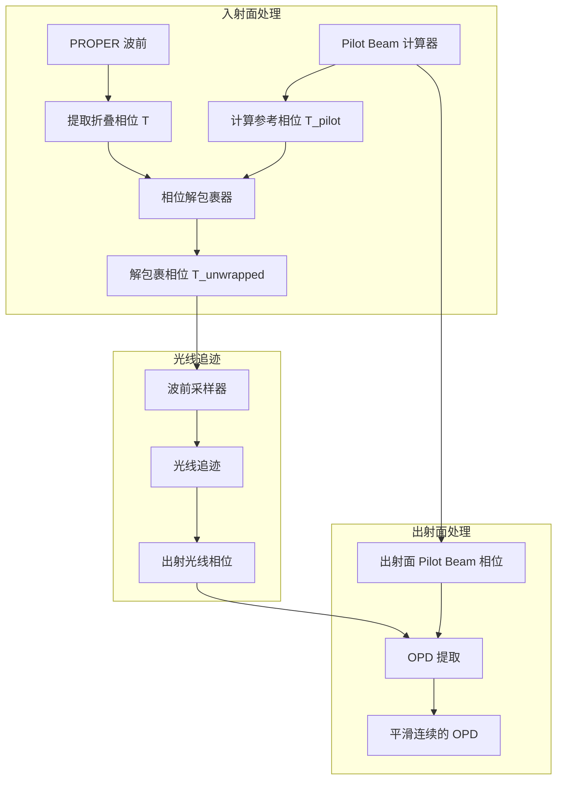

# 设计文档：基于 Pilot Beam 的相位解包裹

## 概述

本设计文档描述了基于 Pilot Beam 参考相位的相位解包裹方案，用于解决 PROPER 提取的折叠相位在几何光线追迹中导致的 2nπ 相位误差问题。

### 核心问题

PROPER 的 `prop_get_phase(wfo)` 返回折叠相位（范围 [-π, π]），当波前曲率较大时会发生 2π 折叠。在入射面对光线采样时直接使用折叠相位，会导致出射面重采样时出现 2nπ 的相位误差。

### 解决方案

使用 Pilot Beam（基于 ABCD 法则计算的理想高斯光束）作为参考，在入射面对 PROPER 提取的折叠相位进行解包裹：

```
T_unwrapped = T_pilot + angle(exp(1j * (T - T_pilot)))
```

### 设计原则

1. **最小侵入性**：尽量复用现有的 `PilotBeamCalculator` 和 `ABCDCalculator`
2. **单一职责**：新增专门的相位解包裹模块
3. **可验证性**：每个步骤都可独立验证
4. **向后兼容**：不破坏现有接口

## 架构

### 系统架构图



### 数据流

```
入射面：
  PROPER 复振幅 → 提取折叠相位 T → 解包裹(T, T_pilot) → T_unwrapped
  → 构建相位元件 → 光线采样

光线追迹：
  入射光线(携带非折叠相位) → 元件追迹 → 出射光线(非折叠相位)

出射面：
  出射光线相位 - 出射面 T_pilot → OPD（平滑连续）
  → 网格重采样 → 复振幅重建
```

## 组件和接口

### 1. PhaseUnwrapper 类（新增）

相位解包裹器，负责使用 Pilot Beam 参考相位对折叠相位进行解包裹。

```python
class PhaseUnwrapper:
    """基于 Pilot Beam 的相位解包裹器
    
    使用 Pilot Beam 参考相位对 PROPER 提取的折叠相位进行解包裹，
    确保光线采样时使用连续的相位分布。
    
    参数:
        pilot_beam_calculator: PilotBeamCalculator 实例
        element_index: 元件索引
        position: 'entrance' 或 'exit'
    """
    
    def __init__(
        self,
        pilot_beam_calculator: PilotBeamCalculator,
        element_index: int = 0,
        position: str = 'entrance',
    ) -> None:
        ...
    
    def unwrap(
        self,
        wrapped_phase: NDArray[np.floating],
        x_coords: NDArray[np.floating],
        y_coords: NDArray[np.floating],
    ) -> NDArray[np.floating]:
        """对折叠相位进行解包裹
        
        使用公式：T_unwrapped = T_pilot + angle(exp(1j * (T - T_pilot)))
        
        参数:
            wrapped_phase: 折叠相位数组（弧度），形状 (N, N)
            x_coords: x 坐标数组（mm）
            y_coords: y 坐标数组（mm）
        
        返回:
            解包裹后的相位数组（弧度）
        """
        ...
    
    def validate_unwrapping(
        self,
        wrapped_phase: NDArray[np.floating],
        unwrapped_phase: NDArray[np.floating],
        pilot_phase: NDArray[np.floating],
    ) -> UnwrapValidationResult:
        """验证解包裹结果
        
        检查：
        1. 解包裹后相位与 Pilot Beam 相位差异 < π
        2. 解包裹后相位平滑连续，无 2π 跳变
        
        返回:
            UnwrapValidationResult 对象
        """
        ...
```

### 2. 修改 WavefrontToRaysSampler 类

在现有的波前采样器中集成相位解包裹功能。

```python
class WavefrontToRaysSampler:
    """波前采样器（增强版）
    
    新增参数:
        phase_unwrapper: 可选的 PhaseUnwrapper 实例
        use_unwrapped_phase: 是否使用解包裹相位，默认 True
    """
    
    def __init__(
        self,
        wavefront_amplitude: NDArray,
        physical_size: float,
        wavelength: float,
        num_rays: int = 100,
        distribution: str = "hexapolar",
        edge_extend_pixels: int = 2,
        # 新增参数
        phase_unwrapper: Optional[PhaseUnwrapper] = None,
        use_unwrapped_phase: bool = True,
    ):
        ...
    
    def _extract_phase(self) -> NDArray:
        """从波前复振幅中提取相位
        
        如果提供了 phase_unwrapper 且 use_unwrapped_phase=True，
        则对提取的折叠相位进行解包裹。
        """
        # 提取折叠相位
        wrapped_phase = np.angle(self.wavefront_amplitude)
        
        # 如果有解包裹器，进行解包裹
        if self.phase_unwrapper is not None and self.use_unwrapped_phase:
            return self.phase_unwrapper.unwrap(
                wrapped_phase, self.x_coords, self.y_coords
            )
        
        return wrapped_phase
```

### 3. 扩展 PilotBeamCalculator 类

确保 `PilotBeamCalculator` 能够计算非折叠的参考相位。

```python
class PilotBeamCalculator:
    """Pilot Beam 计算器（扩展）
    
    新增方法:
        compute_unwrapped_reference_phase: 计算非折叠参考相位
    """
    
    def compute_unwrapped_reference_phase(
        self,
        x_coords: NDArray[np.floating],
        y_coords: NDArray[np.floating],
        element_index: int = 0,
        position: str = 'entrance',
    ) -> NDArray[np.floating]:
        """计算非折叠的 Pilot Beam 参考相位
        
        使用 ABCD 法则计算的光束参数，在给定坐标处计算
        高斯光束的球面波前相位。相位以非折叠方式解析计算，
        定义为相对于主光线的相位延迟（主光线处为 0）。
        
        参数:
            x_coords: x 坐标数组（mm）
            y_coords: y 坐标数组（mm）
            element_index: 元件索引
            position: 'entrance' 或 'exit'
        
        返回:
            非折叠参考相位数组（弧度）
        """
        ...
```

### 4. UnwrapValidationResult 数据类

```python
@dataclass
class UnwrapValidationResult:
    """解包裹验证结果
    
    属性:
        is_valid: 验证是否通过
        max_phase_diff: 解包裹相位与 Pilot Beam 相位的最大差异（弧度）
        has_discontinuity: 是否存在相位不连续
        discontinuity_locations: 不连续位置列表
        warnings: 警告信息列表
    """
    is_valid: bool
    max_phase_diff: float
    has_discontinuity: bool
    discontinuity_locations: List[Tuple[int, int]]
    warnings: List[str]
```

## 数据模型

### 相位数据流

```
┌─────────────────────────────────────────────────────────────────┐
│ 入射面                                                           │
│                                                                  │
│   PROPER 复振幅: complex[N, N]                                   │
│         ↓                                                        │
│   折叠相位 T: float[N, N], 范围 [-π, π]                          │
│         ↓                                                        │
│   Pilot Beam 相位 T_pilot: float[N, N], 非折叠                   │
│         ↓                                                        │
│   解包裹: T_unwrapped = T_pilot + angle(T - T_pilot)             │
│         ↓                                                        │
│   解包裹相位: float[N, N], 连续                                  │
│                                                                  │
└─────────────────────────────────────────────────────────────────┘
         ↓
┌─────────────────────────────────────────────────────────────────┐
│ 光线采样                                                         │
│                                                                  │
│   相位元件: 使用解包裹相位构建                                    │
│         ↓                                                        │
│   入射光线: 携带非折叠相位                                        │
│                                                                  │
└─────────────────────────────────────────────────────────────────┘
         ↓
┌─────────────────────────────────────────────────────────────────┐
│ 元件追迹                                                         │
│                                                                  │
│   光线追迹: 计算 OPD                                             │
│         ↓                                                        │
│   出射光线: 携带非折叠相位                                        │
│                                                                  │
└─────────────────────────────────────────────────────────────────┘
         ↓
┌─────────────────────────────────────────────────────────────────┐
│ 出射面                                                           │
│                                                                  │
│   出射光线相位: float[M], 非折叠                                  │
│         ↓                                                        │
│   出射面 Pilot Beam 相位: float[N, N], 非折叠                    │
│         ↓                                                        │
│   OPD = 光线相位 - Pilot Beam 相位                               │
│         ↓                                                        │
│   OPD: float[M], 平滑连续                                        │
│         ↓                                                        │
│   网格重采样: float[N, N]                                        │
│                                                                  │
└─────────────────────────────────────────────────────────────────┘
```

### 单位约定

| 数据 | 单位 | 说明 |
|------|------|------|
| 坐标 (x, y) | mm | 物理坐标 |
| 波长 | μm | 输入参数 |
| 相位 | rad | 弧度 |
| OPD | 波长数 | 相对于主光线 |
| 曲率半径 R | mm | 波前曲率 |

### 入射面与出射面定义

#### ⚠️ 核心约束：无波前倾斜

**入射面和出射面永远垂直于光轴，因此不应具有波前倾斜相位。**

这是混合光学仿真系统的核心设计约束：

1. **入射面**：垂直于入射光轴的平面
   - PROPER 波前在此平面上采样
   - 波前不具有整体倾斜（Tilt）
   - 相位分布仅包含曲率和像差

2. **出射面**：垂直于出射光轴的平面
   - 光线追迹结果在此平面上重采样
   - 重建的波前不具有整体倾斜
   - OPD 仅包含真实像差

```
入射面（⊥入射光轴）    元件      出射面（⊥出射光轴）
        |               /              |
        |              /               |
   PROPER 波前  →  光线追迹  →   PROPER 波前
   （无倾斜）      计算 OPD      （无倾斜）
```

#### 为什么无倾斜

1. **PROPER 的设计**：PROPER 记录的复振幅在垂直于光轴的平面上采样，波前不具有整体倾斜

2. **光轴追踪**：系统自动追踪主光线方向变化，入射面和出射面始终垂直于当前光轴

3. **OPD 定义**：OPD 相对于主光线计算，倾斜相位被自动补偿

#### 对相位解包裹的影响

由于入射面和出射面无倾斜：

1. **Pilot Beam 相位**：仅包含球面波前相位 φ = k*r²/(2R)，无倾斜项
2. **解包裹参考**：参考相位是纯球面，不需要考虑倾斜补偿
3. **OPD 提取**：出射面 OPD 是平滑的，不包含倾斜跳变

#### 验证要点

- 入射面：解包裹后相位应是对称的（无倾斜）
- 出射面：OPD 应是对称的（无倾斜）
- 如果检测到倾斜，说明存在坐标系或光轴追踪问题

## 算法详解

### 相位解包裹算法

#### 核心公式

```
T_unwrapped = T_pilot + angle(exp(1j * (T - T_pilot)))
```

其中：
- `T`: PROPER 提取的折叠相位，范围 [-π, π]
- `T_pilot`: Pilot Beam 计算的非折叠参考相位
- `angle()`: 将复数映射到 [-π, π] 的相位函数

#### 算法原理

1. **计算相位差**：`delta = T - T_pilot`
   - 这是折叠相位与参考相位的差值
   - 如果没有折叠，`delta` 应该很小（< π）

2. **包裹相位差**：`wrapped_delta = angle(exp(1j * delta))`
   - 将相位差包裹到 [-π, π] 范围
   - 这一步消除了 2nπ 的整数倍差异

3. **重建相位**：`T_unwrapped = T_pilot + wrapped_delta`
   - 使用参考相位作为基准
   - 加上包裹后的相位差
   - 结果是连续的非折叠相位

#### 数学证明

设真实相位为 `T_true`，折叠相位为 `T = T_true mod 2π`（映射到 [-π, π]）。

假设 Pilot Beam 相位 `T_pilot` 与真实相位的差异小于 π：
```
|T_true - T_pilot| < π
```

则：
```
T - T_pilot = (T_true mod 2π) - T_pilot
            = T_true - 2nπ - T_pilot  （其中 n 是某个整数）
            = (T_true - T_pilot) - 2nπ
```

由于 `|T_true - T_pilot| < π`，包裹后：
```
angle(exp(1j * (T - T_pilot))) = T_true - T_pilot
```

因此：
```
T_unwrapped = T_pilot + (T_true - T_pilot) = T_true
```

### Pilot Beam 参考相位计算

#### ABCD 矩阵法

高斯光束的复参数 `q` 通过 ABCD 矩阵传播：
```
q_out = (A * q_in + B) / (C * q_in + D)
```

从 `q` 提取曲率半径：
```
R = 1 / Re(1/q)
```

#### 参考相位公式

Pilot Beam 相位（相对于主光线的相位延迟）：
```
φ_pilot(r) = k * r² / (2 * R)
```

其中：
- `k = 2π/λ` 是波数
- `r² = x² + y²` 是径向距离平方
- `R` 是波前曲率半径

#### 主光线处相位为零

根据定义，主光线处 `r = 0`，因此 `φ_pilot(0) = 0`。

这确保了参考相位是相对于主光线定义的。

### 出射面 OPD 提取

#### 流程

1. 光线追迹得到出射光线相位 `φ_ray`（非折叠）
2. 计算出射面 Pilot Beam 相位 `φ_pilot_out`（非折叠）
3. OPD = `(φ_ray - φ_pilot_out) / (2π)` （波长数）

#### 为什么 OPD 是平滑的

由于入射面已经解包裹，光线携带的是非折叠相位。
光线追迹过程中相位变化是连续的。
出射面 Pilot Beam 相位也是非折叠的。
因此，两者的差值（OPD）是平滑连续的。

## 实现细节

### 文件结构

```
src/
├── hybrid_propagation/
│   ├── __init__.py          # 更新导出
│   ├── phase_unwrapper.py   # 新增：相位解包裹器
│   ├── pilot_beam.py        # 扩展：添加非折叠相位计算
│   └── propagator.py        # 修改：集成解包裹
├── wavefront_to_rays/
│   └── wavefront_sampler.py # 修改：支持解包裹相位
```

### 关键实现

#### PhaseUnwrapper.unwrap()

```python
def unwrap(
    self,
    wrapped_phase: NDArray[np.floating],
    x_coords: NDArray[np.floating],
    y_coords: NDArray[np.floating],
) -> NDArray[np.floating]:
    """对折叠相位进行解包裹"""
    # 创建坐标网格
    X, Y = np.meshgrid(x_coords, y_coords)
    
    # 计算 Pilot Beam 参考相位（非折叠）
    pilot_phase = self.pilot_beam_calculator.compute_reference_phase(
        X.ravel(), Y.ravel(),
        element_index=self.element_index,
        position=self.position,
    ).reshape(wrapped_phase.shape)
    
    # 计算相位差
    phase_diff = wrapped_phase - pilot_phase
    
    # 包裹相位差到 [-π, π]
    wrapped_diff = np.angle(np.exp(1j * phase_diff))
    
    # 重建非折叠相位
    unwrapped_phase = pilot_phase + wrapped_diff
    
    return unwrapped_phase
```

#### 验证解包裹结果

```python
def validate_unwrapping(
    self,
    wrapped_phase: NDArray[np.floating],
    unwrapped_phase: NDArray[np.floating],
    pilot_phase: NDArray[np.floating],
) -> UnwrapValidationResult:
    """验证解包裹结果"""
    # 检查与 Pilot Beam 相位的差异
    phase_diff = unwrapped_phase - pilot_phase
    max_diff = np.max(np.abs(phase_diff))
    
    # 检查相位连续性（梯度）
    grad_x = np.diff(unwrapped_phase, axis=1)
    grad_y = np.diff(unwrapped_phase, axis=0)
    
    # 检测 2π 跳变
    threshold = np.pi  # 相邻像素相位差阈值
    discontinuity_x = np.abs(grad_x) > threshold
    discontinuity_y = np.abs(grad_y) > threshold
    
    has_discontinuity = np.any(discontinuity_x) or np.any(discontinuity_y)
    
    # 收集不连续位置
    discontinuity_locations = []
    if has_discontinuity:
        locs_x = np.argwhere(discontinuity_x)
        locs_y = np.argwhere(discontinuity_y)
        discontinuity_locations = [tuple(loc) for loc in locs_x[:10]]  # 最多报告 10 个
        discontinuity_locations.extend([tuple(loc) for loc in locs_y[:10]])
    
    # 生成警告
    warnings = []
    if max_diff > np.pi:
        warnings.append(
            f"解包裹相位与 Pilot Beam 相位差异过大: {max_diff:.4f} rad > π"
        )
    if has_discontinuity:
        warnings.append(
            f"检测到相位不连续，共 {len(discontinuity_locations)} 处"
        )
    
    return UnwrapValidationResult(
        is_valid=(max_diff <= np.pi and not has_discontinuity),
        max_phase_diff=max_diff,
        has_discontinuity=has_discontinuity,
        discontinuity_locations=discontinuity_locations,
        warnings=warnings,
    )
```


## 正确性属性

*正确性属性是系统应该在所有有效执行中保持为真的特征或行为——本质上是关于系统应该做什么的形式化陈述。属性作为人类可读规范和机器可验证正确性保证之间的桥梁。*

基于验收标准的分析，以下是本功能的正确性属性：

### Property 1: 折叠相位范围不变量

*对于任意* PROPER 复振幅数组，提取的折叠相位应在 [-π, π] 范围内。

```python
# 伪代码
for all complex_amplitude in valid_complex_amplitudes:
    wrapped_phase = np.angle(complex_amplitude)
    assert np.all(wrapped_phase >= -np.pi)
    assert np.all(wrapped_phase <= np.pi)
```

**Validates: Requirements 1.1**

### Property 2: Pilot Beam 相位公式一致性

*对于任意* 有效的光束参数（波长 λ、曲率半径 R）和坐标 (x, y)，计算的 Pilot Beam 参考相位应符合高斯光束公式：φ = k * r² / (2 * R)，其中 k = 2π/λ，r² = x² + y²。

```python
# 伪代码
for all (wavelength, R, x, y) in valid_beam_params:
    k = 2 * np.pi / wavelength
    r_squared = x**2 + y**2
    expected_phase = k * r_squared / (2 * R)
    actual_phase = pilot_beam_calculator.compute_reference_phase(x, y)
    assert np.allclose(actual_phase, expected_phase, rtol=1e-10)
```

**Validates: Requirements 1.2, 3.1, 3.2, 3.3**

### Property 3: 主光线相位为零

*对于任意* 有效的光束参数，在主光线位置 (x=0, y=0) 处，Pilot Beam 参考相位应为 0。

```python
# 伪代码
for all beam_params in valid_beam_params:
    phase_at_origin = pilot_beam_calculator.compute_reference_phase(0, 0)
    assert phase_at_origin == 0.0
```

**Validates: Requirements 3.5**

### Property 4: 解包裹相位差异约束

*对于任意* 折叠相位 T 和参考相位 T_pilot，解包裹后的相位 T_unwrapped 与参考相位的差异应在 [-π, π] 范围内。

```python
# 伪代码
for all (T, T_pilot) in valid_phase_pairs:
    T_unwrapped = T_pilot + np.angle(np.exp(1j * (T - T_pilot)))
    diff = T_unwrapped - T_pilot
    assert np.all(diff >= -np.pi)
    assert np.all(diff <= np.pi)
```

**Validates: Requirements 1.3, 1.4**

### Property 5: 解包裹保持平滑性

*对于任意* 平滑的真实相位（梯度 < π），经过折叠和解包裹后，结果应恢复平滑性（梯度 < π）。

```python
# 伪代码
for all smooth_true_phase in smooth_phases:
    # 折叠相位
    wrapped_phase = np.angle(np.exp(1j * smooth_true_phase))
    # 使用真实相位作为参考（模拟 Pilot Beam）
    pilot_phase = smooth_true_phase  # 或近似值
    # 解包裹
    unwrapped = pilot_phase + np.angle(np.exp(1j * (wrapped_phase - pilot_phase)))
    # 验证平滑性
    gradient = np.abs(np.diff(unwrapped))
    assert np.all(gradient < np.pi)
```

**Validates: Requirements 1.5**

### Property 6: Pilot Beam 相位连续性

*对于任意* 有效的光束参数和坐标网格，计算的 Pilot Beam 参考相位应是连续的（相邻像素相位差 < π）。

```python
# 伪代码
for all (beam_params, grid) in valid_configurations:
    pilot_phase = pilot_beam_calculator.compute_reference_phase_grid(grid)
    grad_x = np.abs(np.diff(pilot_phase, axis=1))
    grad_y = np.abs(np.diff(pilot_phase, axis=0))
    assert np.all(grad_x < np.pi)
    assert np.all(grad_y < np.pi)
```

**Validates: Requirements 2.2, 3.4**

### Property 7: OPD 连续性

*对于任意* 正确解包裹的入射相位，经过光线追迹后，出射面 OPD 应是连续的（梯度 < 阈值）。

```python
# 伪代码
for all valid_unwrapped_inputs:
    opd = trace_and_extract_opd(unwrapped_input)
    gradient = np.abs(np.gradient(opd))
    threshold = 0.5  # 波长数/像素
    assert np.all(gradient < threshold)
```

**Validates: Requirements 2.3, 2.4**

### Property 8: 连续性检测正确性

*对于任意* 相位分布（有或无跳变），连续性检测功能应正确识别跳变的存在。

```python
# 伪代码
for all (phase, has_discontinuity) in labeled_phases:
    result = validator.check_continuity(phase)
    assert result.has_discontinuity == has_discontinuity
```

**Validates: Requirements 4.1, 4.2**

## 错误处理

### 输入验证错误

| 错误条件 | 错误类型 | 错误消息 |
|----------|----------|----------|
| 复振幅数组不是 2D | ValueError | "复振幅数组必须是 2D 数组" |
| 复振幅数组不是正方形 | ValueError | "复振幅数组必须是正方形" |
| 波长 ≤ 0 | ValueError | "波长必须为正数" |
| 物理尺寸 ≤ 0 | ValueError | "物理尺寸必须为正数" |

### 解包裹警告

| 警告条件 | 警告类型 | 警告消息 |
|----------|----------|----------|
| 解包裹后相位差异 > π | PhaseUnwrapWarning | "解包裹相位与参考相位差异过大" |
| 检测到相位不连续 | PhaseUnwrapWarning | "检测到相位不连续" |
| Pilot Beam 相位采样不足 | PilotBeamWarning | "Pilot Beam 相位采样不足" |

### 错误恢复策略

1. **解包裹失败**：如果解包裹后仍有不连续，发出警告但继续处理
2. **Pilot Beam 计算失败**：回退到不解包裹的模式，发出警告
3. **数值溢出**：使用 np.clip 限制相位范围


## 测试策略

### 双重测试方法

本功能采用单元测试和属性基测试相结合的方法：

- **单元测试**：验证特定示例、边界条件和错误处理
- **属性基测试**：验证所有输入的通用属性

两种方法互补，共同提供全面的测试覆盖。

### 属性基测试配置

- **测试框架**：hypothesis
- **最小迭代次数**：100 次/属性
- **标签格式**：`Feature: phase-unwrapping-pilot-beam, Property N: {property_text}`

### 测试用例分类

#### 单元测试

1. **基本功能测试**
   - 从复振幅提取相位
   - 计算 Pilot Beam 参考相位
   - 执行相位解包裹
   - 验证解包裹结果

2. **边界条件测试**
   - 零相位输入
   - 平面波前（R = ∞）
   - 极大曲率波前
   - 边缘像素处理

3. **错误处理测试**
   - 无效输入参数
   - 数值溢出情况
   - 警告触发条件

#### 属性基测试

1. **Property 1 测试**：折叠相位范围
   - 生成器：随机复振幅数组
   - 验证：相位在 [-π, π] 范围内

2. **Property 2 测试**：Pilot Beam 公式
   - 生成器：随机光束参数和坐标
   - 验证：计算结果符合公式

3. **Property 3 测试**：主光线相位
   - 生成器：随机光束参数
   - 验证：原点处相位为 0

4. **Property 4 测试**：解包裹差异约束
   - 生成器：随机折叠相位和参考相位
   - 验证：差异在 [-π, π] 范围内

5. **Property 5 测试**：平滑性保持
   - 生成器：随机平滑相位
   - 验证：解包裹后梯度 < π

6. **Property 6 测试**：Pilot Beam 连续性
   - 生成器：随机光束参数和网格
   - 验证：相位梯度 < π

7. **Property 7 测试**：OPD 连续性
   - 生成器：随机解包裹输入
   - 验证：OPD 梯度 < 阈值

8. **Property 8 测试**：检测正确性
   - 生成器：带标签的相位分布
   - 验证：检测结果正确

### 集成测试场景

1. **简单球面波前**
   - 输入：已知曲率的球面波前
   - 验证：解包裹后相位与理论值一致

2. **大曲率波前（多次折叠）**
   - 输入：曲率足够大导致多次 2π 折叠的波前
   - 验证：解包裹后相位连续，无跳变

3. **带像差的波前**
   - 输入：具有像差的波前（如球差、彗差）
   - 验证：解包裹后保留像差信息，OPD 正确提取

4. **端到端流程**
   - 输入：PROPER 生成的复振幅
   - 流程：解包裹 → 光线采样 → 追迹 → OPD 提取
   - 验证：OPD 平滑连续

### 测试数据生成策略

```python
from hypothesis import strategies as st

# 波长策略（可见光范围，单位 μm）
wavelength_strategy = st.floats(min_value=0.4, max_value=0.8)

# 曲率半径策略（单位 mm）
curvature_radius_strategy = st.floats(min_value=10.0, max_value=10000.0)

# 网格大小策略
grid_size_strategy = st.sampled_from([64, 128, 256, 512])

# 物理尺寸策略（单位 mm）
physical_size_strategy = st.floats(min_value=1.0, max_value=100.0)

# 相位策略（弧度）
phase_strategy = st.floats(min_value=-100.0, max_value=100.0)

# 平滑相位生成器
@st.composite
def smooth_phase_strategy(draw, grid_size=64):
    """生成平滑的相位分布（梯度 < π）"""
    # 使用低频傅里叶分量生成平滑相位
    amplitude = draw(st.floats(min_value=0.1, max_value=10.0))
    freq_x = draw(st.integers(min_value=1, max_value=5))
    freq_y = draw(st.integers(min_value=1, max_value=5))
    
    x = np.linspace(-1, 1, grid_size)
    y = np.linspace(-1, 1, grid_size)
    X, Y = np.meshgrid(x, y)
    
    phase = amplitude * np.sin(freq_x * np.pi * X) * np.sin(freq_y * np.pi * Y)
    return phase
```

## 性能考虑

### 时间复杂度

| 操作 | 复杂度 | 说明 |
|------|--------|------|
| 相位提取 | O(N²) | N 为网格大小 |
| Pilot Beam 计算 | O(N²) | 网格上的解析计算 |
| 解包裹 | O(N²) | 逐像素计算 |
| 连续性检测 | O(N²) | 梯度计算 |

### 内存使用

| 数据 | 大小 | 说明 |
|------|------|------|
| 输入复振幅 | 16N² bytes | complex128 |
| 折叠相位 | 8N² bytes | float64 |
| 参考相位 | 8N² bytes | float64 |
| 解包裹相位 | 8N² bytes | float64 |
| 总计 | ~40N² bytes | 约 10MB @ N=512 |

### 优化建议

1. **向量化计算**：使用 NumPy 向量化操作
2. **原地操作**：尽可能使用原地操作减少内存分配
3. **缓存参考相位**：如果多次使用相同参数，缓存 Pilot Beam 相位

## 依赖关系

### 内部依赖

- `hybrid_propagation.pilot_beam.PilotBeamCalculator`：Pilot Beam 参考相位计算
- `gaussian_beam_simulation.ABCDCalculator`：ABCD 矩阵追踪
- `wavefront_to_rays.wavefront_sampler.WavefrontToRaysSampler`：波前采样

### 外部依赖

- `numpy`：数值计算
- `proper`：物理光学传输（可选，用于测试）
- `hypothesis`：属性基测试

## 未来扩展

1. **多元件系统支持**：扩展到多个光学元件的级联处理
2. **自适应解包裹**：根据相位分布自动选择最佳参考
3. **GPU 加速**：使用 CuPy 加速大网格计算
4. **实时可视化**：集成相位分布的实时显示

