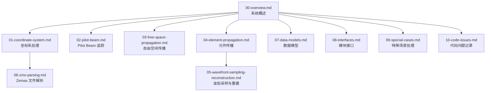
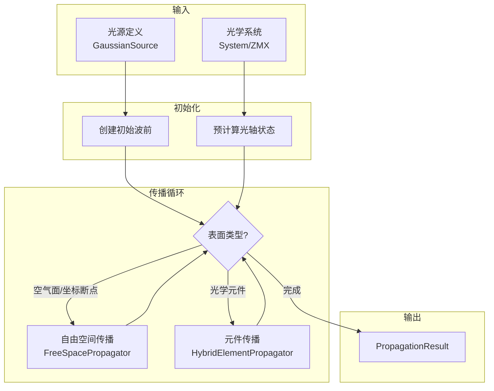
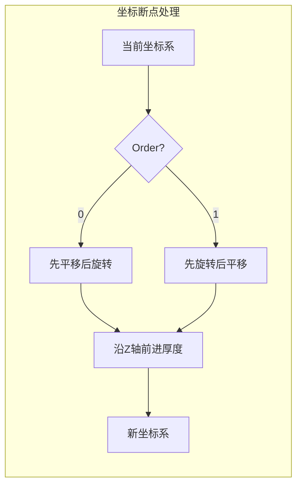
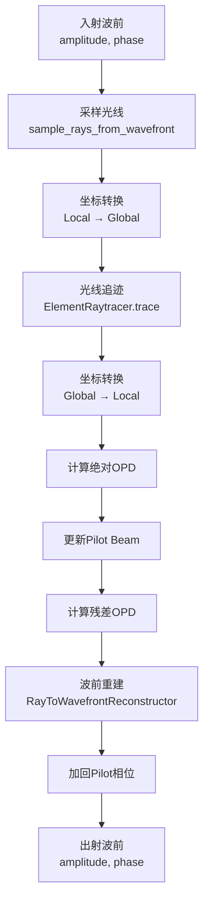
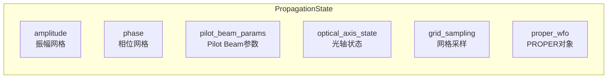

# 设计文档

## 概述

本设计文档描述 POP（Physical Optics Propagation）仿真系统 Code Review 文档的架构设计。目标是创建一系列 steering markdown 文件，为开发者提供系统的算法流程、数据流和模块功能的完整描述。

## 架构

### 文档架构

文档采用分层组织结构，从系统概述到具体模块实现：




### 代码模块映射

文档与代码模块的对应关系：

| 文档文件 | 对应代码模块 |
|---------|-------------|
| 00-overview.md | pop/、src/hybrid_optical_propagation/ |
| 01-coordinate-system.md | pop/coordinates/transforms.py、src/sequential_system/coordinate_system.py |
| 02-pilot-beam.md | pop/propagation/pilot_beam.py、src/hybrid_optical_propagation/data_models.py |
| 03-free-space-propagation.md | pop/propagation/free_space.py、src/hybrid_optical_propagation/free_space_propagator.py |
| 04-element-propagation.md | pop/propagation/element.py、src/hybrid_optical_propagation/hybrid_element_propagator.py |
| 05-wavefront-sampling-reconstruction.md | pop/wavefront/sampler.py、pop/wavefront/reconstructor.py、src/wavefront_to_rays/ |
| 06-zmx-parsing.md | pop/io/zmx.py、src/sequential_system/zmx_parser.py |
| 07-data-models.md | pop/core.py、src/hybrid_optical_propagation/data_models.py |
| 08-interfaces.md | src/hybrid_optical_propagation/hybrid_propagator.py |
| 09-special-cases.md | 各模块中的特殊处理逻辑 |
| 10-code-issues.md | 代码问题记录（在阅读各模块时发现的错误和潜在风险） |

## 组件和接口

### 文档组件结构

每个文档文件遵循统一的结构模板：


```
# 文档标题

## 概述
- 文档目的
- 适用范围
- 相关模块

## 物理背景（如适用）
- 物理原理说明
- 数学公式

## 核心流程
- 流程图（Mermaid）
- 步骤说明

## 数据流
- 输入参数表
- 输出参数表
- 中间数据说明

## 关键实现
- 算法描述
- 坐标变换公式
- 参数计算方法

## 与其他模块的关系
- 上游模块
- 下游模块
- 数据传递

## 注意事项
- 边界条件
- 常见问题
```


### 各文档详细设计

#### 00-overview.md 系统概述

内容设计：
1. POP 仿真系统的整体架构图
2. 两种传播模式的对比说明
3. 核心模块职责列表
4. 典型仿真流程的时序图
5. 与 PROPER 库和 optiland 库的集成关系

关键流程图：



#### 01-coordinate-system.md 坐标系处理

内容设计：
1. 全局坐标系与局部坐标系的定义
2. CurrentCoordinateSystem 类的状态追踪
3. 坐标断点处理的 Order=0 和 Order=1 模式
4. 旋转矩阵计算（X→Y→Z 顺序）
5. 光轴追踪算法（主光线追迹）
6. 入射面/出射面坐标系构建

关键数学公式：
- 旋转矩阵组合：R_xyz = R_z × R_y × R_x
- 坐标变换：P_global = R × P_local + Origin
- 方向变换：D_global = R × D_local

关键流程图：



#### 02-pilot-beam.md Pilot Beam 追踪

内容设计：
1. Pilot Beam 的物理意义（理想高斯光束参考）
2. 复参数 q 的定义：1/q = 1/R - jλ/(πw²)
3. ABCD 矩阵法的各种应用场景
4. 各类光学元件的 ABCD 矩阵
5. Pilot Beam 相位网格计算
6. 与 PROPER 库的参数同步

关键公式：
- 自由空间传播：q_out = q_in + d
- 薄透镜：1/q_out = 1/q_in - 1/f
- 球面镜：1/q_out = 1/q_in + 2/R
- 折射面：q_out = (A×q_in + B)/(C×q_in + D)
- 相位网格：φ_pilot(r) = k × r² / (2 × R)

#### 03-free-space-propagation.md 自由空间传播

内容设计：
1. 衍射传播的物理原理
2. PROPER 库 prop_propagate 的使用
3. 传播距离计算（考虑折射率：d_eff = d/n）
4. 网格采样参数的更新
5. 参考面类型选择（PLANAR/SPHERI）
6. 振幅/相位提取方法
7. 残差相位范围检查


#### 04-element-propagation.md 元件传播

内容设计：
1. 混合传播的整体流程（波前→光线→波前）
2. 光线采样过程
3. ElementRaytracer 的光线追迹
4. OPD 计算方法
5. Pilot Beam 参数更新
6. 残差 OPD 计算
7. 波前重建过程

关键流程图：



#### 05-wavefront-sampling-reconstruction.md 波前采样与重建

内容设计：
1. 波前采样算法
   - 网格采样策略
   - 方向余弦计算：L = ∂φ/∂x / k + x/R
   - 有效性验证条件
2. 波前重建算法
   - RBF 插值建立坐标映射
   - 雅可比行列式数值计算
   - 能量守恒振幅计算：A_out = A_in / √|J|
   - griddata 网格重采样
3. 相位突变检测

关键公式：
- 方向余弦：L = (∂φ_residual/∂x)/k + x/R_pilot
- 雅可比行列式：|J| = |∂x_out/∂x_in × ∂y_out/∂y_in - ∂x_out/∂y_in × ∂y_out/∂x_in|
- 振幅变换：A_out = A_in / √|J|

#### 06-zmx-parsing.md Zemax 文件解析

内容设计：
1. ZMX 文件格式关键字段
2. ZmxParser 解析流程
3. SurfaceTraversalAlgorithm 遍历算法
4. GlobalSurfaceDefinition 数据结构
5. ZemaxToOptilandConverter 转换逻辑
6. 各种表面类型的处理


#### 07-data-models.md 数据模型

内容设计：
1. PropagationState 结构
   - 振幅/相位分离存储设计
   - 与 PROPER 对象的关系
2. PilotBeamParams 参数
   - q 参数计算
   - 各种变换方法
3. GridSampling 采样参数
   - 与 PROPER 的一致性
4. OpticalAxisState 光轴状态
5. SourceDefinition 光源定义

#### 08-interfaces.md 模块接口

内容设计：
1. HybridOpticalPropagator 主接口
2. FreeSpacePropagator 接口
3. HybridElementPropagator 接口
4. ElementRaytracer 接口
5. RayToWavefrontReconstructor 接口
6. StateConverter 接口

接口参数表格式：
| 参数名 | 类型 | 单位 | 说明 |
|-------|------|------|------|


#### 09-special-cases.md 特殊场景处理

内容设计：
1. 倾斜平面镜处理
   - 光轴折叠计算
   - 法向量方向判断
2. 离轴抛物面镜处理
   - 主光线交点计算
   - 有效焦距计算
3. 折射面处理
   - 材料检测
   - 折射率获取
4. 连续坐标断点处理
5. 近轴面形处理
6. 错误处理机制
7. 相位突变调试方法


#### 10-code-issues.md 代码问题记录

内容设计：
1. 问题统计摘要
   - 按严重程度统计（高/中/低）
   - 按问题类型统计（逻辑错误、潜在 Bug、性能问题等）
   - 按模块统计

2. 问题分类记录
   - 坐标系处理相关问题
   - 传播算法相关问题
   - 数据模型相关问题
   - 接口设计相关问题
   - 其他问题

3. 问题记录表格格式：

| 编号 | 文件路径 | 问题类型 | 严重程度 | 问题描述 | 建议修复方案 |
|------|---------|---------|---------|---------|-------------|

4. 问题类型定义：
   - **逻辑错误**：代码逻辑与预期行为不符
   - **潜在 Bug**：可能在特定条件下触发的问题
   - **性能问题**：影响执行效率的代码
   - **代码风格**：不符合最佳实践的写法
   - **文档缺失**：缺少必要的注释或文档
   - **物理公式错误**：物理计算公式实现有误

5. 严重程度定义：
   - **高**：影响计算正确性，必须修复
   - **中**：可能导致问题，建议修复
   - **低**：代码质量问题，可选修复

## 数据模型

### 文档元数据结构

每个文档文件包含以下元数据：
- 文档标题
- 版本号
- 最后更新日期
- 相关代码模块列表
- 前置阅读建议


### 关键数据流

#### 传播状态数据流



#### 光线数据流


## 正确性属性

*正确性属性是指在系统所有有效执行中都应保持为真的特性或行为——本质上是关于系统应该做什么的形式化陈述。属性作为人类可读规范和机器可验证正确性保证之间的桥梁。*

由于本项目是文档生成任务，不涉及可执行代码的正确性测试，因此不定义传统意义上的属性测试。

文档质量的验证将通过人工审核完成，确保：
1. 文档内容与代码实现一致
2. 流程图准确反映实际执行流程
3. 数学公式正确无误
4. 术语使用一致

## 错误处理

### 文档编写错误预防

1. 代码引用验证：确保文档中引用的函数、类、参数名与实际代码一致
2. 流程图验证：确保 Mermaid 语法正确，流程逻辑与代码匹配
3. 公式验证：确保数学公式与代码实现一致
4. 交叉引用验证：确保文档间的引用链接有效


## 测试策略

### 文档质量检查

由于本项目生成的是文档而非代码，测试策略聚焦于文档质量验证：

1. **结构完整性检查**
   - 每个文档包含所有必需章节
   - 标题层级正确
   - Mermaid 图表语法正确

2. **内容准确性检查**
   - 函数名、类名与代码一致
   - 参数说明与代码签名匹配
   - 数学公式与实现一致

3. **一致性检查**
   - 术语使用统一
   - 文档间交叉引用有效
   - 代码模块映射正确

4. **可读性检查**
   - 中文表述清晰
   - 技术术语有解释
   - 流程图易于理解

### 验收标准

- 所有 10 个文档文件创建完成
- 每个文档包含完整的章节结构
- Mermaid 图表可正确渲染
- 无明显的技术错误

