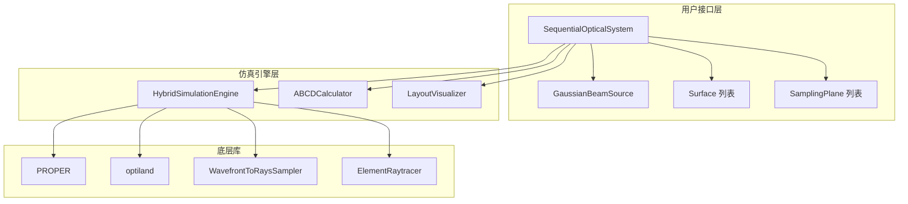
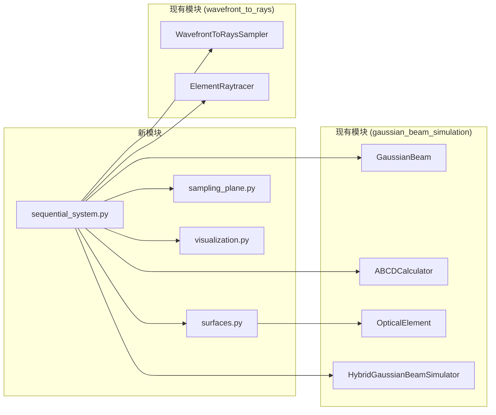
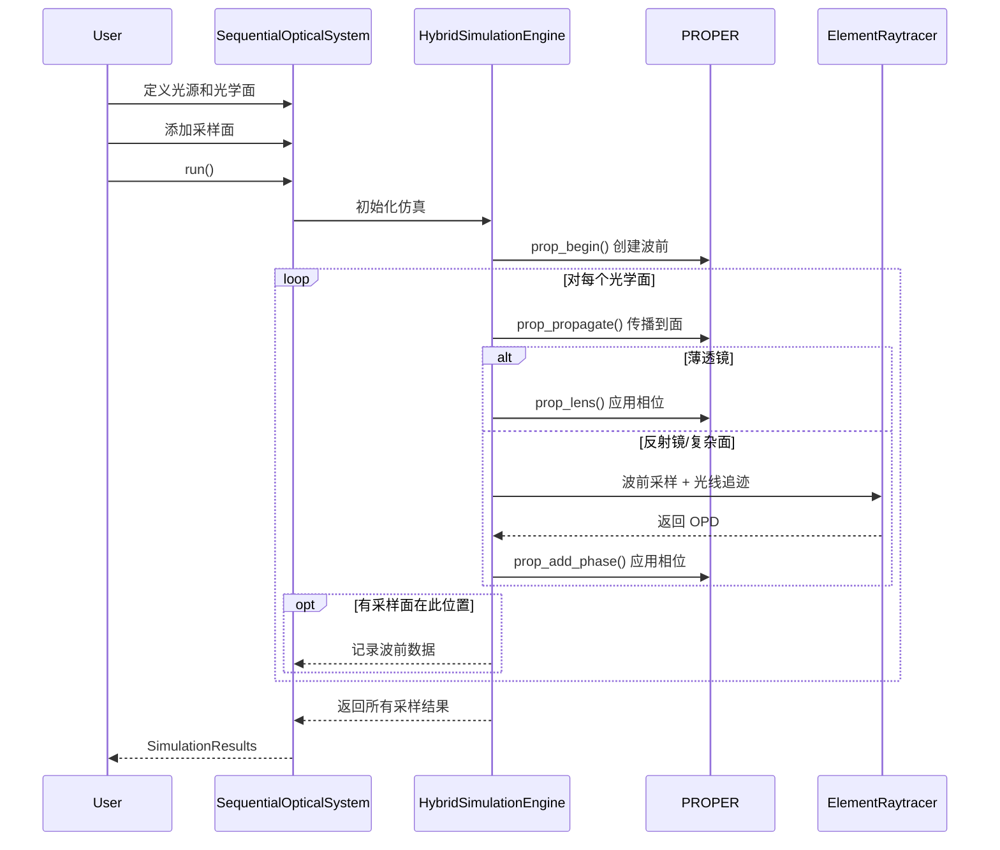

# Design Document: Sequential Optical System

## Overview

本设计文档描述序列模式混合光学仿真系统的架构和实现方案。该系统提供类似 Zemax 序列模式的接口，实现高斯光束在光学系统中的混合仿真（PROPER 物理光学衍射传播 + optiland 几何光线追迹）。

### 设计目标

1. **简洁易用**：用户可以用少于 20 行代码定义和运行简单仿真
2. **代码复用**：最大程度复用现有 `gaussian_beam_simulation` 和 `wavefront_to_rays` 模块
3. **准确性**：混合仿真结果与 ABCD 矩阵理论预测一致（近轴情况）
4. **可扩展性**：支持添加新的光学面类型

### 核心设计理念

采用 Zemax 序列模式的设计理念：
- 光学元件按顺序排列
- 使用 `thickness` 参数定义到下一元件的间距
- 光束沿光路自动传播
- 反射面自动反转传播方向

## Architecture

### 系统架构图



### 模块依赖关系



## Components and Interfaces

### 1. SequentialOpticalSystem 类

主入口类，提供流畅的 API 用于定义和运行仿真。

```python
class SequentialOpticalSystem:
    """序列光学系统
    
    提供类似 Zemax 序列模式的接口，用于定义和仿真光学系统。
    
    参数:
        source: 光源定义（GaussianBeamSource 对象）
        grid_size: 波前网格大小，默认 512
        beam_ratio: PROPER beam_ratio 参数，默认 0.5
    
    示例:
        >>> # 定义光源
        >>> source = GaussianBeamSource(
        ...     wavelength=0.633,  # μm
        ...     w0=1.0,            # mm
        ...     z0=-50.0,          # mm，束腰在光源前 50mm
        ... )
        >>> 
        >>> # 创建系统
        >>> system = SequentialOpticalSystem(source)
        >>> 
        >>> # 添加光学面
        >>> system.add_surface(SphericalMirror(
        ...     radius=200.0,      # mm
        ...     thickness=100.0,   # mm，到下一面的距离
        ...     semi_aperture=15.0,
        ... ))
        >>> 
        >>> # 添加采样面
        >>> system.add_sampling_plane(distance=150.0, name="focus")
        >>> 
        >>> # 运行仿真
        >>> results = system.run()
    """
    
    def __init__(
        self,
        source: GaussianBeamSource,
        grid_size: int = 512,
        beam_ratio: float = 0.5,
    ) -> None: ...
    
    def add_surface(self, surface: Surface) -> 'SequentialOpticalSystem':
        """添加光学面（支持链式调用）"""
        ...
    
    def add_sampling_plane(
        self, 
        distance: float, 
        name: Optional[str] = None,
    ) -> 'SequentialOpticalSystem':
        """添加采样面（支持链式调用）
        
        参数:
            distance: 从光源沿光路的累积距离（mm）
            name: 采样面名称（可选）
        """
        ...
    
    def run(self) -> SimulationResults:
        """执行仿真并返回结果"""
        ...
    
    def get_abcd_result(self, distance: float) -> ABCDResult:
        """获取指定距离的 ABCD 计算结果"""
        ...
    
    def draw_layout(
        self, 
        show: bool = True,
        figsize: Tuple[float, float] = (12, 6),
    ) -> Tuple[Figure, Axes]:
        """绘制 2D 光路图"""
        ...
    
    def summary(self) -> str:
        """返回系统配置摘要"""
        ...
```

### 2. GaussianBeamSource 类

光源定义类，封装高斯光束参数。

```python
@dataclass
class GaussianBeamSource:
    """高斯光束光源定义
    
    参数:
        wavelength: 波长（μm）
        w0: 束腰半径（mm）
        z0: 束腰位置（mm），相对于光源位置
            - 负值表示束腰在光源之前（发散光束）
            - 正值表示束腰在光源之后（会聚光束）
            - 零表示束腰在光源位置（平面波前）
        m2: M² 因子，默认 1.0
    """
    wavelength: float  # μm
    w0: float          # mm
    z0: float = 0.0    # mm
    m2: float = 1.0
    
    def to_gaussian_beam(self) -> GaussianBeam:
        """转换为 GaussianBeam 对象"""
        return GaussianBeam(
            wavelength=self.wavelength,
            w0=self.w0,
            z0=self.z0,
            m2=self.m2,
            z_init=0.0,
        )
```

### 3. Surface 基类和子类

光学面定义的类层次结构。

```python
@dataclass
class Surface(ABC):
    """光学面基类
    
    参数:
        thickness: 到下一面的距离（mm）
        semi_aperture: 半口径（mm）
        tilt_x: X 轴倾斜角（rad），默认 0
        tilt_y: Y 轴倾斜角（rad），默认 0
        decenter_x: X 方向偏心（mm），默认 0
        decenter_y: Y 方向偏心（mm），默认 0
        name: 面名称（可选）
    """
    thickness: float
    semi_aperture: float
    tilt_x: float = 0.0
    tilt_y: float = 0.0
    decenter_x: float = 0.0
    decenter_y: float = 0.0
    name: Optional[str] = None
    
    @property
    @abstractmethod
    def is_reflective(self) -> bool:
        """是否为反射面"""
        ...
    
    @property
    @abstractmethod
    def focal_length(self) -> Optional[float]:
        """焦距（mm），平面返回 None"""
        ...
    
    @abstractmethod
    def to_optical_element(self) -> OpticalElement:
        """转换为现有的 OpticalElement 对象"""
        ...


@dataclass
class SphericalMirror(Surface):
    """球面反射镜
    
    参数:
        radius: 曲率半径（mm）
            - 正值：凹面镜（曲率中心在 +Z 方向）
            - 负值：凸面镜
            - np.inf：平面镜
        thickness: 到下一面的距离（mm）
        semi_aperture: 半口径（mm）
    """
    radius: float = field(default_factory=lambda: np.inf)
    
    @property
    def is_reflective(self) -> bool:
        return True
    
    @property
    def focal_length(self) -> Optional[float]:
        if np.isinf(self.radius):
            return None
        return self.radius / 2.0


@dataclass
class ParabolicMirror(Surface):
    """抛物面反射镜
    
    参数:
        parent_focal_length: 母抛物面焦距（mm）
        off_axis_distance: 离轴距离（mm），默认 0（轴上）
        thickness: 到下一面的距离（mm）
        semi_aperture: 半口径（mm）
    """
    parent_focal_length: float = 100.0
    off_axis_distance: float = 0.0
    
    @property
    def is_reflective(self) -> bool:
        return True
    
    @property
    def focal_length(self) -> float:
        return self.parent_focal_length
    
    @property
    def vertex_radius(self) -> float:
        """顶点曲率半径：R = 2f"""
        return 2 * self.parent_focal_length
    
    @property
    def conic_constant(self) -> float:
        """圆锥常数：抛物面 k = -1"""
        return -1.0


@dataclass
class FlatMirror(Surface):
    """平面反射镜"""
    
    @property
    def is_reflective(self) -> bool:
        return True
    
    @property
    def focal_length(self) -> None:
        return None


@dataclass
class ThinLens(Surface):
    """薄透镜
    
    参数:
        focal_length_value: 焦距（mm）
            - 正值：会聚透镜
            - 负值：发散透镜
        thickness: 到下一面的距离（mm）
        semi_aperture: 半口径（mm）
    """
    focal_length_value: float = 50.0
    
    @property
    def is_reflective(self) -> bool:
        return False
    
    @property
    def focal_length(self) -> float:
        return self.focal_length_value
```

### 4. SamplingPlane 类

采样面定义。

```python
@dataclass
class SamplingPlane:
    """采样面定义
    
    参数:
        distance: 从光源沿光路的累积距离（mm）
        name: 采样面名称（可选）
    """
    distance: float
    name: Optional[str] = None
    
    # 仿真后填充的结果
    result: Optional['SamplingResult'] = field(default=None, init=False)
```

### 5. SimulationResults 类

仿真结果容器。

```python
@dataclass
class SamplingResult:
    """单个采样面的结果
    
    属性:
        distance: 光程距离（mm）
        z_position: z 坐标位置（mm）
        wavefront: 复振幅分布
        amplitude: 振幅分布
        phase: 相位分布（rad）
        sampling: 采样间隔（mm/pixel）
        beam_radius: 光束半径（mm）
        wavefront_rms: 波前 RMS（waves）
        wavefront_pv: 波前 PV（waves）
    """
    distance: float
    z_position: float
    wavefront: NDArray
    amplitude: NDArray
    phase: NDArray
    sampling: float
    beam_radius: float
    wavefront_rms: float
    wavefront_pv: float
    name: Optional[str] = None
    
    def compute_m2(self) -> float:
        """从振幅分布计算 M² 因子"""
        ...
    
    @property
    def grid_size(self) -> int:
        return self.amplitude.shape[0]
    
    @property
    def physical_size(self) -> float:
        return self.sampling * self.grid_size


@dataclass
class SimulationResults:
    """仿真结果集合
    
    属性:
        sampling_results: 各采样面的结果字典，键为采样面名称或索引
        source: 光源参数
        surfaces: 光学面列表
    """
    sampling_results: Dict[str, SamplingResult]
    source: GaussianBeamSource
    surfaces: List[Surface]
    
    def __getitem__(self, key: Union[str, int]) -> SamplingResult:
        """通过名称或索引获取采样结果"""
        if isinstance(key, int):
            return list(self.sampling_results.values())[key]
        return self.sampling_results[key]
    
    def __iter__(self):
        return iter(self.sampling_results.values())
```

### 6. LayoutVisualizer 类

光路可视化。

```python
class LayoutVisualizer:
    """光路 2D 可视化器
    
    基于 ABCD 矩阵计算绘制光束包络和光学元件。
    """
    
    def __init__(
        self,
        system: 'SequentialOpticalSystem',
    ) -> None: ...
    
    def draw(
        self,
        figsize: Tuple[float, float] = (12, 6),
        show: bool = True,
        show_waist: bool = True,
        show_sampling_planes: bool = True,
    ) -> Tuple[Figure, Axes]:
        """绘制 2D 光路图
        
        参数:
            figsize: 图形大小
            show: 是否调用 plt.show()
            show_waist: 是否显示束腰位置
            show_sampling_planes: 是否显示采样面
        
        返回:
            (fig, ax) 元组
        """
        ...
```

## Data Models

### 数据流图



### 坐标系统

```
        Y (向上)
        |
        |
        |________ Z (光轴方向，光传播方向)
       /
      /
     X (指向屏幕内)
```

- **Z 轴**：光轴方向，光线传播的主方向
- **光程距离**：沿光路的累积距离（考虑反射折叠）
- **z 坐标**：全局坐标系中的位置（反射后可能反向）

### 单位约定

| 参数 | 单位 |
|------|------|
| 波长 | μm |
| 长度（位置、半径、厚度） | mm |
| 角度 | rad |
| 相位 | rad |
| OPD | waves |


## Correctness Properties

*A property is a characteristic or behavior that should hold true across all valid executions of a system—essentially, a formal statement about what the system should do. Properties serve as the bridge between human-readable specifications and machine-verifiable correctness guarantees.*

### Property 1: 高斯光束参数计算正确性

*For any* valid GaussianBeamSource with wavelength λ, waist radius w0, and M² factor, the computed Rayleigh range shall equal π * w0² / (M² * λ), and the beam radius at any position z shall equal w0 * sqrt(1 + ((z-z0)/zR)²).

**Validates: Requirements 1.8, 1.9, 1.10**

### Property 2: 无效输入参数拒绝

*For any* invalid input parameter (negative wavelength, zero w0, M² < 1.0, NaN, or infinity values), the system shall raise a ValueError with descriptive error message containing the parameter name and actual value.

**Validates: Requirements 1.2, 1.4, 1.7**

### Property 3: 光学面位置自动计算

*For any* sequence of surfaces with thickness values [t1, t2, ..., tn], the z-position of surface i shall equal the sum of all preceding thicknesses (considering direction reversals at reflective surfaces), and the optical path length shall equal the cumulative sum of absolute thickness values.

**Validates: Requirements 3.3, 3.4**

### Property 4: 反射面方向反转

*For any* reflective surface in the system, after the beam passes through it, the propagation direction shall be reversed (z-coordinate changes sign for subsequent propagation).

**Validates: Requirements 2.13, 5.5**

### Property 5: 采样面数据完整性

*For any* SamplingPlane added to the system, after simulation completes, the result shall contain: non-null complex amplitude array, positive sampling interval, positive beam radius, and the array shape shall match the system's grid_size.

**Validates: Requirements 4.3, 4.4, 4.5, 4.6, 5.6**

### Property 6: ABCD 与物理仿真一致性

*For any* paraxial optical system (small beam angles, small apertures relative to focal lengths), the beam radius computed by ABCD matrix method shall match the beam radius from physical simulation within 5% relative tolerance.

**Validates: Requirements 6.2, 6.3, 6.4, 6.5**

### Property 7: 仿真结果完整性

*For any* completed simulation with n sampling planes, the SimulationResults shall contain exactly n SamplingResult objects, each with valid amplitude, phase, and beam radius data.

**Validates: Requirements 5.6, 8.1, 8.2, 8.3**

### Property 8: 曲率半径符号约定

*For any* SphericalMirror with positive radius, the focal length shall be positive (concave, focusing mirror). For negative radius, the focal length shall be negative (convex, diverging mirror).

**Validates: Requirements 2.6, 2.7**

### Property 9: 错误信息描述性

*For any* error condition during simulation, the raised exception shall contain a Chinese error message with sufficient context information including the error location and suggested resolution.

**Validates: Requirements 5.7, 10.3**

## Error Handling

### 异常类型层次

```python
class SequentialSystemError(Exception):
    """序列光学系统基础异常"""
    pass

class SourceConfigurationError(SequentialSystemError):
    """光源配置错误"""
    pass

class SurfaceConfigurationError(SequentialSystemError):
    """光学面配置错误"""
    pass

class SimulationError(SequentialSystemError):
    """仿真执行错误"""
    pass

class SamplingError(SequentialSystemError):
    """采样面错误"""
    pass
```

### 错误处理策略

| 错误类型 | 触发条件 | 处理方式 |
|---------|---------|---------|
| SourceConfigurationError | 无效的光源参数 | 抛出异常，包含参数名和实际值 |
| SurfaceConfigurationError | 无效的光学面参数 | 抛出异常，包含面索引和参数信息 |
| SimulationError | 仿真过程中的数值问题 | 抛出异常，包含当前位置和状态 |
| SamplingError | 采样面位置超出光路范围 | 抛出异常，包含有效范围信息 |

### 错误信息格式

```python
# 示例错误信息
raise SourceConfigurationError(
    f"光源参数 'wavelength' 无效：期望正值，实际为 {wavelength} μm。"
    f"请确保波长为正有限值。"
)

raise SurfaceConfigurationError(
    f"光学面 {index} ('{name}') 配置错误：半口径 ({semi_aperture} mm) "
    f"必须为正值。"
)

raise SimulationError(
    f"仿真在光程距离 {path_length:.2f} mm 处失败：{reason}。"
    f"当前位置 z = {z_position:.2f} mm。"
)
```

## Testing Strategy

### 测试框架

- **pytest**: 单元测试和集成测试
- **hypothesis**: 属性基测试（Property-Based Testing）
- **numpy.testing**: 数值比较

### 测试目录结构

```
tests/
├── test_sequential_system.py      # 主系统测试
├── test_surfaces.py               # 光学面测试
├── test_sampling_plane.py         # 采样面测试
├── test_visualization.py          # 可视化测试
└── test_integration.py            # 集成测试
```

### 单元测试

单元测试用于验证具体示例和边界情况：

1. **光源参数验证**
   - 有效参数创建成功
   - 无效参数抛出正确异常
   - 默认值正确设置

2. **光学面定义**
   - 各类型光学面创建成功
   - 参数验证正确
   - 焦距计算正确

3. **系统构建**
   - 添加光学面成功
   - 位置自动计算正确
   - 链式调用工作正常

4. **可视化**
   - show=False 不阻塞
   - 返回正确的 figure 和 axes

### 属性基测试

属性基测试用于验证普遍性质，每个测试运行至少 100 次迭代。

```python
from hypothesis import given, strategies as st, settings

@given(
    wavelength=st.floats(min_value=0.3, max_value=1.0),
    w0=st.floats(min_value=0.1, max_value=10.0),
    m2=st.floats(min_value=1.0, max_value=3.0),
)
@settings(max_examples=100)
def test_rayleigh_range_formula(wavelength, w0, m2):
    """
    **Feature: sequential-optical-system, Property 1: 高斯光束参数计算正确性**
    **Validates: Requirements 1.8**
    """
    source = GaussianBeamSource(wavelength=wavelength, w0=w0, m2=m2)
    beam = source.to_gaussian_beam()
    
    wavelength_mm = wavelength * 1e-3
    expected_zR = np.pi * w0**2 / (m2 * wavelength_mm)
    
    np.testing.assert_allclose(beam.zR, expected_zR, rtol=1e-10)


@given(
    radius=st.floats(min_value=50.0, max_value=500.0),
    thickness=st.floats(min_value=10.0, max_value=200.0),
)
@settings(max_examples=100)
def test_surface_position_calculation(radius, thickness):
    """
    **Feature: sequential-optical-system, Property 3: 光学面位置自动计算**
    **Validates: Requirements 3.3, 3.4**
    """
    source = GaussianBeamSource(wavelength=0.633, w0=1.0)
    system = SequentialOpticalSystem(source)
    
    system.add_surface(SphericalMirror(
        radius=radius,
        thickness=thickness,
        semi_aperture=10.0,
    ))
    
    # 验证位置计算
    assert system.surfaces[0].z_position == 0.0
    assert system.surfaces[0].path_length == 0.0


@given(
    focal_length=st.floats(min_value=50.0, max_value=500.0),
    distance=st.floats(min_value=100.0, max_value=1000.0),
)
@settings(max_examples=100)
def test_abcd_physical_consistency(focal_length, distance):
    """
    **Feature: sequential-optical-system, Property 6: ABCD 与物理仿真一致性**
    **Validates: Requirements 6.5**
    """
    source = GaussianBeamSource(wavelength=0.633, w0=1.0, z0=-50.0)
    system = SequentialOpticalSystem(source, grid_size=256)
    
    system.add_surface(SphericalMirror(
        radius=2*focal_length,
        thickness=distance,
        semi_aperture=15.0,
    ))
    system.add_sampling_plane(distance=distance)
    
    results = system.run()
    abcd_result = system.get_abcd_result(distance)
    
    # 近轴情况下，误差应小于 5%
    relative_error = abs(results[0].beam_radius - abcd_result.w) / abcd_result.w
    assert relative_error < 0.05
```

### 集成测试

集成测试验证完整的仿真流程：

1. **简单反射镜系统**
   - 单个凹面镜聚焦
   - 验证焦点位置和光束尺寸

2. **离轴抛物面系统**
   - OAP 镜准直/聚焦
   - 验证光束方向变化

3. **多元件系统**
   - 扩束器配置
   - 验证放大倍率

### 测试配置

```python
# conftest.py
import pytest
import numpy as np

@pytest.fixture
def simple_source():
    """简单高斯光源"""
    return GaussianBeamSource(
        wavelength=0.633,
        w0=1.0,
        z0=-50.0,
    )

@pytest.fixture
def concave_mirror():
    """凹面反射镜"""
    return SphericalMirror(
        radius=200.0,
        thickness=100.0,
        semi_aperture=15.0,
    )

@pytest.fixture
def parabolic_mirror():
    """抛物面反射镜"""
    return ParabolicMirror(
        parent_focal_length=100.0,
        thickness=150.0,
        semi_aperture=15.0,
    )
```

### 测试覆盖率目标

- 整体覆盖率 > 80%
- 核心模块（SequentialOpticalSystem, Surface 类）覆盖率 > 90%
- 所有公共 API 100% 覆盖

## Implementation Notes

### 代码复用策略

1. **GaussianBeam 类**：直接复用 `gaussian_beam_simulation.gaussian_beam.GaussianBeam`
2. **ABCDCalculator 类**：直接复用 `gaussian_beam_simulation.abcd_calculator.ABCDCalculator`
3. **OpticalElement 类**：新的 Surface 类继承或包装现有 OpticalElement
4. **HybridGaussianBeamSimulator**：内部使用，封装在 SequentialOpticalSystem 中
5. **WavefrontToRaysSampler 和 ElementRaytracer**：在混合仿真中使用

### 文件组织

```
src/
├── gaussian_beam_simulation/     # 现有模块（保持不变）
│   ├── __init__.py
│   ├── gaussian_beam.py
│   ├── optical_elements.py
│   ├── hybrid_simulator.py
│   └── abcd_calculator.py
├── wavefront_to_rays/            # 现有模块（保持不变）
│   ├── __init__.py
│   ├── wavefront_sampler.py
│   └── element_raytracer.py
└── sequential_system/            # 新模块
    ├── __init__.py
    ├── system.py                 # SequentialOpticalSystem 类
    ├── source.py                 # GaussianBeamSource 类
    ├── surfaces.py               # Surface 类层次
    ├── sampling.py               # SamplingPlane 和结果类
    ├── visualization.py          # LayoutVisualizer 类
    └── exceptions.py             # 异常类定义
```

### 向后兼容性

- 现有的 `gaussian_beam_simulation` 模块保持不变
- 现有的 `wavefront_to_rays` 模块保持不变
- 新的 `sequential_system` 模块作为独立入口
- 用户可以选择使用新接口或现有接口
