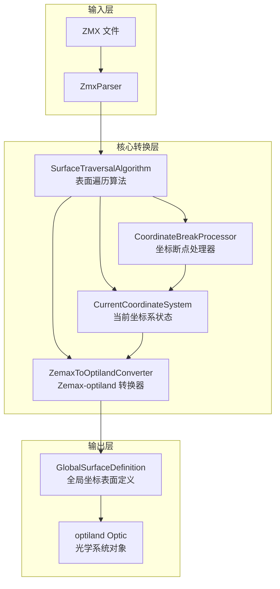

# Design Document: Zemax 光轴追踪与坐标转换

## Overview

本设计文档描述了 Zemax 序列模式光学系统到 optiland 全局坐标系的转换机制。核心功能包括：

1. **当前坐标系追踪**：追踪 Zemax 序列模式中随光路演化的"当前坐标系"状态
2. **坐标断点处理**：正确处理 Zemax 坐标断点的偏心、旋转和变换顺序
3. **Zemax 到 optiland 转换**：将 Zemax 表面参数转换为 optiland 全局坐标系中的表面定义
4. **统一表面遍历**：提供统一的算法处理所有表面类型，无需特殊化处理

### 设计原则

- **Zemax 兼容性**：严格遵循 Zemax 序列模式的坐标系演化规则
- **简洁性**：统一的表面遍历算法，不对连续坐标断点或空气面做特殊处理
- **可测试性**：每个组件都可独立测试，提供明确的输入输出接口
- **与 optiland 垂直集成**：直接生成 optiland 兼容的表面定义

## Architecture

### 系统架构图



### 数据流

```
ZMX 文件 
    → ZmxParser（解析）
    → ZmxDataModel（Zemax 数据模型）
    → SurfaceTraversalAlgorithm（遍历）
        → CoordinateBreakProcessor（处理坐标断点）
        → CurrentCoordinateSystem（更新状态）
        → ZemaxToOptilandConverter（转换）
    → GlobalSurfaceDefinition[]（全局坐标表面列表）
    → optiland Optic（光学系统）
```

## Components and Interfaces

### 1. CurrentCoordinateSystem（当前坐标系状态）

追踪 Zemax 当前坐标系相对于全局坐标系的状态。

```python
@dataclass
class CurrentCoordinateSystem:
    """当前坐标系状态
    
    追踪 Zemax 序列模式中"当前坐标系"相对于全局坐标系的位置和姿态。
    
    属性:
        origin: 当前坐标系原点在全局坐标系中的位置 (mm)
        axes: 轴向量矩阵，3×3 矩阵，列向量为 [X, Y, Z] 轴在全局坐标系中的方向
    """
    origin: np.ndarray  # shape (3,)，单位 mm
    axes: np.ndarray    # shape (3, 3)，列向量为 X, Y, Z 轴
    
    @classmethod
    def identity(cls) -> "CurrentCoordinateSystem":
        """创建与全局坐标系重合的初始状态"""
        return cls(
            origin=np.array([0.0, 0.0, 0.0]),
            axes=np.eye(3)
        )
    
    def advance_along_z(self, thickness: float) -> "CurrentCoordinateSystem":
        """沿当前 Z 轴方向前进指定距离
        
        参数:
            thickness: 前进距离 (mm)，可正可负
        
        返回:
            新的坐标系状态（不修改原对象）
        """
        ...
    
    def apply_decenter(self, dx: float, dy: float) -> "CurrentCoordinateSystem":
        """应用偏心（沿当前 X、Y 轴平移）
        
        参数:
            dx: X 方向偏心 (mm)
            dy: Y 方向偏心 (mm)
        
        返回:
            新的坐标系状态
        """
        ...
    
    def apply_rotation(
        self, 
        tilt_x: float, 
        tilt_y: float, 
        tilt_z: float
    ) -> "CurrentCoordinateSystem":
        """应用旋转（绕当前 X、Y、Z 轴依次旋转）
        
        参数:
            tilt_x: 绕 X 轴旋转角度 (弧度)
            tilt_y: 绕 Y 轴旋转角度 (弧度)
            tilt_z: 绕 Z 轴旋转角度 (弧度)
        
        返回:
            新的坐标系状态
        """
        ...
    
    @property
    def x_axis(self) -> np.ndarray:
        """当前 X 轴在全局坐标系中的方向"""
        return self.axes[:, 0]
    
    @property
    def y_axis(self) -> np.ndarray:
        """当前 Y 轴在全局坐标系中的方向"""
        return self.axes[:, 1]
    
    @property
    def z_axis(self) -> np.ndarray:
        """当前 Z 轴在全局坐标系中的方向"""
        return self.axes[:, 2]
```

### 2. CoordinateBreakProcessor（坐标断点处理器）

处理 Zemax 坐标断点的变换逻辑。

```python
class CoordinateBreakProcessor:
    """坐标断点处理器
    
    根据 Zemax 坐标断点参数更新当前坐标系状态。
    支持 Order=0（先平移后旋转）和 Order=1（先旋转后平移）两种变换顺序。
    """
    
    @staticmethod
    def process(
        current_cs: CurrentCoordinateSystem,
        decenter_x: float,
        decenter_y: float,
        tilt_x_rad: float,
        tilt_y_rad: float,
        tilt_z_rad: float,
        order: int,
        thickness: float
    ) -> CurrentCoordinateSystem:
        """处理坐标断点，返回更新后的坐标系状态
        
        参数:
            current_cs: 当前坐标系状态
            decenter_x: X 方向偏心 (mm)
            decenter_y: Y 方向偏心 (mm)
            tilt_x_rad: 绕 X 轴旋转角度 (弧度)
            tilt_y_rad: 绕 Y 轴旋转角度 (弧度)
            tilt_z_rad: 绕 Z 轴旋转角度 (弧度)
            order: 变换顺序，0=先平移后旋转，1=先旋转后平移
            thickness: 坐标断点厚度 (mm)
        
        返回:
            更新后的坐标系状态
        """
        ...
    
    @staticmethod
    def rotation_matrix_x(angle: float) -> np.ndarray:
        """绕 X 轴旋转矩阵"""
        ...
    
    @staticmethod
    def rotation_matrix_y(angle: float) -> np.ndarray:
        """绕 Y 轴旋转矩阵"""
        ...
    
    @staticmethod
    def rotation_matrix_z(angle: float) -> np.ndarray:
        """绕 Z 轴旋转矩阵"""
        ...
    
    @staticmethod
    def rotation_matrix_xyz(
        tilt_x: float, 
        tilt_y: float, 
        tilt_z: float
    ) -> np.ndarray:
        """组合旋转矩阵（X → Y → Z 顺序）"""
        ...
```


### 3. GlobalSurfaceDefinition（全局坐标表面定义）

存储转换后的表面在全局坐标系中的完整定义。

```python
@dataclass
class GlobalSurfaceDefinition:
    """全局坐标系中的表面定义
    
    存储从 Zemax 转换后的表面参数，所有位置和方向都在全局坐标系中表示。
    
    属性:
        index: 原始 Zemax 表面索引
        surface_type: 表面类型 ('standard', 'even_asphere', 'flat')
        vertex_position: 表面顶点在全局坐标系中的位置 (mm)
        orientation: 表面姿态矩阵，列向量为表面局部坐标系的 X, Y, Z 轴
        radius: 曲率半径 (mm)，正值表示曲率中心在表面 +Z 方向
        conic: 圆锥常数
        is_mirror: 是否为反射镜
        semi_aperture: 半口径 (mm)
        material: 材料名称
        asphere_coeffs: 非球面系数列表（用于偶次非球面）
        comment: 注释/名称
    """
    index: int
    surface_type: str
    vertex_position: np.ndarray  # shape (3,)
    orientation: np.ndarray      # shape (3, 3)
    radius: float = np.inf
    conic: float = 0.0
    is_mirror: bool = False
    semi_aperture: float = 0.0
    material: str = "air"
    asphere_coeffs: List[float] = field(default_factory=list)
    comment: str = ""
    
    @property
    def surface_normal(self) -> np.ndarray:
        """表面法向量（指向入射侧，即 -Z 方向）"""
        return -self.orientation[:, 2]
    
    @property
    def curvature_center(self) -> Optional[np.ndarray]:
        """曲率中心在全局坐标系中的位置
        
        返回:
            曲率中心位置，如果是平面则返回 None
        """
        if np.isinf(self.radius):
            return None
        return self.vertex_position + self.radius * self.orientation[:, 2]
    
    def to_optiland_params(self) -> Dict:
        """转换为 optiland 表面参数字典"""
        ...
```

### 4. SurfaceTraversalAlgorithm（表面遍历算法）

统一的表面遍历算法，处理所有表面类型。

```python
class SurfaceTraversalAlgorithm:
    """表面遍历算法
    
    遍历 Zemax 表面序列，追踪当前坐标系状态，生成全局坐标表面定义。
    
    设计原则：
    - 统一处理所有表面类型，不对连续坐标断点或空气面做特殊处理
    - 虚拟表面（坐标断点）只更新坐标系，不生成 optiland 表面
    - 光学表面生成全局坐标定义后，再更新坐标系
    """
    
    def __init__(self, zmx_data: ZmxDataModel):
        """初始化遍历算法
        
        参数:
            zmx_data: ZMX 解析后的数据模型
        """
        self._zmx_data = zmx_data
        self._current_cs = CurrentCoordinateSystem.identity()
        self._global_surfaces: List[GlobalSurfaceDefinition] = []
    
    def traverse(self) -> List[GlobalSurfaceDefinition]:
        """遍历所有表面，返回全局坐标表面定义列表
        
        返回:
            GlobalSurfaceDefinition 列表，只包含光学表面（不含坐标断点）
        """
        ...
    
    def _process_surface(self, surface: ZmxSurfaceData) -> None:
        """处理单个表面
        
        根据表面类型：
        - coordinate_break: 更新当前坐标系
        - standard/even_asphere: 生成全局坐标定义，然后更新坐标系
        """
        ...
    
    def _is_virtual_surface(self, surface: ZmxSurfaceData) -> bool:
        """判断是否为虚拟表面（不产生光学作用）"""
        return surface.surface_type == 'coordinate_break'
    
    def _create_global_surface(
        self, 
        surface: ZmxSurfaceData
    ) -> GlobalSurfaceDefinition:
        """从 Zemax 表面创建全局坐标定义"""
        ...
```

### 5. ZemaxToOptilandConverter（Zemax-optiland 转换器）

将全局坐标表面定义转换为 optiland 对象。

```python
class ZemaxToOptilandConverter:
    """Zemax 到 optiland 转换器
    
    将 GlobalSurfaceDefinition 列表转换为 optiland Optic 对象。
    """
    
    def __init__(self, global_surfaces: List[GlobalSurfaceDefinition]):
        """初始化转换器
        
        参数:
            global_surfaces: 全局坐标表面定义列表
        """
        self._surfaces = global_surfaces
    
    def convert(self) -> "Optic":
        """转换为 optiland Optic 对象
        
        返回:
            配置好的 optiland Optic 对象
        """
        ...
    
    def _add_surface_to_optic(
        self, 
        optic: "Optic", 
        surface: GlobalSurfaceDefinition
    ) -> None:
        """向 optiland Optic 添加单个表面"""
        ...
```


## Data Models

### 坐标系状态数据模型

```python
# 当前坐标系状态
CurrentCoordinateSystem:
    origin: np.ndarray[3]      # 原点位置 (mm)
    axes: np.ndarray[3, 3]     # 轴向量矩阵，列向量为 X, Y, Z

# 全局坐标表面定义
GlobalSurfaceDefinition:
    index: int                  # Zemax 表面索引
    surface_type: str           # 'standard', 'even_asphere', 'flat'
    vertex_position: np.ndarray[3]  # 顶点位置 (mm)
    orientation: np.ndarray[3, 3]   # 姿态矩阵
    radius: float               # 曲率半径 (mm)
    conic: float                # 圆锥常数
    is_mirror: bool             # 是否反射镜
    semi_aperture: float        # 半口径 (mm)
    material: str               # 材料
    asphere_coeffs: List[float] # 非球面系数
    comment: str                # 注释
```

### 坐标变换数学模型

#### 旋转矩阵

绕 X 轴旋转角度 θ：
```
R_x(θ) = | 1    0       0    |
         | 0  cos(θ) -sin(θ) |
         | 0  sin(θ)  cos(θ) |
```

绕 Y 轴旋转角度 θ：
```
R_y(θ) = |  cos(θ)  0  sin(θ) |
         |    0     1    0    |
         | -sin(θ)  0  cos(θ) |
```

绕 Z 轴旋转角度 θ：
```
R_z(θ) = | cos(θ) -sin(θ)  0 |
         | sin(θ)  cos(θ)  0 |
         |   0       0     1 |
```

组合旋转（X → Y → Z 顺序）：
```
R_xyz = R_z(θ_z) × R_y(θ_y) × R_x(θ_x)
```

#### 坐标断点变换

Order=0（先平移后旋转）：
```python
# 1. 平移
new_origin = origin + axes @ [dx, dy, 0]
# 2. 旋转
new_axes = axes @ R_xyz(tilt_x, tilt_y, tilt_z)
# 3. 厚度
new_origin = new_origin + thickness * new_axes[:, 2]
```

Order=1（先旋转后平移）：
```python
# 1. 旋转
new_axes = axes @ R_xyz(tilt_x, tilt_y, tilt_z)
# 2. 平移（使用旋转后的轴）
new_origin = origin + new_axes @ [dx, dy, 0]
# 3. 厚度
new_origin = new_origin + thickness * new_axes[:, 2]
```

### 曲率半径符号约定

**⚠️ 关键概念：面形参数在当前坐标系中定义**

Zemax 中所有表面形状参数（曲率半径、圆锥常数、非球面系数等）都是相对于**当前坐标系**定义的，而不是全局坐标系。这意味着：

1. **曲率半径 R 的符号**：R > 0 表示曲率中心在当前坐标系的 +Z 方向
2. **坐标系旋转后**：后续表面的 R 符号仍然相对于新的当前坐标系
3. **转换到全局坐标系**：曲率中心位置 = 顶点位置 + R × 当前Z轴方向

**示例：45° 折叠镜后的凹面镜**

```
初始状态：当前坐标系 = 全局坐标系
    Z轴 = (0, 0, 1)

坐标断点：绕 X 轴旋转 45°
    新 Z轴 = (0, -0.707, 0.707)

凹面镜：R = +100 mm
    曲率中心 = 顶点 + 100 × (0, -0.707, 0.707)
             = 顶点 + (0, -70.7, 70.7)
```

| Zemax 半径 | 曲率中心位置（当前坐标系） | 表面类型 | 全局坐标曲率中心 |
|-----------|-------------------------|---------|----------------|
| R > 0 | 当前 +Z 方向 | 凹面 | vertex + R × current_z_axis |
| R < 0 | 当前 -Z 方向 | 凸面 | vertex + R × current_z_axis |
| R = ∞ | 无穷远 | 平面 | None |

**注意**：曲率半径的数值不需要修改，因为 `current_z_axis` 已经包含了坐标系旋转的信息。

### 圆锥常数定义

| k 值 | 表面类型 |
|------|---------|
| k = 0 | 球面 |
| k = -1 | 抛物面 |
| k < -1 | 双曲面 |
| -1 < k < 0 | 扁椭球面 |
| k > 0 | 长椭球面 |

### 单位约定

| 项目 | Zemax 文件 | 内部计算 | optiland |
|------|-----------|---------|----------|
| 长度 | mm | mm | mm |
| 角度 | 度 | 弧度 | 弧度 |
| 曲率 | 1/mm | - | - |
| 半径 | mm | mm | mm |


## Correctness Properties

*A property is a characteristic or behavior that should hold true across all valid executions of a system—essentially, a formal statement about what the system should do. Properties serve as the bridge between human-readable specifications and machine-verifiable correctness guarantees.*

### Property 1: 坐标断点 Order=0 变换正确性

*For any* coordinate break with Order=0, decenter values (dx, dy), and tilt angles (θx, θy, θz), the resulting coordinate system should have:
1. Origin = old_origin + old_axes @ [dx, dy, 0]（先平移）
2. Axes = old_axes @ R_xyz(θx, θy, θz)（后旋转）

**Validates: Requirements 2.1, 8.4**

### Property 2: 坐标断点 Order=1 变换正确性

*For any* coordinate break with Order=1, decenter values (dx, dy), and tilt angles (θx, θy, θz), the resulting coordinate system should have:
1. Axes = old_axes @ R_xyz(θx, θy, θz)（先旋转）
2. Origin = old_origin + new_axes @ [dx, dy, 0]（后平移，使用旋转后的轴）

**Validates: Requirements 2.2, 8.5**

### Property 3: 旋转顺序 X→Y→Z

*For any* tilt angles (θx, θy, θz), the combined rotation matrix should equal R_z(θz) × R_y(θy) × R_x(θx)，即先绕 X 轴旋转，再绕 Y 轴，最后绕 Z 轴。

**Validates: Requirements 2.3**

### Property 4: 偏心平移正确性

*For any* decenter values (dx, dy) and current coordinate system with axes matrix A, the origin should move by exactly dx × A[:, 0] + dy × A[:, 1]（沿当前 X 和 Y 轴方向）。

**Validates: Requirements 2.4**

### Property 5: 反射定律

*For any* incident direction d and surface normal n (both unit vectors), the reflected direction r should satisfy r = d - 2(d·n)n，且 |r| = 1。

**Validates: Requirements 3.2, 4.1**

### Property 6: 方向余弦单位向量

*For any* optical axis state, the direction cosines (L, M, N) should satisfy L² + M² + N² = 1 within numerical tolerance.

**Validates: Requirements 5.3**

### Property 7: 角度转换

*For any* angle value in degrees, the converted radian value should equal angle × π/180。

**Validates: Requirements 7.3**

### Property 8: 厚度前进

*For any* surface with thickness t and current coordinate system with Z axis direction z, the origin should advance by exactly t × z。

**Validates: Requirements 8.3**

### Property 9: 坐标断点厚度处理

*For any* coordinate break with non-zero thickness t, after completing decenter and rotation transformations, the origin should advance by t × new_z_axis（沿变换后的 Z 轴方向）。

**Validates: Requirements 8.6**

### Property 10: 反射镜不改变当前坐标系

*For any* reflective surface (mirror), processing it should not modify the Current_Coordinate_System state. The coordinate system should only advance by the surface thickness.

**Validates: Requirements 8.7**

### Property 11: 表面顶点和姿态转换

*For any* optical surface, the converted GlobalSurfaceDefinition should have:
1. vertex_position = current_origin at conversion time
2. orientation = current_axes at conversion time

**Validates: Requirements 9.1, 9.2**

### Property 12: 曲率中心计算

*For any* surface with radius R (positive or negative, not infinity) and orientation matrix with Z axis z, the curvature center should be located at vertex_position + R × z。

**Validates: Requirements 9.3, 9.4**

### Property 13: 圆锥常数保持

*For any* surface with conic constant k, the converted GlobalSurfaceDefinition should have the same conic value k unchanged.

**Validates: Requirements 9.6**

### Property 14: 连续坐标断点累积

*For any* sequence of N consecutive coordinate breaks, the final coordinate system state should equal the result of applying all N transformations in order, regardless of how many coordinate breaks are in sequence.

**Validates: Requirements 10.2**

### Property 15: 负厚度处理

*For any* surface with negative thickness t, the origin should move by t × z_axis（即沿 Z 轴负方向移动 |t| 距离）。

**Validates: Requirements 10.7**

### Property 16: 虚拟表面与光学表面分类

*For any* surface, it should be classified as Virtual_Surface if and only if surface_type == 'coordinate_break'. Virtual surfaces should not produce GlobalSurfaceDefinition entries, while optical surfaces should.

**Validates: Requirements 10.4, 10.5, 10.6**

### Property 17: optiland 表面参数传递

*For any* GlobalSurfaceDefinition converted to optiland:
1. Radius and conic constant should be preserved
2. Reflective surfaces should have mirror material set
3. Non-identity orientation should be correctly applied

**Validates: Requirements 11.2, 11.3, 11.5**

### Property 18: 旋转坐标系后的曲率中心计算

*For any* optical surface defined after coordinate breaks that have rotated the current coordinate system, the curvature center in global coordinates should be calculated as `vertex_position + R × current_z_axis`, where `current_z_axis` is the Z axis of the rotated current coordinate system.

**Validates: Requirements 9.3, 9.4, 9.8, 9.9**


## Error Handling

### 输入验证错误

| 错误类型 | 触发条件 | 处理方式 |
|---------|---------|---------|
| InvalidSurfaceIndex | 表面索引为负数或超出范围 | 抛出 ValueError，包含索引值 |
| InvalidRadius | 曲率半径为 0（非法值） | 抛出 ValueError，曲率半径必须为非零或无穷大 |
| InvalidConicConstant | 圆锥常数导致表面方程无解 | 抛出 ValueError，包含 k 值 |
| InvalidTransformOrder | Order 参数不是 0 或 1 | 抛出 ValueError，Order 必须为 0 或 1 |

### 数值计算错误

| 错误类型 | 触发条件 | 处理方式 |
|---------|---------|---------|
| SingularMatrix | 旋转矩阵变为奇异（数值误差累积） | 重新正交化矩阵，记录警告 |
| NormalizationError | 方向向量归一化失败（零向量） | 抛出 ValueError，方向向量不能为零 |
| IntersectionError | 光线与表面无交点 | 返回 None 或抛出异常，取决于上下文 |

### 兼容性错误

| 错误类型 | 触发条件 | 处理方式 |
|---------|---------|---------|
| UnsupportedSurfaceType | 遇到不支持的 Zemax 表面类型 | 抛出 ZmxUnsupportedError，包含类型名称 |
| OptilandConversionError | 无法转换为 optiland 格式 | 抛出 ZmxConversionError，包含详细信息 |

### 错误恢复策略

1. **输入验证**：在处理前验证所有输入参数，尽早失败
2. **数值稳定性**：定期检查旋转矩阵的正交性，必要时重新正交化
3. **详细错误信息**：所有错误都包含足够的上下文信息用于调试
4. **日志记录**：记录警告和错误到日志系统

## Testing Strategy

### 单元测试

单元测试用于验证各组件的基本功能：

1. **CurrentCoordinateSystem 测试**
   - 初始化状态验证
   - advance_along_z 方法
   - apply_decenter 方法
   - apply_rotation 方法

2. **CoordinateBreakProcessor 测试**
   - Order=0 变换
   - Order=1 变换
   - 旋转矩阵计算
   - 组合旋转

3. **SurfaceTraversalAlgorithm 测试**
   - 单表面遍历
   - 多表面遍历
   - 虚拟表面处理
   - 光学表面处理

4. **ZemaxToOptilandConverter 测试**
   - 球面转换
   - 非球面转换
   - 反射镜转换
   - 完整系统转换

### 属性基测试

使用 hypothesis 库进行属性基测试，每个测试至少运行 100 次迭代。

**测试框架配置**：
```python
from hypothesis import given, strategies as st, settings

# 角度策略（弧度）
angle_strategy = st.floats(min_value=-np.pi, max_value=np.pi)

# 长度策略（mm）
length_strategy = st.floats(min_value=-1000.0, max_value=1000.0)

# 正半径策略
positive_radius_strategy = st.floats(min_value=1.0, max_value=10000.0)

# 圆锥常数策略
conic_strategy = st.floats(min_value=-10.0, max_value=10.0)

# 变换顺序策略
order_strategy = st.sampled_from([0, 1])
```

**属性测试标注格式**：
```python
@given(...)
@settings(max_examples=100)
def test_property_N_description():
    """
    **Feature: zemax-optical-axis-tracing, Property N: Property Title**
    **Validates: Requirements X.Y, X.Z**
    """
    ...
```

### 集成测试

1. **45° 折叠镜测试**
   - 输入：沿 +Z 入射，45° 倾斜镜
   - 预期：出射方向沿 -Y

2. **Z 形双镜系统测试**
   - 输入：两个 45° 镜
   - 预期：180° 方向改变

3. **离轴抛物面镜测试**
   - 输入：90° OAP
   - 预期：出射方向垂直于入射方向

4. **伽利略扩束器测试**
   - 输入：两个 OAP 组成的扩束器
   - 预期：正确追踪两次反射

### 验证测试

与 Zemax 参考数据对比：

1. 导出 Zemax 光线追迹数据
2. 使用相同的光学系统定义
3. 比较主光线位置和方向
4. 验证误差在可接受范围内（位置 < 1e-6 mm，方向 < 1e-6）

### 测试覆盖率目标

- 整体覆盖率 > 80%
- 核心模块（坐标变换、表面遍历）覆盖率 > 90%
- 所有公共 API 100% 覆盖
